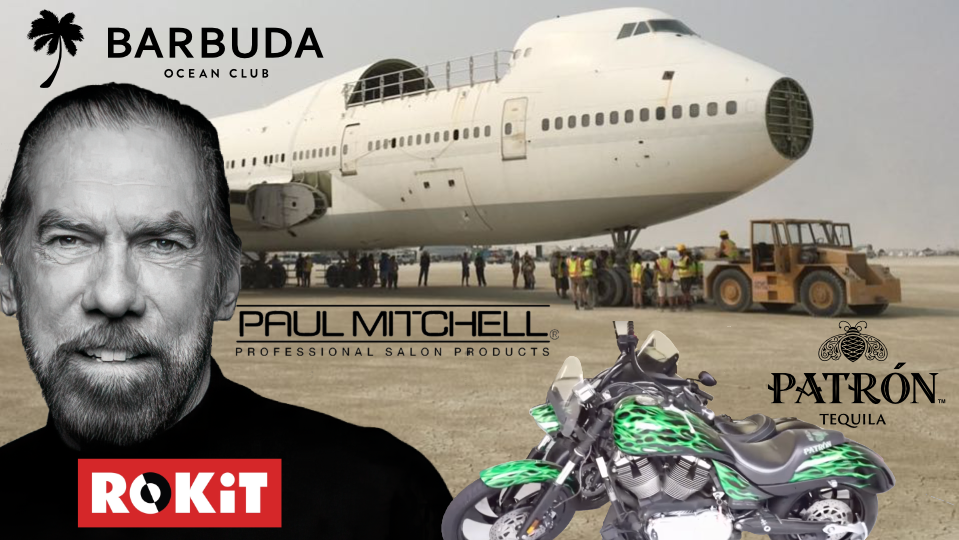
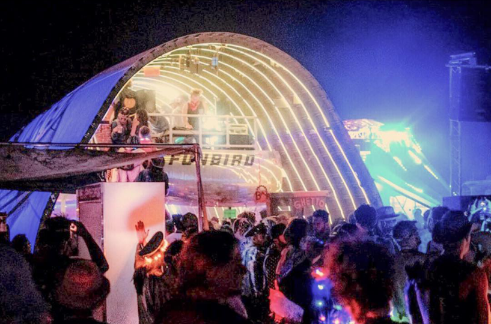
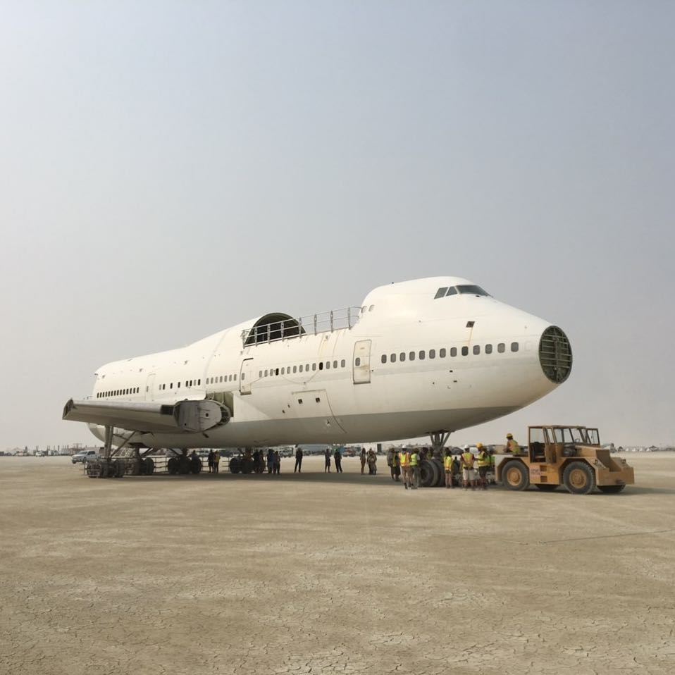
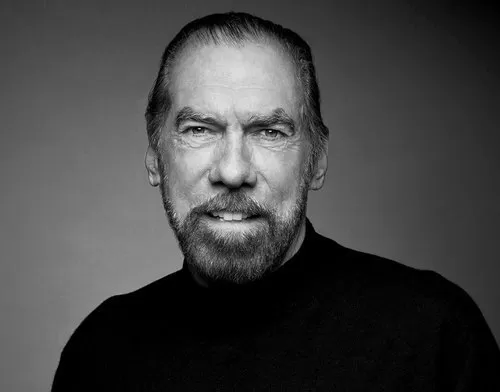
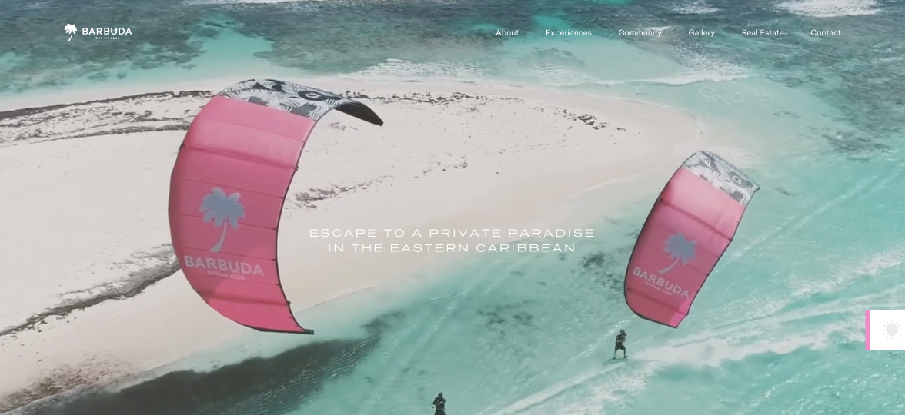
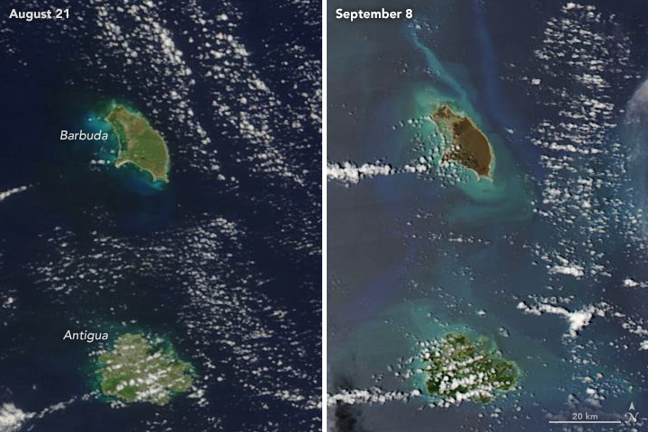
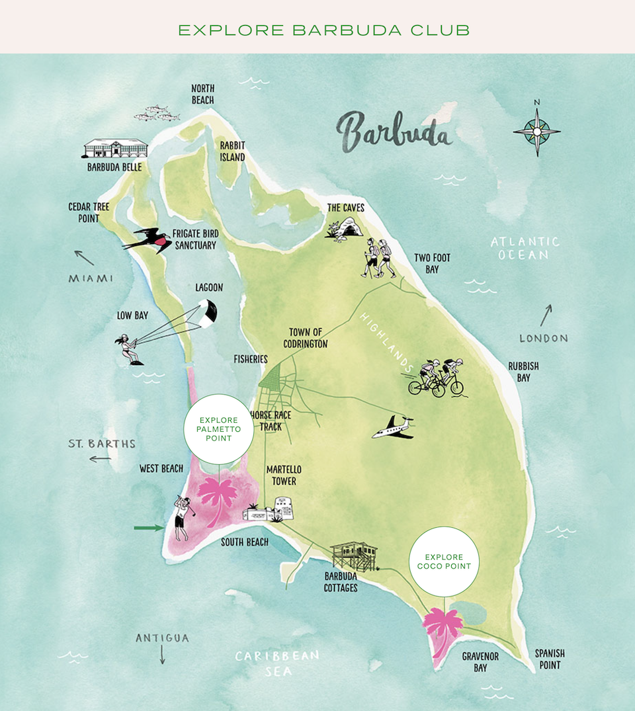
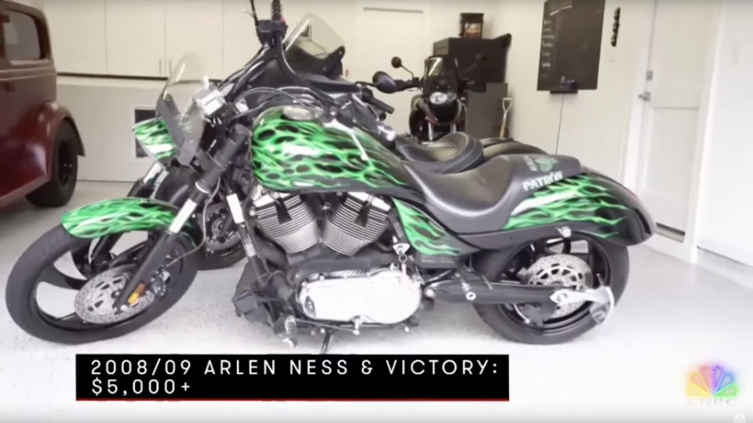

# The Billionaire Burning Man Attendee Who Loves Private Jets and Philanthropy

Like mmst of the Internet, I've been captivated by the recent flooding at Burning Man. While reading up on the last few years of the festival, I discovered that Burning Man featured a controversial installment from 2016 to 2018 in the form of a decommisoned Boeing 747. This jet, dubbed "Camp 747" by a group of organizers called Big Imagination, was bought to Black Rock City from an airplane boneyard and turned into a music venue. 

*(Camp 747 in 2017. Photo credit: Big Imagination's [Instagram](https://www.instagram.com/p/BXEWt9Fgntp/))*

Camp 747 received [strong negative reactions online](https://www.reddit.com/r/BurningMan/comments/9czslw/im_pretty_sure_the_big_imagination_747_airplane/), with burners likening the experience to that of an exclusive night club. Despite this, Mashable would [report](https://mashable.com/article/747-burning-man) that the camp had the "full confidence of the Burning Man organization". The 747 would return for 2019 and the organizers stated they wanted the plane to be an "evolving fixture at Burning Man".

In light of the flooding, I can't help but wonder what would've happened if Camp 747 had been present in 2023. I can't imagine moving something as heavy as an airplane through the thick mud would've been possible at all until the playa is mostly done drying out. Transporting the jet in 2018 required a police escort and it [took longer than expected](https://www.sfgate.com/travel/burningman/article/Burning-Man-747-plane-Big-Imagination-left-behind-13236266.php) for the plane to be comepletely gone from the Black Rock Desert. In 2023, law enforcement's most notable contribution to Burning Man involved [ramming through climate prostestors](https://www.theguardian.com/culture/2023/aug/28/burning-man-protest-climate-change-environment). Ironically, one of the practices these activists were protesting was the presence private jets at Burning Man.

*(Camp 747's eponymous jet in transit. Photo credit: Big Imagination's [Instagram](https://www.instagram.com/p/Bmz7CoOBlJ-/))*

Big Imagination spent multiple years trying to raise enough fund to make Camp 747 possible before its debut in 2018. Mashable's reporting revealed that some of these funders were in fact wealthy tech executives.

> There was a good deal of buy-in to help bring the whole thing, however. Feldman says he received hundreds of donations averaging around $1,000 apiece. There were a "handful of five figure donations," he adds, but "most were under $10k." (Reported backers include Joe Gebbia, co-founder of Airbnb, Singapore VC Jonathan Teo, Guy Laliberte, CEO of Cirque du Soleil, plus Tesla and SpaceX board members.) 

A [FastCompany article](https://www.fastcompany.com/90378291/tech-billionaires-havent-killed-burning-mans-anti-capitalist-spirit-but-influencers-might) on Camp 747 indicates that another one of these weather funders is billionaire John Paul Dejoria. It's unclear what his contributions were beyond these gifts, but he certainly had a hand in Camp 747 and his presence at Burning Man is an excellent example of the extremely wealthy patrons the festival has attracted in recent years.

> Last year, a Los Angeles–based model named Natasha Wagner, one of hundreds of influencers who use the hashtag #Burnerettes, attended Burning Man for the third time. She was part of a group called Camp 747, which hauled an old Boeing 747 into the desert and turned it into a nightclub. Some burners viewed the effort as the pinnacle of imagination; others saw it as an elitist and ostentatious display. Her camp provided its guests with two daily meals, along with showers, Paul Mitchell hair products, and Patrón tequila, which were provided by Paul Mitchell CEO, Patrón cofounder, and 747 attendee John Paul DeJoria.

## John Paul DeJoria

*(Photo credit: [Rokit's website](https://rokit.com/about-us/))*

Before learning about his involvement in Burning Man, I was familiar with Paul Mitchell and Patrón products but knew nothing about John Paul DeJoria himself. A [2018 profile](https://www.ageist.com/profile/john-paul-dejoria-74/) on him from Ageist magazine paints a rosy picture of him. Beyond hair products and tequila, he's involved in the tech and media industries via his [ROKiT](https://rokit.com/rokitapps/) conglomerate and is very active as a philanthropist. 

> DeJoria is a capitalist who believes you do well and do good, and the better you do, the greater your capacity to make a difference.
> His is the story of a guy who did well, then did good — an enormous amount of good. His story was chronicled in the 2016-17 documentary Good Fortune, which is narrated by actor, friend and former business partner, Dan Aykroyd.
> “Most of what I do is philanthropically involved, even businesses,” says DeJoria. “The more money I make, the more I give back.”

Tellingly, the language DeJoria uses around giving is very similar to that used by the effective altruism movement. Ever since prominent effective altruist Sam Bankman-Fried was arrested for a [litany of financial crimes](https://www.nytimes.com/2022/12/12/business/ftx-sam-bankman-fried-bahamas.html) in 2022, I've viewed excessive endorsement of charities by wealthy capitalists as a red flag for potential misconduct and  an investigation into DeJoria's business practices confirm my suspicions.

### John Paul DeJoria vs The Moroccan Royal Family

A serial entrepenuer, Mr. DeJoria is involved in many industries. One of these industries is the oil industry, which he's been in for longer than tequila. Rer an [interview with CNN](https://money.cnn.com/2012/04/24/smallbusiness/paul_mitchell_dejoria.fortune/index.htm), DeJoria joined with businessman Michael Gustin in 1986 to create "Gustin Energy", an oil and gas company "with ecology in mind". 

Gustin and DeJoria would continue to work together and would make news 2000 when they announced to the world that they had found "copious amounts of high quality oil" in Morocco. This led to a deal in which the Moroccan royal family agreed to buy half of the shares of a company DeJoria and Gustin created to extract this oil, Lone Star Energy.

However, there wasn't actually a copious amount of oil in Morocco. Upon closer examination, the field in question only had about 65 million barrels, a far cry from the 10 billion barrel figure touted by DeJoria at the press conference. This discovery naturally made his Moroccan partners quite upset and they sued DeJoria in Moroccan court. DeJoria didn't travel to Morocco for the case, [claiming](https://www.forbes.com/sites/christopherhelman/2015/10/13/tequila-tycoon-faces-123m-judgement-in-moroccan-oil-deal-gone-wrong/) that he "believed his life would be in danger" in Morocco. He would go on to lose the suit and the courts ruled that he owed $123 million in damages.

Being a multi-billionaire, DeJoria could easily afford to pay such a judgement. Though a $123 million settlement might get in the way of his [private jet hobby](https://www.businessinsider.com/john-paul-dejoria-splurges-on-private-jets-2016-4) though. In an article for Insider that's sure to anger climate activists titled ["Billionaire John Paul DeJoria splurges on one thing to make his life easier"](https://www.businessinsider.com/john-paul-dejoria-splurges-on-private-jets-2016-4), DeJoria is reported to use his three private jets to save the "valuable commodity" that is his time.

Rather than pay $123 million, Dejoria instead decided to lobby the Texas legilature to retroactively change their laws so he could get out of the lawsuit. A [Texas Tribune article](https://www.texastribune.org/2019/12/19/John-paul-dejoria-morocco-oil-deal-texas-legislature-morocco/) details how this was accomplished:

> DeJoria was already a well-known face in Austin by December 2016, when, with his chances of overturning the Moroccan judgment still looking iffy in court, he hired one of the capital city’s premier lobbying firms, Focused Advocacy. Its founder, Curt Seidlits, is a former chairman of the Texas House’s powerful State Affairs Committee and a common presence at the Capitol. On its website, the firm boasts “one of the richest networks of relationships in the advocacy industry.” It also commands a steep price: DeJoria paid two lobbyists between $50,000 and $99,999.99 each for less than a month of work in December 2016, and three lobbyists the same range each for about a year of work in 2017, state records show.

> That the bill had been born of DeJoria’s floundering case was not lost on the lawmakers considering it — nor was there much attempt to keep that hidden. Enoch, who formally registered to testify on DeJoria’s behalf, sold the bill as a protection for Texans in “any number of cases.” But he and other advocates acknowledged that the only case they were aware of was DeJoria’s. “We have no idea” how many such cases were in Texas courts, he told a House committee.

The proposed law would go on to pass under the auspices of protecting American entrepeuneurs doing work overseas, though the judge overseeing DeJoria's case was not pleased about it. In her decision, she wrote that “there is a deep irony in allowing DeJoria to contend he was denied due process in Morocco when it was his lobbying efforts that changed the rules of the game midway through the proceedings in the United States”. An [op-ed from Bloomberg Law](https://news.bloomberglaw.com/us-law-week/insight-fifth-circuit-home-cooking-ruling-harms-future-u-s-trade-partners) published after the bill's passage was similarly unhappy about the precedent being set, saying it appeared "arbitrary, unpredictable, and subject to money influence".

It seems this new law may be used again by DeJoria in the future as Morocco is not the only nation where his business plans have sparked outrage.

### John Paul DeJoria and Robert De Niro vs. Barbuda

*(Promotional video from Barduda Ocean Club's [website](https://barbudaoceanclub.com/)*)

John Paul DeJoria founded the Peace Love and Happininess Foundation in 2011 alongside a pledge to give half his wealth to charity, which the Ageist profile frames as part of DeJoria's larger interest in giving back to society.

> “He was doing conscious capitalism before it was cool,” Good Fortune filmmaker Josh Tickell told the Los Angeles Times. “He’s the kind of guy who is personally and physically invested in the people he helps. He rolls his sleeves up and takes on the accountability of making things better.”
> 
>In 2004, DeJoria received the Horatio Alger Award — a prestigious award given each year to someone who has achieved success in the face of adversity.
>	
> In 2011, he joined more than 170 members of the Giving Pledge — a charitable campaign led by Warren Buffett and Bill and Melinda Gates for people who commit to giving away at least half of their wealth to charity.
> 
> That same year, he founded JP’s Peace, Love and Happiness Foundation with his family to invest in charities that share the core values of his companies: sustainability, social responsibility and animal-friendliness. Based in Austin, the foundation has global reach through partners located around the world. Through his foundation, he has raised millions of dollars to support more than 160 charities around the world. Many of his investments are driven by the interests and personal relationships of DeJoria, his wife Eloise and his kids. DeJoria supports veterans’ causes, protects waterways and animals.

What's not mentioned however is that "Peace, Love, and Happiness" is also behind a commercial real estate project DeJoria is working on in the tiny Carribean island of Barbuda called "The Barbuda Ocean Club".

Peace, Love, and Happiness (PLH) acquired a 99 year lease to develop the coastline of the island, which has a population of only 1,800 and shares a government with nearby Antigua. This deal was closed in late 2017, a time during which most of the island's residents were evacuated due to the damage caused by Hurricane Irma and couldn't effectively engage with their political system. PLH is one of several foreign companies to take advantage of this situation, following the lead of Robert De Niro's "Paradise Found Nobu" resort project.

*(Satellite imagery showing the destruction of Barbuda caused by Hurricane Irma. Photo credit: [NASA](https://earthobservatory.nasa.gov/images/90952/hurricane-irma-turns-caribbean-islands-brown))*

To add insult to injury, this lease required changing the property laws for the entire country of Barbuda just a decade after it had enshrined its longstanding tradition of communal land ownership into law. The Intercept [reported](https://theintercept.com/2018/01/23/robert-de-niro-barbuda-hotel-hurricane-irma/) on the nature of the changes to the Barbuda Land Act in 2018:

> On December 12, a sweeping 13-page “amendment” to the hard-won Barbuda Land Act was officially introduced in Antigua and Barbuda’s House of Representatives. It includes changes that entirely reverse the meaning of the law. In the amendment, a clause declaring Barbuda “owned in common by the people of Barbuda” was deleted and replaced. “The fundamental purpose of the Act is to grant to Barbudans the right to purchase the [land],” the amended act reads.
> 
> Browne has said that the law would restrict ownership to Barbudans — and only if they choose to buy. But by allowing land to be sold at all, the communal land ownership structure is being fundamentally changed, and many see a slippery slope. Moreover, once land has been purchased, it can then be leased to foreign developers without a democratic process.

The implications of this change are enormous, as Barbuda's traditional of communal land ownership dates back to the days of slave ownership for reasons explained by a [2020 Guardian article](https://www.theguardian.com/world/2020/dec/14/barbuda-luxury-resort-project-dispute) disucssing the status of PLH's developments in Barbuda.

> The project is unfolding against the backdrop of a bitter ongoing row between Barbuda and big sister Antigua over the central government’s reversal of a centuries-old system of communal land ownership.
> 
> Historically, all land on Barbuda was owned communally, and land parcels could not be bought and sold. The practice was codified into law in 2007. New legislation in 2017 introduced the freehold sale of land but remains the subject of a court battle. In September, the Eastern Caribbean court of appeal granted campaigners the right to take the case to London’s Privy Council, the country’s court of last resort.
> 
> Many Barbudans are still furious over what they view as the theft of their birthright, and the row has even triggered calls for secession from Antigua.

All of this was enabled by the cooperation of the Government of Antigua & Barbuda and its Prime Minister Gaston Browne. Browne who comes from the larger island of Antigua, [referred to opponents](https://www.bbc.com/news/stories-49210150) of private development on the island as "imbeciles" with "ignorantly destructive ways" and [appointed DeJoria](https://www.prnewswire.com/news-releases/john-paul-dejoria-named-ambassador-at-large-for-the-islands-of-antigua-and-barbuda-300618320.html) to the position of Ambassador at Large for the nation. 

*(Planned map of Barbuda Ocean Club from its [website](https://welcome.barbudaoceanclub.com/gallery))*

Before entering politics, Browne spent 13 years [working](https://cip.gov.ag/invest-caribbean-2017/meet-the-speakers/gaston-browne) as a senior manager for the Swiss American Banking Group, a bank founded by controversial businessman Bruce Rappaport. During this time, both Rappaport and Swiss American were been [accused](https://www.theguardian.com/uk/2009/mar/11/antigua-isle-of-man) of various forms of financial misconduct, including a lawsuit filed by the US Department of Justice to recover over $7 million of alleged drug trafficking money. This investigation was [also hindered by a hurricane](https://www.wsj.com/articles/SB909949302963124000), with the bank claiming that records "were not available because Hurricane Luis apparently destroyed the Friars Hill branch".

Since then, PLH's development plans have continued despite concerns of environmental destruction and a [complaint from the United Nations Human Rights office](https://spcommreports.ohchr.org/TMResultsBase/DownLoadPublicCommunicationFile?gId=26336). The Barbuda Ocean Club's [website](https://barbudaoceanclub.com/) invites guests to "escape to a private paradise in the eastern Carribean" alongside footage of tourists playing golf and enjoying the beach. The website also advertises the nearby Nobu Barbuda restaurant, which is part of Robert De Nrio's Paradaise Found Nobu resort. As of this writing, more than half of the listed properties on the island have been sold.

### Rokit vs. The Sports World

In between angering Morocco and angering Barbuda, DeJoria has managed to find the time to anger the many partners in sports that had signed on to promotional deals for Rokit. Yet another company co-founded by DeJoria, Rokit began its life as a cell phone technology from entrepeneur Jonathan Kendrick. Originally called simply ROK (short for "Return of Kendick"), the company was rebooted as ROKiT in 2018 and began expanding into multiple other industries like [animation](https://rokitstudios.com/animation-1), [Bible-based video games](https://biblevideogame.com/), [gambling](https://rokitwagr.com/), and [health care](https://rokitbenefits.com/us/). To promote this umbrella of brands, they turned to the tried and true method of sponsoring sports teams. These included [an F1 team](https://www.formula1.com/en/latest/article.williams-extend-title-partnership-deal-with-rokit.1AIBpdAOaUopuOo9HA8Qyc.html), Manchester United, the Houston Rockets, and the Oakland Raiders, who made Rokit their official phone brand.

In typical DeJoria fashion, that partnership with the Raiders ended when Rokit failed to deliver the nearly $6 million required from them in the first year of their contract. This was [reported by Sportico](https://www.sportico.com/business/sponsorship/2022/rokit-nfl-nba-deals-1234690627/), who also detail a litany of other bankruptcies in ROK-related companies.

>  Radical West (aka Rokit Wireless) filed for bankruptcy last July, claiming no assets and nearly $1 million of liabilities, with a $400,000 debt owed to the Chargers. This came after a breach of contract lawsuit the Chargers filed against Rokit Wireless and Kendrick, individually, in California state court. In August 2018, the team announced it had signed a deal for Rokit to be both its official wireless partner and the title sponsor of its field at what was then known as the StubHub Center. (A spokesperson for the Chargers declined to comment.)
> 
> Six months later, Narrow Management Inc. (aka Skyrokit) filed for Chapter 7 claiming a $625,000 unsecured debt to the Tennis Channel, after a separate lawsuit in California.
> 
>  Able Events Inc., which did business under the name Rokit Marketing Inc., filed for bankruptcy in March, claiming over $70 million in liabilities and no assets. Its list of creditors included Williams Racing, the Houston Rockets and Chargers star Derwin James, who filmed a series of Rokit promotional videos where he teaches touchdown celebrations.

Like his love of "conscious capitalism", these marketing deals bear striking similarities to those secured by Sam Bankman-Fried for FTX before its collapse. Rokit's deal with the Oakland Raiders gave them naming rights to a club inside Allegiant Stadium while FTX secured a deal for the American Airlines Arena in Miami to be [renamed to the FTX Arena](https://www.nba.com/heat/news/heat-partners-with-ftxus).  These sponsorship deals for Rokit have led to civil lawsuits in multiple countries as Rokit's subsidiary companies continue declaring bankruptcy.

---

If there's one thing that can be learned from John Paul DeJoria's business misadventures, it's that public displays of philanthropy from extremely wealthy capitalists should be taken with a grain of salt as it often serves as PR to cover up other misdeeds. This is especially true for billionaires like DeJoria who like to flaunt their wealth in ostentatious displays like Camp 747 or a motorcycle that runs on tequila, which he [showed off](https://www.youtube.com/watch?v=HliPWeVPe3A) on CNBC's "Secret Lives of the Super Rich".

*(John Paul DeJoria's tequila-power motorcycle. Photo credit: CNBC)*

The similarities between John Paul DeJoria and the Sam Bankman-Fried movement are many: luxurious lifestyles, island real estate, [bomb shelters](https://www.wsj.com/articles/patron-spirits-founder-sells-texas-ranch-with-bomb-shelter-1479919519), ties to cryptocurrency (Big Imagination founder Ken Feldman previously ran a Bitcoin price tracking service), [attempts to buy land on remote island](https://qz.com/sam-bankman-fried-ftx-nauru-court-case-money-laundering-1850662899), sponsorship deals, a love of philanthropy, and a professed goal of making capitalism ethical are common themes to both of their stories. 

Bankman-Fried's downfall have led to many doubts about the effective altruism movement. It's high time we as a culture start having the same sorts of reservations about other wealthy philanthropists.
