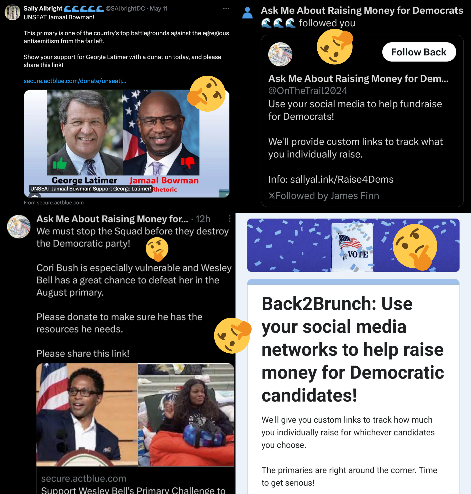
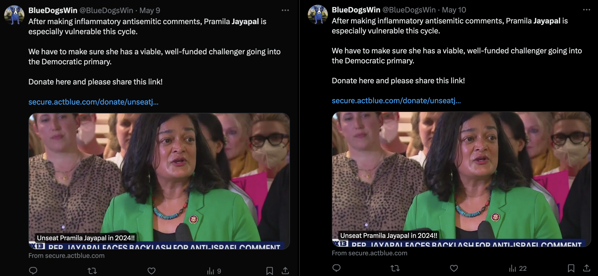

# Two former Hillary Clinton campaigners organized a PAC that's trying to destroy The Squad
## Primarying them is "critical to our mission"

Several former Hillary Clinton campaigners are involved in fundraising for a hybrid PAC called [**Pro PAC**](https://www.fec.gov/data/committee/C00858100/) that aims to unseat The Squad. 

---

A few weeks ago, trans public policy activist and comrade of mine Corinne Green [tweeted](https://twitter.com/gaynarcan/status/1784450254093402367) about an odd account that had followed her recently called [Ask Me About Raising Money For Democrats 🌊🌊🌊 (@OnTheTrail2024)](https://twitter.com/onthetrail2024). It's an election year, so Democrats attempting to fundraise isn't surprising - what made this account odd isn't just fundraising for campaigns against Republicans, but also **for [primary challengers](https://secure.actblue.com/donate/unseatcoribush) against the progressive group of Congressional Democrats known as [The Squad](https://en.wikipedia.org/wiki/The_Squad_(United_States_Congress))**.  

To make matters even more bizarre, @OnTheTrail2024 also promotes a [Google Forms application](https://docs.google.com/forms/d/e/1FAIpQLSdaLJwZKkLJeEjm-sFbZ8xAB3j6oURkPPwjkbctgdj7shD17g/viewform)  for a group called "Back2Brunch". Apparently operated by a [Twitter account of the same name](https://twitter.com/back2brunch), Back2Brunch is a call to action to "use your social media networks to help raise money for Democratic candidates". This fundraising is done through ActBlue links that contain personalized tracking codes that allow each person to keep track of how much donation money they've brought in, presumably for bragging rights. Corinne's reaction to learning about this was pretty much the same as mine: **"WTF"**

I was very curious as to who came up with this scheme and it didn't take me long to find an answer. [Former Clinton campaigner](https://www.sallylalbright.com/) and organizer of Joe Biden's Presidential Inaugural Committee [Sally Albright](https://twitter.com/SAlbrightDC) says on her [website](https://www.sallylalbright.com/) that she runs a podcast also named "Back to Brunch", though I couldn't find any episodes of it. She also has a second, older Twitter account named [@SilentAmuse](https://twitter.com/silentamuse) that posts Democratic fundraising links and seemingly advertises Back2Brunch's promotion competition. None of the other accounts I found involved in the competition appear to be as involved with Back2Brunch as Albright is, so I think it's safe to assume she's the organizer.

The ActBlue links all raise money for the the same hybrid political action committee: "Pro PAC". [FEC documents](https://docquery.fec.gov/cgi-bin/forms/C00858100/1737099/) for the PAC indicate that it was formed in November 2023, potentially indicating that it was created in response to The Squad's opinions on Palestine that diverge from those of the president. The person listed as both treasurer and custodian of records for Pro PAC is [Victoria Perrone](https://twitter.com/vperronedem), an experienced campaign organizer that political consultancy work through her [Spruce Street Compliance](https://www.sprucestreetcomp.com). Perrone previously worked on Hillary Clinton's campaign in Pennsylvania and most recently served as treasurer for John Fetterman's 2022 senatorial campaign. Fetterman has infamously [denounced the "progressive" label](https://www.nbcnews.com/politics/congress/-not-progressive-fetterman-breaks-left-israel-immigration-rcna129747) he previously embraced in part due to his conservative stance in support of Israel's invasion of the Gaza Strip. Spruce Street Compliance also advertises their past work with [Black Voters Matter](https://en.wikipedia.org/wiki/Black_Voters_Matter), which is ironic considering she now helps a PAC that aims to remove several black Democrats from office.

### The Fundraisers

These are all of the ActBlue fundraising campaigns associated with Back2Brunch I could find that have been posted to Twitter. Of the nine squad members, Pro PAC is raising cash for primaries against four of them: Cori Bush, Summer Lee, Ilhan Omar, and Pramila Jayapal.

There are a few fundraisers for Pro PAC that haven't been posted with referral codes, so I assume they aren't currently part of the Back2Brunch campaign. However, it's worth noting that one of these unused fundraisers is simply called ["Primary The Squad in 2024!!!"](https://secure.actblue.com/donate/primarythesquad2024).

| Candidate          | Title                                                    | URL                                                    |
| ------------------ | -------------------------------------------------------- | ------------------------------------------------------ |
| Biden-Harris 2024  | Are you Ridin' with Biden 2024?                          | https://secure.actblue.com/donate/bidenharris2024      |
| Biden-Harris 2024  | Reelect Biden Harris to Stop the MAGA Anti-woman Agenda! | https://secure.actblue.com/donate/trust-women          |
| Wesley Bell (MO)   | Help Us Unseat Cori Bush!!                               | https://secure.actblue.com/donate/unseatcoribush       |
| Bhavini Patel (PA) | Political newcomer Bhavini Patel to challenge Summer Lee | https://secure.actblue.com/donate/bhavinipatel         |
| Don Samuels (MN)   | Unseat Ilhan Omar in 2024!!!                             | https://secure.actblue.com/donate/unseatilhanomar      |
| n/a                | Unseat Pramila Jayapal in 2024!                          | https://secure.actblue.com/donate/unseatjayapal        |
| Josh Stein (NC)    | IT'S TRUE!! NORTH CAROLINA IS IN PLAY!!                  | https://secure.actblue.com/donate/joshsteinforgovernor |
| n/a                | Let's Beat Gym Jordan in 2024                            | https://secure.actblue.com/donate/beatgym              |
| Jon Tester (MO)    | Reelect Jon Tester To Hold the Senate Majority           | https://secure.actblue.com/donate/jontestermt          |
| n/a                | Turn Congress Blue 2024                                  | https://secure.actblue.com/donate/turncongressblue2024 |
| n/a                | Unseat Matt Gaetz in 2024!                               | https://secure.actblue.com/donate/unseatmattgaetz      |

Reading through the descriptions for all of the fundraisers, I noticed some interesting details:

- The justification used for supporting Wesley Bell in "Help Us Unseat Cori Bush!!" are Bush's opposition of the genocide in Gaza, support of Defund the Police, and Bell's superior fundraising attempts (something Pro PAC is actively contributing to).
- No criticism of Summer Lee is given at all to justify Pro PAC's funding of her primary challenger -- John Fetterman even endorsed her before October 7th. Lee went on to defeat Patel in the primary.
- Strangely, the Biden-Harris fundraisers says "It's Official! Joe Biden and Kamala Harris are running!" as if this information is new even though Pro PAC didn't exist at all before November 2023.
- The "Unseat Pramila Jayapal" fundraiser isn't going to a candidate. Donations go directly to Pro PAC, presumably to "make sure she has a viable, well-funded challenger". The call to action begins with the text **"We must stop the Squad before they destroy the Democratic party"**.
 - Similarly, the "Let's Beat Gym Jordan" and "Unseat Matt Gaetz in 2024" campaigns are also in support of Pro PAC rather than a specific candidate.
- One of Pro PAC's fundraisers for Joe Biden is called "Reelect Biden Harris to Stop the MAGA Anti-woman Agenda!". Ironically, the "Help Us Unseat Cori Bush!!" fundraiser is in support of a man's primary challenge against a women.

---

### My Take

Here's my take on all this: I don't like the fact that two moderate Democrats associated with the Hillary Clinton campaign *really* want to get rid of some of the party's most progressive congresspeople.

I especially don't like this fact when the Democratic party has been very loudly begging voters to unite in defeating Donald Trump. Spending time and money on primary efforts doesn't accomplish this goal, nor does it address the underlying issues causing division in the party in the first place - namely, Joe Biden's steadfast support for Israel's ongoing genocide in Palestine.

### Appdenix: Who's doing the fundraising

These are all the accounts I've found that seem to be participating in Back2Brunch. The `refcode` tracking codes in the Pro PAC ActBlue URLs these accounts post align perfect with their account names.

At first I was concerned that this may be a network of bots posting the links because Sally Albright's referral competition promotes spammy social media behavior that is indistinguishable from that of bots. @BlueDogsWin for example has posted the same tweet about Pramila Jayapal over 20 times. Some activity from these accounts appears to be genuine however, so it seems likely that these links are being spammed manually.

| Handle           | Username                                        | `refcode` |
| ---------------- | ----------------------------------------------- | --------- |
| @Back2Brunch     | Back2Brunch 🌊🌊🌊🌊🌊🌊🌊🌊🌊                  | b2bjm     |
| @SilentAmuse     | Silent Amuse                                    | silamjm   |
| @OnTheTrail2024  | Ask Me About Raising Money For Democrats 🌊🌊🌊 | ottjm     |
| @BluMajority     | Blue Majority                                   | blujm     |
| @CandlemoreComms | Candlemore 🌊🌊🌊                               | candlejm  |
| @QuinnBlues      | Quinn 🌊🌊🌊🌊🌊                                | quinnjm   |
| @ScreamingArgos  | Countless Screaming Argonauts🌊🌊🌊             | RplyArgo  |
| @PearlzB4Wine    | Pearls Before Wine🌊🌊🌊🌊🌊                    | pearljm   |
| @SAlbrightDC     | Sally Allbright🌊🌊🌊🌊🌊                       | salbjm    |
| @BlueDogsWin     | BlueDogsWin                                     | dogim     |
| @WriteBlueInk    | Writing in Blue Ink🌊🌊🌊                       | writejm   |
| @amarsnowe       | A. Marbury Snowe 🌊🌊🌊🌊🌊                     | marbjm    |
| @Raise4Dems      | Raise4Dems                                      | 4djm      |
| @DemsWin2024     | Demswin2024                                     | dwjm      |
| @LeftWordInk     | LeftWORD 🌊🌊🌊                                 | lwjm      |
| @UnseatTheSquad  | UnseatTheSquad 🌊🌊🌊                           | unseatjm  |
