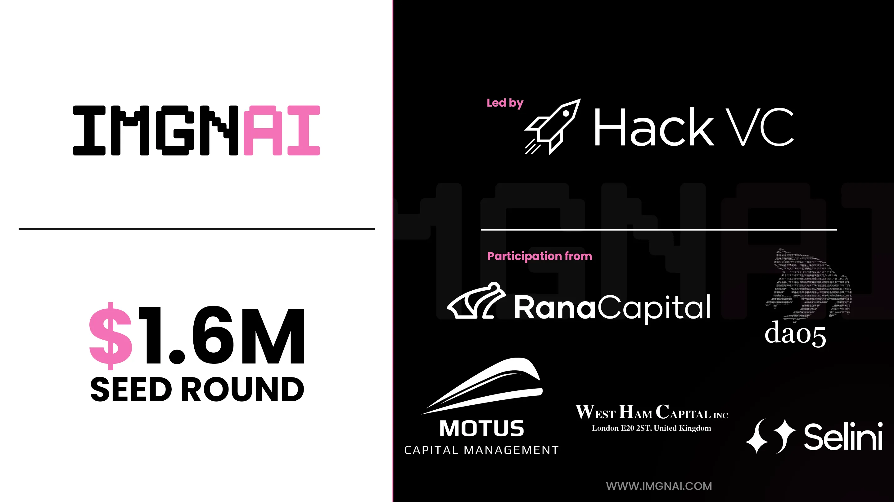

# "Accelerate Catgirl Research" Research

## In which i try to understand what the heck happened outisde GTC last month

Nvidia's [GPU Technology Conference (GTC)](https://www.nvidia.com/gtc/) for artificial intelligence was held last March. There were some protestors outside the event this year, holding signs arguing against the regulation of AI and while repeating their one demand: **"ACCELERATE CATGIRL RESEARCH"**.

When I saw this, I absolutely needed to figure out just what in tarnation was going on. I've managed to find a couple of answers, but boy oh boy does this story get *weird*.

The "accelerate catgirl research" slogan being chanted can be seen on the protestors' matching t-shirts. 

Now, I am not saying that I know for a fact that these protestors were paid...but I am saying that I've never seen so many women that are into crypto in one place at the same time.
### ImgnAI

It didn't take long to find out who was behind the protest. Some searching for "catgirl research" on Twitter reveals that an AI startup called [ImgnAI](https:///app.imgnai.com) was its originator, with the company's account posting [several](https://twitter.com/imgn_ai/status/1769826150610559036) [videos](https://twitter.com/imgn_ai/status/1769791182270333067)  of the protest. A search for "accelerate catgirl research" on Google Images also gives results for the [t-shirts](https://oratee.com/campaign/accelerate-imgnai-catgirl-research-t-shirt) worn by the protestors that have imgnAI's name visible.

In addition to their generative AI crypto scheme, imgnAI has another product: a girlfriend chatbot named [Naifu](https://imgnai.com/naifu-early-access/). ImgnAI claims that Naifu is "largely uncensored", allowing the user to "roleplay, discuss taboo topics, and explore the limits of your imagination" - it's unclear exactly what these taboo topics are, but one testimonial[^1] claims that Naifu "opened their eyes to vast government conspiracies".

### Thelema: the occult anime accelerationist behind ImgnAI

ImgnAI was co-founded by an anonymous developer who goes as Thelema ([@networkspirits](https://twitter.com/networkspirits) on Twitter), who also serves as its CEO (["cat ear organizer"](https://twitter.com/networkspirits/status/1763658123519091134)). Thelema [appeared](https://twitter.com/rosspower/status/1762243394833629390/photo/1) in person wearing a mask at the Convergence AI crypto/AI summit in Denver. One slide at this presentation [decried](https://twitter.com/rosspower/status/1762243442044731400/photo/1) the addition of "politics" into MidJourney and the last one contained a [meme](https://twitter.com/rosspower/status/1762243479340490815/photo/1) of a Milady, an NFT line frequently referenced by her (more on this later).

In a blog post about ImgnAI's philosophy called [Generative AI: accelerating creativity & self expression](https://mirror.xyz/networkspirits.eth/t2hW0Xk6artfSuDBlsCbmrSSeD40JYAOUvRESs6rZnc), Thelema said:
It also says:
>Simply put, the LLM fuels data accessibility and accelerates IQ. Generative art provides creative balance, allowing our EQ to flourish. The combination of both accelerates human experience and potential as a whole.

And ends with a reference to AGI:
>I, and we at imgnAI hope to add to these conversations and play a part in preserving some of the important parts of humanity as we hit the speedrun to AGI - as well as the values we hold close as part of the crypto community.
### Nick Land & The CCRU

In her post, Thelema also explains the origins of her Aleister Crowley-inspired username.
>We’re currently witnessing the dawn of a new era of online subcultures, some based deeply within the AI realms. Whilst Landian accelerationism isn’t new and has been part of, or at least complimentary to, subcultures such as Remilia; we now see a rise in mindshare of e/acc (and the many accelerationist variants), 21e8 et al, and we’re watching these communities grow and split with their own distinct traits and beliefs in real time.

>As my anon name suggests, I am a long-time Crowley fan so seeing the lore build from the early Land/CCRU days to where we are now, which still feels like the beginning, feels like a great time to be alive as these ideas are building their roots within modern culture.

"Landian" here refers to the writings of [Nick Land](https://en.wikipedia.org/wiki/Nick_Land), an infamous philosopher from the University of Warwick who would later go on to helped craft the reactionary "Dark Enlightenment" movement. During his time at Warwick in the 1990's, Land would draw from the writings of Félix Guattari and Gilles Deleuze to draft his own vision of accelerationism as a philosophical position. His most famous writing from this period is a 1994 piece called [*Meltdown*](http://www.ccru.net/swarm1/1_melt.htm) which laid out his sci-fi vision of the future as such:
>The story goes like this: Earth is captured by a technocapital singularity as renaissance rationalitization and oceanic navigation lock into commoditization take-off. Logistically accelerating techno-economic interactivity crumbles social order in auto-sophisticating machine runaway. As markets learn to manufacture intelligence, politics modernizes, upgrades paranoia, and tries to get a grip.

Land created an unofficial collective at the university called the [Cybernetic Culture Research Unit (CCRU)](http://www.ccru.net/) that produced a bevy of esoteric cyberpunk art pieces and attracted students such as influential dubstep producer [Kode9](https://en.wikipedia.org/wiki/Kode9) and [Mark Fisher](https://en.wikipedia.org/wiki/Mark_Fisher) who would later go on to work on more modern interpretations of accelerationism.

Towards the end of the 90's, Land began to increasingly abuse amphetamines and the CCRU collective became increasingly bizarre and insular. In an interview, former member Robin Mackay [described](http://readthis.wtf/writing/towards-a-transcendental-deduction-of-jungle-interview-part-1/) Land at the time as being in a disturbing "extreme number mania period" and claimed his activities "didn’t fit into any known definition of ‘philosophy’". It was during this manic period that Nick Land developed an interest in occult magician [Aleister Crowley](https://en.wikipedia.org/wiki/Aleister_Crowley), going as far as to move the CCRU's headquarters to one of Crowley's former abodes. Aleister Crowley devised a occult magical belief system he referred to as [Thelema](https://en.wikipedia.org/wiki/Thelema), from which the crypto developer draws her name.

A Twitter account by the name of [Bot Chad](https://twitter.com/BotChadX) is the other co-founder of imgnAI who identifies as an effective accelerationist and whose bio says "I hope AI enslaves humanity". Such an attitude would apparently contradict with Thelema's professed love for humanity, but it's perfectly in line with Land's brand of AI-fueled nihilism. 
### Remilia Corp, Milady, and right-wing NFT madness

As mentioned earlier, Thelema is a big fan of the Milady Maker NFT line and their creator, the Remilia Corporation. In a [November 2023 tweet](https://twitter.com/networkspirits/status/1728442706366484949) praising the project, she celebrated Remilia "pushing cancel culture into its own combustion" while celebrating accelerationism taking over the tech world. 

The backstory behind Remilia is far too weird and dark to cover in this article, but here's the Cliff Notes version of what happened: 

Krishna Okhandiar (aka "Charlotte Fang") is the creator of Remilia and Milady. Shortly after Milady launched in 2021 and a community began developing around the NFT collection, reporters began digging into Charlotte Fang's history on the public internet and the 4chan-esque memes and symbolism that constantly appear alongside the Milady NFTs. An [article from CoinDesk](https://web.archive.org/web/20220505153929/https://www.coindesk.com/layer2/2022/05/05/everything-you-always-wanted-to-know-about-miladys-but-were-afraid-to-ask/) on the topic detailed Fang's connection to Land's writings[^2] and the Kali Yuga Accelerationism group that frequently used Nazi dogwhistles.  

Fang would later be [sued](https://news.bloomberglaw.com/esg/nft-founder-charlotte-fang-likened-to-cult-leader-in-lawsuit) by the other co-founders of Remilia in a lawsuit accusing him of tanking Milady's value with his racism and stealing over a million dollars in crypto. At the same time, Fang himself was [alleging](https://www.ccn.com/news/milady-nft-founder-sues-stealing-income-ip/) that his former partners tried to steal the Milady IP owned by him exclusively through Remilia. This public kerfluffle led to Milady NFTs [losing over 40% of their value](https://www.dlnews.com/articles/people-culture/milady-nfts-lose-a-third-of-their-value-as-founders-fight/).

### West Ham Capital

I decided to look into the funders in this image and one of them stood out to me in particular: "West Ham Capital, Inc". Its listed address of *London E20 2ST, United Kingdom* is actually that of the London Stadium, currently the home of [West Ham United FC](https://www.whufc.com/). It seems doubtful that West Ham Capital is officially associated with the actual West Ham football club.

I then found West Ham Capital's [website](https://westhamcapital.com/) and uh... the whole thing is just a giant meme.

Their [legal page](https://westhamcapital.com/legal) makes things even more mysterious. It includes this interesting bit:
>West Ham Capital Inc. does not file any reports with the Securities and Exchange Commission, because seriously, fuck that guy.

The page goes on to emphasize that any and all of the information on the website could be incorrect[^3] . Another post on their homepage is designated as a [message from the company](https://westhamcapital.com/message) whose only "recommendations"[^4] are such:

>Every year, millions of people lose billions of dollars on their government-sanctioned lotteries. Why this form of state-sanctioned gambling is legal while many others are not confuses us, but frankly, it still beats losing all your money in a centralized shitcoin casino — at least the lottery proceeds ostensibly support public services rather than hollow PR campaigns about Effective Altruism[^5]. And where else are you going to put your money, the stock market? Bonds? Real estate? LOL.

West Ham's obviously fake [holdings page](https://westhamcapital.com/holdings) is dedicated to dunking on FTX and their motto appears to be "Degeneranti, genus opprobrium" which translates to "To a degenerate man his family is a disgrace". Similarly, their obviously fake [governance page](https://westhamcapital.com/governance) declares that West Ham is an "insider cabal and you're not part of it" whose initiation ritual "involves a Bahamian Penthouse and a non-trivial amount of Vaseline and amphetamines".
#### OK, so WTF is going on then??

Even if West Ham Capital's website is just a huge joke, there has to be a real legal entity associated with it in order for it to be funding IMGNAI; I set out to find it.

Searching for West Ham in the [UK's companies register](https://find-and-update.company-information.service.gov.uk/company/15172852/officers) reveals that it was official incorporated on September 28th, 2023 by Dr. Laurence Edward Day. Dr. Day ([@functi0nZer0](https://twitter.com/functi0nZer0) on Twitter) is also in charge of [Zero Day Technologies](https://find-and-update.company-information.service.gov.uk/company/12136768), his Ethereum-focused [consulting firm](https://sites.google.com/zerodaytechnologies.co.uk/zerodaytechnologies/home?authuser=0). Thelema has tweeted [memes](https://twitter.com/networkspirits/status/1773768471639105945/photo/1) referencing both Dr. Day and West Ham. Day can also be seen wearing the same ImgnAI shirt from the protest in a [trailer](https://twitter.com/CodeIsLawFilm/status/1780975575722496335) for the upcoming crypto documentary [Code Is Law: The Movie](https://twitter.com/CodeIsLawFilm)[^6].

In a [YouTube video](https://www.youtube.com/watch?v=fJiTHBqBCsA) from March 2023, West Ham's original incarnation was revealed by Dr. Day to be a massive crypto group chat on Twitter organized by him. It's unclear how this group chat became big enough to become a legit venture capital firm, a feeling apparently shared by West Ham itself - its Twitter account [posted](https://twitter.com/WestHamGC/status/1750940235343519764/photo/1)a meme indicating that the situation was a surprise to them as well. 

 

Fast forward to this year: ImgnAI and West Ham sponsored a private party at the 2024 ETH Denver conference called [West Ham: No Longer Joking](https://lu.ma/isitvegan) in the lead up to GTC.

It's unclear who else is officially involved with West Ham beside Lawrence Day. A Twitter user by the name of [@thepaulbalaji](https://twitter.com/thepaulbalaji) claims to be West Ham's "head of wristbands" - I have no clue what that means. Another user named "scrypto" penned what appears to be a critical [open letter](https://twitter.com/scrypto_/status/1693903335500505169) to the West Ham group chat, but I'm not convinced this isn't just another meme.

Besides West Ham, all of the other groups that funded ImgnAI appear to be normal crypto/web3 VC firms (though dao5 has an [advisor](https://dao5.com/collective) they refer to as ["Cuck of Femboy Capital"](https://twitter.com/cuckqueeen)).

### What did I learn?

I learned that Remilia, Milady, ImgnAI, Thelema are all extremely cursed.

I learned that Nick Land's writing and occult interests have a growing influence on the right-wing meme NFT ecosystem.

I learned that a joke group chat based on a British football club is now sponsoring generative AI startups and their IRL publicity stunts

Beyond that, I don't think I learned very much of value. I did sustain tremendous amounts of psychic damage while researching this article though.

### Additional Reading

Both imgnAI and Milady fall under the "cute/acc" branch of accelerationism, which Matt Colquhoun has written extensively about cute/acc and its relation to Nick Land over at their Xenogothic blog. Cute/acc doesn't inherently fallunder the umbrella of "effective accelerationism" like other "/acc" variants, but is instead a descendent of Nick Land's proto-e/acc views[^7] and could theoretically be described as left wing, I believe the concept of left accelerationism is mostly dead in 2024[^8] and any association with NFTs invariably attracts crazed libertarians.

Matt "Xenogothic" Colquhoun on cute/acc: https://xenogothic.com/2024/02/02/cute-accs-postmodern-princedoms/
Xenogothic on e/acc: https://xenogothic.com/2023/12/20/effective-accelerationism-brxg-on-acid-horizon-brwith-a-note-on-accelerationism-brand-its-revolutionary-sentiments/
Miaia Crimew on Remilia and Milady: https://maia.crimew.gay/posts/brg/
Ryan Broderick on e/acc and Remilia: https://www.garbageday.email/p/you-are-tearing-me-apart-eacc
CoinDesk article on Charlotte Fang and Remilia (via the Wayback Machine): https://web.archive.org/web/20220505153929/https://www.coindesk.com/layer2/2022/05/05/everything-you-always-wanted-to-know-about-miladys-but-were-afraid-to-ask/

---

##### Notes

[1] These user reviews may be entirely fabricated; I have no way of knowing for sure.
[2] Also mentioned as influential within this social sphere is the edgy [Angelicism01](https://cashedcobrazhousewriter.substack.com) Substack which has also made [references](https://cashedcobrazhousewriter.substack.com/p/reaction-harmony-korine-hitler-mitchell) to Land's accelerationism. The blog also has [several](https://cashedcobrazhousewriter.substack.com/p/somebody-please-columbine-the-entire) [posts](https://cashedcobrazhousewriter.substack.com/p/somebody-please-columbine-the-entire) calling for the "Columbining" of journalists.
[3] It also encourages the sharing of information on its website, like I'm doing right now.
[4] West Ham states that their advice was "not, in fact, financial advice". They're also apparently looking for a new lawyer.
[5] Memes aside, this is a pretty decent critique of crypto and EA if I'm being honest.
[6] Lawrence Day's participation in this film is most likely due to a 2021 incident where his crypto project got, for lack of a better word, ["pwned"](https://www.bloomberg.com/news/features/2022-05-19/crypto-platform-hack-rocks-blockchain-community) by a racist hacker.
[7] This is ironic because Land has been vocal about his dislike of anime, [tweeting](https://twitter.com/xenocosmography/status/1746122125348626909) in January 2024 that he has a "cartoon allergy". 
[8] There's a minority of people with good politics still adopting the "accelerationist" and "l/acc" labels, but they've sadly been eclipsed by the right-wing anctics of effective accelerationism. I don't believe any sort of "acc" is the most descriptive term for an ideology, but that's a linguistic nitpick outside the scope of this blog post.