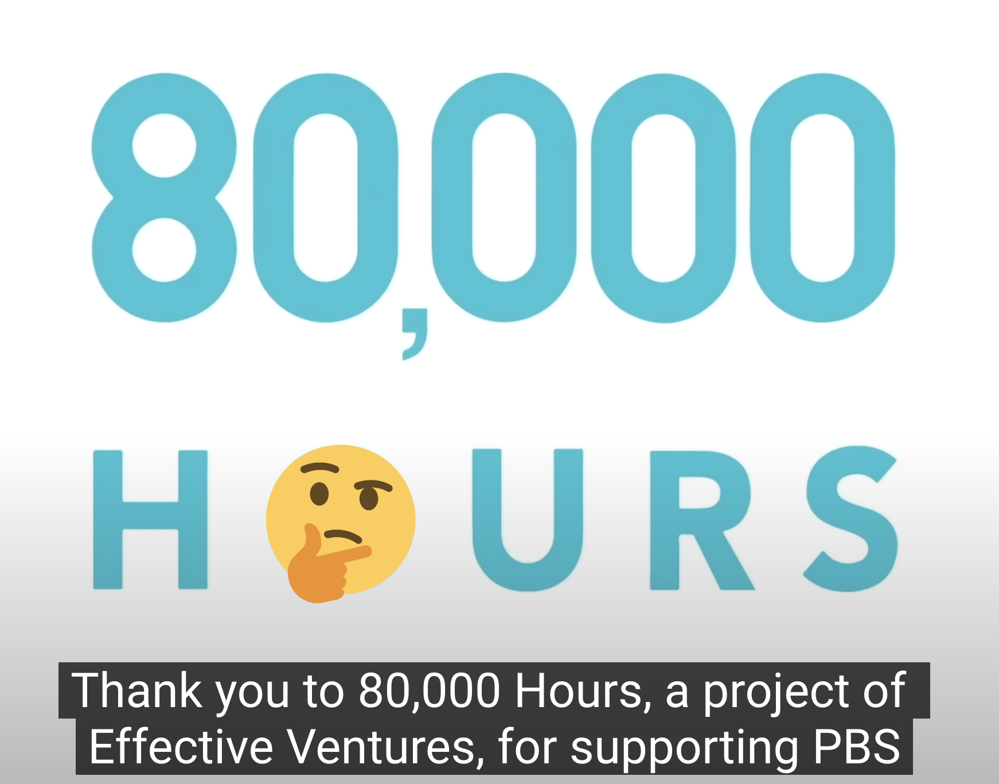

# Effective Altruists are trying very hard to recruit on YouTube

Back in July 2023, Nitasha Tiku of The Washington Post wrote an [article](https://www.washingtonpost.com/technology/2023/07/05/ai-apocalypse-college-students/) detailing the effective altruism movement's fixation on preventing a hypothetical AI doomsday. Special focus was paid to the funding activities of Open Philanthropy, the grant-making organization backed by the vast fortune of Facebook co-founder Dustin Moskovitz and his wife Cari Tuna. Tiku wrote:

>[Open Philanthropy](https://www.openphilanthropy.org/) alone has funneled nearly half a billion dollars into developing a pipeline of talent to fight rogue AI, building a scaffolding of think tanks, YouTube channels, prize competitions, grants, research funding and scholarships — as well as a new fellowship that can pay student leaders as much as $80,000 a year, plus tens of thousands of dollars in expenses.

Since then, I have been *very* curious as to what YouTube channels are part of the effective altruist scaffolding they've constructed. After extensively searching through both Youtube and Open Philanthropy's public grants, I've identified 124 Youtube videos on 49 different channels that sponsored by two prominent effective altruist operations: [GiveWell](https://en.wikipedia.org/wiki/GiveWell) and [80,000 Hours](https://en.wikipedia.org/wiki/80,000_Hours).

#### Understanding the Effective Altruist Organizations involved

Effective altruist organizations often share employees and coordinate their actions in ways that are not apparent at first glance. In order to make sense of EA recruitment on YouTube, there's three overlapping groups that need to be understood:
- **GiveWell** is a charity recommendation service that uses the effective altruism movement's idiosyncratic version of utilitarian ethics to determine the "highest impact" nonprofits. This often leads to a narrow focus on a handful of charities, which has led to various [criticisms](https://ssir.org/articles/entry/the_elitist_philanthropy_of_so_called_effective_altruism) over the years.
- **80,000 Hours** runs a career mentorship service, job board, and podcast that uses those same utilitarian ethical formulas to advise people on the "highest impact" careers. Unlike GiveWell, these recommendations often fall within the "AI Safety" and biosecurity fields because they're perceived as having a small chance of saving billions of humans. A newer variation of effective altruist ethics called longtermism extends this to [quadrillions of future humans](https://80000hours.org/articles/future-generations/), effectively making these jobs the *most important careers in human history* in the eyes of the movement. 80,000 Hours is operated by Effective Ventures alongside the Centre for Effective Altruism which in turn runs the Effective Altruism forum.
- **Open Philanthropy** is a grant-making nonprofit created and primarily funded by Facebook co-founder Dustin Moskovitz and his wife Cari Tuna. Open Philanthropy [started](https://www.givewell.org/about/gw-op-relationship) as a division within GiveWell for Tuna and Moskovitz to donate their wealth to GiveWell's recommended charities via their [Good Ventures](https://www.goodventures.org/) foundation. Open Philanthropy became a separate organization from GiveWell in 2017, but executives of both organizations serve on the others' boards and Open Philanthropy continues to [support GiveWell's operations](https://blog.givewell.org/2013/09/17/balancing-support-from-good-ventures-vs-individuals/) as well as donating to their recommended charities. Open Philanthropy has also [funded](https://80000hours.org/about/donors/) a large portion of 80,000 Hours' budget for quite some time - they've given over £10 million to 80,000 Hours every year from 2017 to 2022 with the exception of 2021 (data for 2023 is not available).

Confused? So am I.
### The videos

I've compiled a list of all the videos I've found on my standalone blog at [polemics.md](https://polemics.md/datasets/ea-youtube-videos)[^1]. Here's what I noticed:

- The majority of videos were sponsored by GiveWell; only 24 of 124 were sponsored by 80,000 Hours, but the channels selected tend to be of a higher profile.
- The videos receiving sponsorship vary wildly in popularity. Some have millions of views while others only have a few dozen.
- A video from [TLDR News Global](https://www.youtube.com/@tldrnewsglobal) called [Why the US is Tempering its Support for Israel](https://www.youtube.com/watch?v=1wh3CK1XUe4) is about the ongoing genocide in Palestine being perpetrated by Israel was sponsored by GiveWell and links to their donation page. However, none of the charities in GiveWell's [Top Charities Fund](https://www.givewell.org/charities/top-charities)operate in the Gaza Strip or the West Bank. It's unclear from GiveWell's public [grants list](https://airtable.com/appGuFtOIb1eodoBu/shr1EzngorAlEzziP) if GiveWell has ever granted money to a charity that does work in Palestine. When asked about Gaza in December 2023, CEO Elie Hassenfeld [replied](https://files.givewell.org/files/DWDA%202009/GiveWellNewYorkeventtranscript2023-12-06.pdf) that GiveWell is **"not trying to select the most important problems"** and implied that Westerners are limited in their ability to influence the events that are unfolding. 
- Though it doesn't have many views, one of the videos sponsored by GiveWell is a interview with effective accelerationism creator "Beff Jezos" about ["doxxing, e/acc, and why crypto will save AI"](https://www.youtube.com/watch?v=GX-ylUhKbpE) on [Upstream with Erik Torenburg](https://www.youtube.com/@UpstreamwithErikTorenberg).
- GiveWell has sponsored 11 other videos on Torenburg's channel, including this [interview](https://www.youtube.com/watch?v=iGpQs9tMKEU) about embryo screening and fertility with Noor Siddiqui, founder and CEO of genetic testing company Orchid. Torenburg suggests that Elon Musk's decision to have more children could influence the culture in a manner similar to Taylor Swift. He goes on to bring up those who are worried about existential risk and "technological innovation" as a group of people who could be drawn to pro-natalism. Orchid provides provides genetic testing services for embryos that includes screening for autism as well as physical disorders - their website has an [FAQ page](https://guides.orchidhealth.com/post/my-brother-has-autism-what-does-this-mean-for-me) that includes the question "Based on my family history of autism, are there options for me to prevent or reduce the chance of having a child affected with autism?".  Geneticist Mark Daly has described the company as "ethically repugnant" in an [article](https://www.science.org/content/article/genetics-group-slams-company-using-its-data-screen-embryos-genomes) from Science Magazine.
- Another GiveWell-sponsored video on Erik Torenburg's channel is an [interview](https://www.youtube.com/watch?v=qDX1i74ze4s) with entrepreneur Balaji Srinivasan. Srinivasan has recently [laid out](https://www.parallelmirror.com/balaji-srinivasans-gray-vision-for-san-francisco/) an authoritarian vision of San Francisco controlled by a "Gray Tribe" of technologists and once [suggested](https://www.businessinsider.com/venture-capitalist-balaji-srinivasan-suggested-doxxing-journalist-nyt-2021-2) "siccing" a part of his audience on a journalist. Torenburg has also [repeatedly](https://www.youtube.com/watch?v=PjYUScg0tr4) [interviewed](https://www.youtube.com/watch?v=-ksJtugea9o) right-wing writer Richard Hanania in recent months, well after his white supremacist writings for neo-Nazi outlets was [exposed](https://www.huffpost.com/entry/richard-hanania-white-supremacist-pseudonym-richard-hoste_n_64c93928e4b021e2f295e817) by HuffPost.

  
Other notable channels to receive sponsorship from 80,000 Hours and GiveWell include PBS Eons and Space Time, Sam Seder's The Majority Report, LegalEagle, Wendover Productions, TierZoo, and Extra Credits.

Beyond the broad effective altruist advertising campaign on YouTube, there's two particular channels that merit special discussion: Kurzgesagt and Rational Animations.

### We need to talk about Kurzgesagt (again)

[Kurzgesagt](https://www.youtube.com/@kurzgesagt) (German for "in a nutshell") is a science YouTube channel that produces short animated videos on a variety of topic related to science and technology. With 21 million subscribers, it is one of the biggest science channels on YouTube and the [2nd most subcribed to](https://socialblade.com/youtube/top/country/de/mostsubscribed) channel from Germany.

Starting from 2022, Kurzgesagt has received three [grants](https://www.openphilanthropy.org/grants/?organization-name=kurzgesagt) from Open Philanthropy for creating and translating video content related to catastrophic risks from AI and pandemics. These grants were made for the purpose of advancing Open Philanthropy's [focus on longtermism](https://www.openphilanthropy.org/research/update-on-cause-prioritization-at-open-philanthropy/#Long-termist_vs._near-termist_views). In particular their [grant](https://www.openphilanthropy.org/focus/global-catastrophic-risks-capacity-building/) to Kurzgesagt in 2023 was filed under Open Philanthropy's ["Global Catastrophic Risks Capacity Building"](https://www.openphilanthropy.org/focus/global-catastrophic-risks-capacity-building/) category. This used to be referred to as "Effective Altruism Community Growth (Longtermism)", a name that makes clear Open Philanthropy's goal of gaining new recruits for the EA movement.

I'm far from the first person to raise questions regarding Kurzgesagt's funding. In January 2023, YouTube video essayist The Hated One released a video called [How Kurzgesagt Cooks Propaganda For Billionaires](https://www.youtube.com/watch?v=HjHMoNGqQTI) laying out the channel's funding sources. Kurzgesagt gave an [official response](https://old.reddit.com/r/kurzgesagt/comments/10jlyyk/kurzgesagt_statement_to_the_conflict_of_interest/) on their subreddit, which was followed by a lengthy [counter-response](https://www.reddit.com/r/thehatedone/comments/10pb1q9/my_response_to_kurzgesagt/) on The Hated One's own sub. The Hated One's video discusses several of Kurzgesagt's funding sources, but my focus here is on Open Philanthropy specifically.

As part of his counter-response, The Hated One had this to say about the idea of sponsor money influencing Kurzgesagt:
> I think Kurzgesagt perfectly aligns with the values of their sponsors. That doesn't make it immune to influence. It arguable makes it even worse. It is because of your values that you receive all this significant funding. The problem is, that any channel that would try to go against your values, would not receive such funding and would not have enough resources to compete with you.

After watching Kurzgesagt release videos increasingly aligned with longtermism such as, I fully agree with this sentiment. 

To try and get an idea of where Kurzgesagt's own values lie, I turned to the tried and true method of checking who they've recently followed on Twitter. As of this writing, [@Kurz_Gesagt](https://twitter.com/Kurz_Gesagt) follows less than 200 accounts but these follows include Effective Altruisms [official account](https://twitter.com/EffectvAltruism), [80,000 Hours](https://twitter.com/80000Hours), [GiveWell](https://twitter.com/GiveWell),  [Open Philanthropy](https://twitter.com/open_phil), and a host of notable effective altruists and longtermists such as Tyler Cowen, Benjamin Todd, William MacAskill, Toby Ord, and Robin Hanson.

One particularly notable account on Kurzgesagt's list of followers is that of [Michael Shellenberger](https://twitter.com/shellenberger), a writer who's work has mostly recently been in the news for releasing "the WPATH Files", a [decontextualized, misleading, and pseudoscientific](https://www.erininthemorning.com/p/fact-check-216-instances-of-factual) attempt to discredit doctors providing gender affirming care to children and stoke the flames of the far right's ongoing hate campaign against transgender people. Shellenberger's header image is a call to "defund the thought police".

Besides his transphobia, Michael Shellenberger is known for downplaying climate change against the recommendations of a majority of climate scientists, having once [claimed](https://www.theatlantic.com/politics/archive/2022/06/california-governor-race-shellenberger-homelessness-san-francisco/661164/) that climate change is "not the end of the world". This is similar to the perspective presented by Kurzgesagt in their 2022 video called [We WILL Fix Climate Change!](https://www.youtube.com/watch?v=LxgMdjyw8uw). Despite the title, this video presented a global temperature rise of 2°C as an optimistic goal for dealing with climate change despite the fact that [projections](https://www.reuters.com/business/cop/whats-difference-between-15c-2c-global-warming-2021-11-07/)indicate that such an increase could cause widespread famines and the death of 99% of coral reefs on earth.

### Rational Animations

Over the course of Sam Bankman-Fried's well-publicized [fraud trial](https://www.washingtonpost.com/business/2023/11/02/sbf-bankman-fried-trial-ftx/) that recently concluded with his [sentencing to 25 years in prison](https://www.justice.gov/opa/pr/samuel-bankman-fried-sentenced-25-years-his-orchestration-multiple-fraudulent-schemes), details emerged about what he planned on doing with the money he stole from his FTX cryptocurrency exchange. Much ado was made about his brother's idea to [build a doomsday bunker on the island nation of Nauru](https://nypost.com/2023/07/21/ftx-wanted-to-buy-a-pacific-island-nation-to-prepare-for-apocalypse-lawsuit/), but the lawsuit also alleged that money was spent on a "**entity that posted animated videos on YouTube related to ‘rationalist and (effective altruism) material,’ including videos on ‘grabby aliens**". Thanks to the Wayback Machine's [backup](https://web.archive.org/web/20220910082348/https://ftxfuturefund.org/our-grants/?_funding_stream=open-call) of FTX's website, I can confirm that this entity is a YouTube channel called [Rational Animations](https://www.youtube.com/@RationalAnimations) . This is corroborated by the channel posted two [animated](https://www.youtube.com/watch?v=l3whaviTqqg) [videos](https://www.youtube.com/watch?v=LceY7nhi6j4) about "grabby aliens" in 2021.

In the wake of FTX's collapse in the fall of 2022, Open Philanthropy [offered](https://forum.effectivealtruism.org/posts/HPdWWetJbv4z8eJEe/open-phil-is-seeking-applications-from-grantees-impacted-by) to use their finances to support effective altruist projects who were previously promised money by FTX. Subsequently, their own grant of [$285,000](https://www.openphilanthropy.org/grants/rational-animations-video-animation-costs-2021/) to Rational Animations in 2021 was increased to  [$1,000,000](https://www.openphilanthropy.org/grants/rational-animations-video-animation-costs-2023/) in 2023, and again to [$2,980,355](https://www.openphilanthropy.org/grants/rational-animations-video-animation-costs-2021/) in 2024. Prior to this, Bankman-Fried was a longtime friend of William MacAskill, co-founder of both 80,000 Hours and the Centre for Effective Altruism, spending a month as director of development for the latter in 2017.

Rational Animations is even more explicit than Open Philanthropy in its goal to recruit people into longtermist ideology, with a particular focus on the AI doomsday scenarios popularized on the "rationalist" forum LessWrong by fiction writer Eliezer Yudkowsky[^2] . Videos on the channel promote links to the Effective Altruism Forum that [shares code](https://github.com/ForumMagnum/ForumMagnum) as well as an Open Philanthropy-funded [courses](https://aisafetyfundamentals.com/) on how to prevent hypothetical killer AI.

In a May 2023 LessWrong thread called [Should Rational Animations invite viewers to read content on LessWrong?](https://www.lesswrong.com/posts/TNsLdAZmSzMHTeaKf/should-rational-animations-invite-viewers-to-read-content-on), Rational Animations reveals that they have had discussions with Open Philanthropy about purposefully creating an "intellectual rabbit hole" leading to viewers to fall into that leads to the forum:
>In my most recent communications with Open Phil, we discussed the fact that a YouTube video aimed at educating on a particular topic would be more effective if **viewers had an easy way to fall into an "intellectual rabbit hole" to learn more**. So a potential way to increase Rational Animations' impact is to increase the number of calls to action to read the sources of our videos. LessWrong and the EA Forum are good candidates for people to go learn more. 

Rational Animations has additionally solicited [job applications](https://www.lesswrong.com/posts/mC5eWRwkfi3vJ9XB3/rational-animations-is-looking-for-an-ai-safety-scriptwriter) and [scripts relating to longtermism](https://www.lesswrong.com/posts/RH8nGG5vnuXc4eKu5/rational-animations-script-writing-contest) from LessWrong.

### Kurzgesagt x Rational Animations

In Kurzgesagt's video titled [The Second Deadliest Virus](https://www.youtube.com/watch?v=Kr57ax0OWMk), Kurzgesagt provides a link to a Rational Animations called [500 Million, But Not A Single One More](https://www.youtube.com/watch?v=ljmifo4Klss) in the video description, right before their disclosure of Open Philanthropy's funding. 500 Million, But Not A Single One More is an animated version of a [2020 thread of the same name](https://forum.effectivealtruism.org/posts/jk7A3NMdbxp65kcJJ/500-million-but-not-a-single-one-more) that was posted to the Effective Altruism Forum by a user named "jai". 

Rational Animations' video contains four separate links back to the EA forum, including the original thread. In the comments for that thread, a user excitedly points out that Kurzgesagt has indirectly promoted the thread, prompting jai to respond that he was "happy to see the animated-birds-explaining-things crossover with the animated-dogs-explaining-things, especially as I'm now working with the animated explainer dogs", indicating that he was now in an active partnership with Rational Animations.

I'm not sure what kind of conversations Kurzgesagt has had with Open Philanthropy or if they found out about Rational Animations via their shared funding source. However, it's clear from Rational Animations' actions that they have an interest in using Open Philanthropy's donations to grow the Rationalist, EA, and longtermist movements; topic covered in recents animations include [the 80,000 Hours Career Guide](https://www.youtube.com/watch?v=ll9myMeFU3g), [charter cities](https://www.youtube.com/watch?v=v-A1i2g9riU), [AI alignment](https://www.youtube.com/watch?v=jQOBaGka7O0), [mind uploading](https://www.youtube.com/watch?v=LwBVR68z-fg), and a [video adaptation of an Elizer Yudkowsky essay](https://www.youtube.com/watch?v=gpBqw2sTD08). Kurzgesagt's promotion of effective altruist organizations seems to suggest that they're interested in doing the same, albeit without Rational Animations' explicit focus on AI doom.

### Conclusion

I don't have any reason to believe that the majority of the non-tech YouTubers receiving these sponsorships knew about the bizarre and wealthy background of the philanthropic groups offering to sponsor them. Given that other Youtube sponsors are almost universally trying to sell something, I'm sure a sponsorship offer for purely altruist purposes seemed like a breath of fresh air. However, the effective altruist and rationalist ideologies can resemble cults in their most extreme forms. An ex-member recently [spoke out](https://mathbabe.org/2024/03/16/an-interview-with-someone-who-left-effective-altruism/) about high profile effective altruists using new recruitments to do their laundry and described their recruitment efforts as "scary":
>I think **there’s a really scary intentionality to get people involved in this movement**, to not just get involved, but really hooked to them. Because the idea of EA is that it’s also a lifestyle. It’s not just a cultural movement or a way to the job market, but it is just about how you think about the world and how you spend your life, and where you donate, and what you need to do with your career, And even how you eat, whether you’re vegan or how you source your food, it’s all of those things. In order to involve people in a movement that’s so broad and that spans every aspect of your life and how you live it, you need to really get that philosophical buy-in for it, you need to sell people on it and get them to commit for life. 

>And so I think that it starts at the university level. And then people start there, and they completely get indoctrinated into it. And there’s a very intense intentionality behind that, a strategy behind how they’re convincing 19-year-olds to change their career path and what they want to do with their lives and how they think and all of it, which is…

My goal in highlighting the recruitment efforts of these movements is to raise awareness among the YouTube community of their problematic elements and hopefully lead to more critical examination of these ad campaigns.

---

[^1] The full list of videos is available at https://polemics.md/datasets/ea-youtube-videos and can be downloaded in Markdown format from my [Github](https://github.com/rapka/polemics-md/blob/main/content/datasets/ea-youtube-videos.md).
[^2]  Refer to this [New York Times](https://www.nytimes.com/2021/02/13/technology/slate-star-codex-rationalists.html) article for more context on Eliezer Yudkowsky, LessWrong, and Rationality.