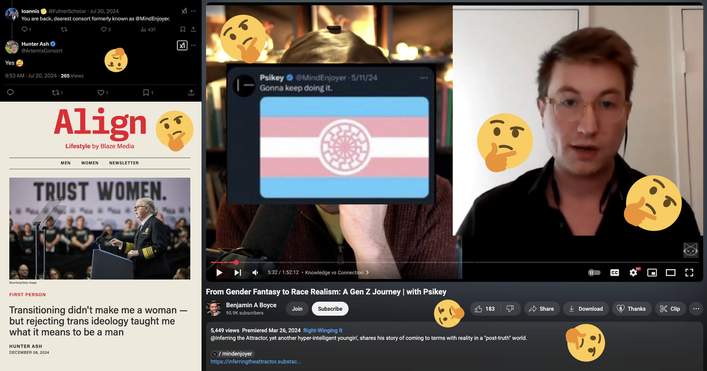
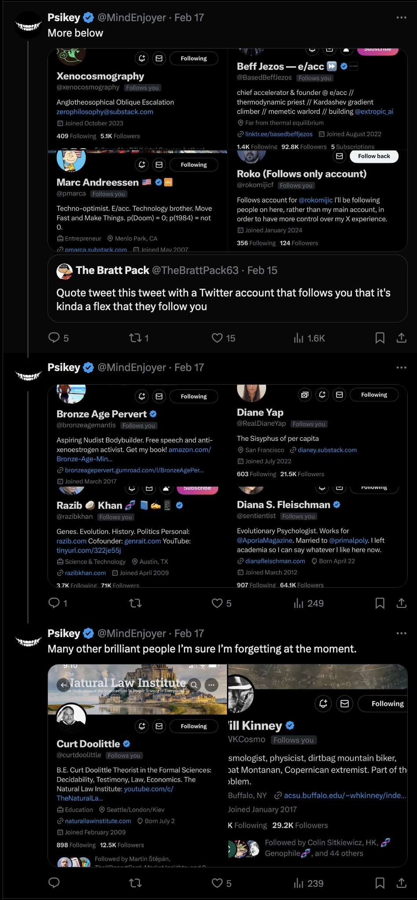

# "Pre-Chewing  Nick Land": The Racist Accelerationism of Detransitioner Hunter Ash

In December 2024, The Blaze published an essay called [Transitioning didn't make me a woman — but rejecting trans ideology taught me what it means to be a man](https://www.theblaze.com/align/transitioning-didnt-make-me-a-woman-but-rejecting-trans-ideology-taught-me-what-it-means-to-be-a-man) by Hunter Ash, someone who's relatively new to the conservative detransitioner circuit. For those unaware, anti-trans groups often uplift the voices of anyone they can find who has stopped their gender transition and is now willing to denounce the transgender community. These individuals have often repressed themselves back into the closet and are sometimes even [paid] by anti-transgender groups to repeat their talking point.

His appearance in The Blaze was Hunter Ash's first big publication, but he actually has an extensive and controversial social media history before reappearing under his current name. Let's look into it...

### Who is Hunter Ash?

Ash defines his current detranisitoned presence on the internet as being ["like a mother bird pre-chewing Nick Land’s content for my audience"](https://x.com/ArtemisConsort/status/1849290159985959380)[^1]. He further explains his appreciation for Land in an [interview](https://www.youtube.com/watch?v=fTy-NdWW7NY) with reactionary influence Alex Kaschuta on *Subversive* show.

In a [response](https://x.com/ArtemisConsort/status/1876762411576758769) to being asked why he detransitioned on Twitter, Ash claimed that reading Nick Land, Curtis Yarvin, and "a bunch of behavioral genetics papers" led him to detransitioning. He elaborates on this in a [Substack post](https://inferringtheattractor.substack.com/p/5-who-i-am-and-why) (using the name "Alice Fields") which details how a bad mushroom trip also contributed to his detransition and shift to authoritarian politics:

>All of these thoughts were bubbling under the surface, but I was still resisting them. Then I took an exceptionally strong dose of psilocybin mushrooms. I sat in a dark room by myself for 6 hours, typing a note into my phone and crying. Though I was still struggling to find language for my thoughts, the core insight is this: there is inherent structure to reality. There are inherently, objectively better and worse ways of doing things, and when we ignore this, people suffer needlessly. But the truth hurts people’s feelings sometimes, so we are all committing slow societal suicide in order to avoid that awkwardness and guilt. This is a disaster, and stopping it is the only thing that matters.

> I read articles and papers on the economic history of colonialism, on the unity and heritability of intelligence, on the true causes of transsexuality as best we understand them scientifically, on crime, on evolutionary psychology, physics, philosophy, and more.

Besides his essay for The Blaze and Substack, Ash has also appeared on a handful of other reactionary outlets to promote transphobia. On an episode of "Autohetero Files" by Phil Lily called ["The Truth of Being Male"](https://www.youtube.com/watch?v=lp9XJSivLzg), Ash further elaborates on his experience with psychedelics and also discovers his discovery of the concept of "autogynephilia" (AGP) created by Ray Blanchard. Nowadays, Blanchard is virtually indistinguishable from you average "gender critical" transphobe on Twitter and has even [retweeted]() Hunter's new account. explain agp here bla bla bla

Ash delves into his belief in AGP more in an essay called[*"Things I Learned When I Was Trans"*](https://www.piratewires.com/p/things-i-learned-when-i-was-trans)  for Pirate Wires, where he further demonizes trans people with misleading claims like "Almost all trans people have mental illnesses" and that trans women are "not any more behaviorally or psychologically feminine than the average man". 

Hunter Ash appeared alongside another right-wing influencer in the tech sphere named Diane Yap to discuss their belief in AGP on yet another anti-trans podcast called [The Navel Gaze](https://www.navelgays.com/p/episode-21-the-men-who-want-to-be). Interestingly, Yap has made [several](https://dianey.substack.com/p/the-trans-debate) [posts](https://x.com/RealDianeYap/status/1906886588606329116) indicating that she has her own struggles with gender.[^2]

### Who was Psikey?

Prior to relaunched his internet presence, Hunter Ash / Alice Fields was known as "Psikey" or "Pischey", using the @MindEnjoyer handle on Twitter. This is shown by both interactions on the platform regarding his old account[^3] as well as a Wayback Machine [archive](https://web.archive.org/web/20231201152951/https://inferringtheattractor.substack.com/) linking his Substack account to the name "piskey"[^4]. He also had a podcast appearance under this name, [From Gender Fantasy to Race Realism: A Gen Z Journey](https://www.youtube.com/watch?v=CIB-M2Zt5G0) with YouTuber Benjamin A. Boyce which clearly shows that Psikey and Ash are the same person.

{pic here}

Benjamin A. Boyce hosted Ash on his anti-transgender interview series called [Calmversations](https://www.youtube.com/watch?v=8LckyQ5ew3c&list=PLRdayXEOwuMH3f0pmZqVQUU62rgJIzvt9) which also featured of interviews with notable transphobes such as Helen Joyce and Kathleen Stock as well as Ray Blanchard himself. 

Boyce's channel has another series called ["Right-Winging It"](https://www.youtube.com/watch?v=NalyGiMBPVs&list=PLRdayXEOwuMEigoyVC1yxJvRmIGUTdGDA) where he interviews a number of notable right-wingers and anti-trans influencers such as Christopher Rufo and Blaire White. Notably, the series has featured transhumanists Simone & Malcolm Collins as well as [multiple](https://www.youtube.com/watch?v=6Z6AyddEveU)[interviews](https://www.youtube.com/watch?v=6Z6AyddEveU) with Curtin Yarvin.

Around the time of his detransition, Ash's mental health took a clear turn for the worse and his Twitter account was deleted after making several shocking posts. In response to user "generic_void" [tweeted](https://x.com/generic_void/status/1789506962763444328) that "people Hitler definitely would’ve killed are out here saying the most nazi/holocaust-coded sh\*t", Piskey tweeted a Nazi symbol known as the sonnenrad decorated in trans pride colors with the message "gonna keep doing it".

image here

In one of the most shocking social media posts of all time, Ash also admitted to being both a racist and a pedophile, embracing his status as the former while hating his status as the latter[^5].

pedo pic here

Prior to his meltdown and account deletion, Psichey attracted the attention of many big names in the reactionary and e/acc circles on Twitter. Ash publicly bragged about these followers on his MindEnjoyer account, which include:
- **Nick Land (Tweeting using the name Xenocosmography at the time)** himself, creator of the [modern accelerationist movement](https://www.theguardian.com/world/2017/may/11/accelerationism-how-a-fringe-philosophy-predicted-the-future-we-live-in) 
- **Beff Jezos** Effective Accelerationism creator
- **Marc Andreessen** Billionaire venture capitalist co-founder of Andreessen-Horowitz (a16z). Andreessen is known for penning a "Techno-Optimist Manifesto" that praised Italian Fascist FT Marinelli as a "saint"
- **Roko**, creator of the Roko's Basilisk thought experiment involving a hypothetical evil and omniscient artificial intelligence.  Both Elon Musk and Grimes are fans of this theory, which is how they [initially met and became a couple](https://www.vice.com/en/article/what-is-rokos-basilisk-elon-musk-grimes/)
- **Bronze Age Pervert**, Far-right influencer
- **Diane Yap**, San Francisco based anti-affirmative action campaigner. The only Substack she [recommends](https://dianey.substack.com/recommendations) is Crémieux Receuil, pen name of race science writer Jordan Lasker, who I unmasked earlier this year. She recently [proposed](https://dianey.substack.com/p/the-value-of-human-life) using "return of investment" as a means of evaluating human life.
- **Diana S. Fleischman**, podcaster for the race science outlet Aporia and creator of a talk called "You're probably a eugenicist"
- **Dr. Razib Kahn** Race scientist and geneticist who is closely tied to the white supremacist *Unz Review*
- **Curt Doolittle**, creator of the openly fascist ["Natural Law Institute"](https://naturallawinstitute.com/) that promotes the "Great Replacement" conspiracy theory
- **Dr. Will Kinney**, cosmologist at the University of Buffalo

### "Divine Accelerationism"

The effective accelerationism movement (often referred to as "e/acc") is bla bla bla . 

E/acc stands in contrast to the Rationality school of thought centered on "AI Alignment", the idea that a superintelligent AI could be controlled by humans. This notion was popularlized by writer Eliezer Yudkowsky on his blog/forum *LessWrong*, where he also defined his larger probability based pseudo-intellectual philosophy that he dubbed Rationality. LessWrong has since developed a cult-like following and the community around it has influenced real life AI laboratories such as OpenAI, Google DeepMind, and Anthropic.

E/acc followers have a tendency to come up with their own memey variants on the philosophy and Hunter Ash is no different. As Psichey, he penned a lengthy manifesto about his own twist on e/acc, dubbed "divine accelerationism". The manifesto was posted to the e/acc wiki where it is still readable in the [edit history](https://www.eaccwiki.com/index.php?title=Div/acc&oldid=9464) for his userpage.

In the manifesto, Ash praises president of El Salvador Nayib Bukele's [efforts to dismantle democracy](https://www.economist.com/the-americas/2023/07/20/nayib-bukele-shows-how-to-dismantle-a-democracy-and-stay-popular) as "noble and essential for maintaining functional societies". He argued that the "hands dedicated to the task, and the minds strong enough to do what is necessary, are too few" and implied that sustainability and diversity initiatives  "death worshippers".

The manifesto concludes with Ash's accelerationist thesis that humanity should embrace possible extinction and pursue the creation of superintelligent AI:
>**"Whatever may become of us, I for one would rest easy knowing that such an unfathomably subtle and profound being as an AGI was expanding throughout the universe. I propose that we create such a being as soon as possible and by any means necessary, and trust that the spaces of mind it discovers will be worthwhile. This is the div/acc position.create (AGI) as soon as possible and by any means necessary, and trust that the spaces of mind it discovers will be worthwhile. This is the div/acc position"**.

[^1]: In response to this, transhumanist and Rationalist writer Roko simply replied ["lol"](https://x.com/RokoMijic/status/1849294554396024903) to this. Roko is best known as the creator of the infamously silly AI thought experiment later dubbed as Roko's Basilisk.
[^2]: In the same essay explaining his bad mushroom trip, Ash describes his gender transition in an extremely positive light, saying that the relief from dysphoria it gave him was "almost instant, and intoxicating". Perhaps Diane Yap would feel better if she embraced her masculine side since she thinks presenting feminine makes her feel like a "tr\*nny".
[^3]: In July 2024, Twitter user "FuhrerScholar" [tweeted](https://x.com/ArtemisConsort/status/1814659976847032592) "You are back, dearest consort formerly known as @MindEnjoyer". Hunter Ash replied ["Yes 🥰"](https://x.com/ArtemisConsort/status/1814659976847032592)
[^4]: An [archive](https://web.archive.org/web/20231201152951/https://inferringtheattractor.substack.com/) of the *Inferring the Attractor* Substack from the Wayback Machine shows that Alice Field's account used "psikey" as a handle. A later [archive](https://web.archive.org/web/20240905235642/https://inferringtheattractor.substack.com/) shows that the same account also briefly used "Azrael" as a pseudonym. An [introductory post](https://inferringtheattractor.substack.com/p/5-who-i-am-and-why) on the Substack still refers to Alice Fields despite the account that posted it now being named Hunter Ash.
[5]: After Psikey's account was deleted, Roko [posted](https://x.com/RokoMijic/status/1795202810968957013) a screenshot of this tweet along with the commentary "Psikey @mindenjoyer will be remembered for going out on this absolute banger".

---

other tweets 

https://x.com/ArtemisConsort/status/1806748156274909487

>There are a ton of people who both think I’m a psychopath, and think I’ll be offended by being called a psychopath. These beliefs are not compatible.
>

https://x.com/InfiniumLives/status/1736213633137336397/photo/1

A screenshot of @MindEnjoyer's account shows Psikey using the same profile picture as his account on the e/acc wiki.

https://x.com/ArtemisConsort/status/1882162592669749583

>In his essay “Hyper-Racism”, philosopher Nick Land argues that the future genetic class structure of society is neither racial nor egalitarian. Rather, assortative mating for positive traits like intelligence will stratify the global population into the elites and the plebs.

https://inferringtheattractor.substack.com/p/14-long-term-ai-alignment-is-impossible

https://web.archive.org/web/20240402132556/https://twitter.com/mindenjoyer