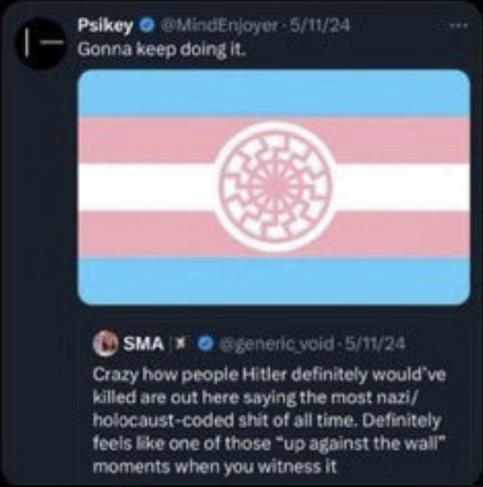
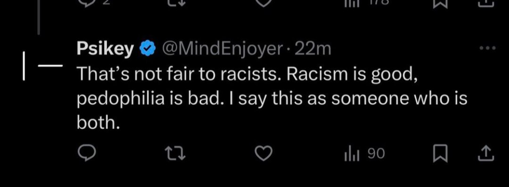

# "Pre-Chewing Nick Land": The Racist Accelerationism of Detransitioner Hunter Ash

In December 2024, The Blaze published an essay called [Transitioning didn't make me a woman — but rejecting trans ideology taught me what it means to be a man](https://www.theblaze.com/align/transitioning-didnt-make-me-a-woman-but-rejecting-trans-ideology-taught-me-what-it-means-to-be-a-man) by Hunter Ash, someone who's relatively new to the conservative detransitioner circuit. For those unaware, anti-trans groups often uplift the voices of anyone they can find who has stopped their gender transition and is now willing to denounce the transgender community. These individuals have often repressed themselves back into the closet and are sometimes even [paid](https://www.erininthemorning.com/p/chloe-cole-testifies-she-makes-up) by anti-transgender groups to parrot their talking points.

His appearance in The Blaze was Hunter Ash's first big publication, but he actually has an extensive and controversial social media history before reappearing under his current name. Let's look into it...

### Who is Hunter Ash?

Ash defines his current presence on the internet as being ["like a mother bird pre-chewing Nick Land’s content for my audience"](https://x.com/ArtemisConsort/status/1849290159985959380)[^1].

For those unfamiliar, Nick Land is an English philosopher often credited as the creator of the [modern accelerationist movement](https://www.theguardian.com/world/2017/may/11/accelerationism-how-a-fringe-philosophy-predicted-the-future-we-live-in). His writings, primarily from his time at University of Warwick in the 1990's. Land's apocalyptic vision of acceleration posits that capitalism is an unstoppable force that will inevitably create conscious AI that will replace humanity and that this self-destructive process should be embraced. Years later, Land would build on these ideas and the writings of Curtis Yarvin to develop the modern Neoreactionary movement (often shortened to "NRx" or called the "Dark Enlightenment") which promotes the idea that American democracy must be dismantled. NRx ideas have been influential throughout Silicon Valley as well as the Donald Trump administration - Vice President JD Vance and State Department appointee Michael Anton have both [publicly praised](https://www.theguardian.com/us-news/2024/dec/21/curtis-yarvin-trump) Yarvin's work.

Hunter Ash's fondness for Nick Land can be seen on his Twitter, where he's [quoted](https://x.com/ArtemisConsort/status/1882162592669749583) from Land's writings. Notably, this includes his 2014 essay "Hyper-Racism" which included an "HBD" tag when it was [originally posted](https://web.archive.org/web/20190111223053/http://www.xenosystems.net/hyper-racism) to his blog. "HBD" refers to "human biodiversity", a euphemism for eugenicist [racial IQ theories](https://nymag.com/intelligencer/2017/04/steve-sailer-invented-identity-politics-for-the-alt-right.html) popularized by white supremacist Steve Sailer.

 Ash further explains his appreciation for Land in an [interview](https://www.youtube.com/watch?v=fTy-NdWW7NY) with influencer Alex Kaschuta on her *Subversive* show and in a [response](https://x.com/ArtemisConsort/status/1876762411576758769) to being asked why he detransitioned on Twitter, Ash claimed that reading Nick Land, Curtis Yarvin, and "a bunch of behavioral genetics papers" led him to detransitioning. He elaborates on this in a [Substack post](https://inferringtheattractor.substack.com/p/5-who-i-am-and-why) (using the name "Alice Fields") which details how a bad mushroom trip also contributed to his detransition and shift to authoritarian politics:

>All of these thoughts were bubbling under the surface, but I was still resisting them. Then I took an exceptionally strong dose of psilocybin mushrooms. I sat in a dark room by myself for 6 hours, typing a note into my phone and crying. Though I was still struggling to find language for my thoughts, the core insight is this: there is inherent structure to reality. There are inherently, objectively better and worse ways of doing things, and when we ignore this, people suffer needlessly. But the truth hurts people’s feelings sometimes, so we are all committing slow societal suicide in order to avoid that awkwardness and guilt. This is a disaster, and stopping it is the only thing that matters.
>
> I read articles and papers on the economic history of colonialism, on the unity and heritability of intelligence, on the true causes of transsexuality as best we understand them scientifically, on crime, on evolutionary psychology, physics, philosophy, and more.

### "AGP" and its connection to race science

Besides his essay for The Blaze and his Substack, Ash has had a handful of other alt-right media appearance to promote transphobia. On an episode of *"Autohetero Files"* by Phil Lily called ["The Truth of Being Male"](https://www.youtube.com/watch?v=lp9XJSivLzg), Ash further elaborates on his experience with psychedelics and also discovers his discovery of the concept of "autogynephilia" (AGP). This highly disputed psychological theory created by Dr. Ray Blanchard and popularized by his frequent collaborator J. Michael Bailey in his much-criticized 2003 book *The Man Who Would Be Queen* suggests that all trans women can be divided into two categories based on their sexual orientation and that trans lesbians actually just have an AGP "fetish" for being a woman. The methodology of the research and the validity of Dr. Blanchard's conclusions have been widely criticized by experts (notably by [Dr. Julia M. Serano](https://www.juliaserano.com/av/Serano-CaseAgainstAutogynephilia.pdf)) and rejected by the trans community at large.

There is a frequent overlap between transphobic medical concepts such as AGP and the completely fabricated "Rapid Onset Gender Dysphoria" disorder (also embraced by Dr. Blanchard and Dr. Bailey) and other forms of pseudoscientific beliefs such as race science. The anti-extremist research group *Southern Poverty Law Center* [documented](https://www.splcenter.org/resources/reports/northwestern-university-psychology-professor-j-michael-bailey-looks-queer-science/) both researchers ties to Steve Sailer's *Human Biodiversity Initiative* group.

Nowadays, Blanchard is virtually indistinguishable from your average "gender critical" transphobe on Twitter, [promoting](https://x.com/BlanchardPhD/status/1864809373115035960) the likes of Libs of TikTok. J. Michael Bailey is much the same, even going so far as to [retweet](https://x.com/profjmb/status/1894931623751065757) Hunter Ash's bizarre assertion that "transwomen are not women, but men attracted to them are not gay". Notably, one of the anti-trans propaganda films recently [promoted]() by Dr. Blanchard was made by a director who describes himself as "Hyperborean" - a dogwhistle used by [esoteric neo-Nazis](https://csmfht.substack.com/p/hyperborea-the-white-supremacist) referencing a mythological land inhabited by Aryans.

Ash delves into his belief in AGP more in an essay called[*"Things I Learned When I Was Trans"*](https://www.piratewires.com/p/things-i-learned-when-i-was-trans)  for Pirate Wires, where he further demonizes trans people with misleading claims like "Almost all trans people have mental illnesses" and that trans women are "not any more behaviorally or psychologically feminine than the average man". 

Hunter Ash appeared alongside another right-wing influencer in the tech sphere named Diane Yap to discuss their belief in AGP on yet another anti-trans podcast called [The Navel Gaze](https://www.navelgays.com/p/episode-21-the-men-who-want-to-be). Interestingly, Yap has made [several](https://dianey.substack.com/p/the-trans-debate) [posts](https://x.com/RealDianeYap/status/1906886588606329116) indicating that she has her own struggles with gender.[^2]

### Who was Psikey?

Prior to relaunching his, more marketable internet presence, Hunter Ash was known as "Psikey" or "Pischey", using the @MindEnjoyer handle on Twitter. This is shown by both interactions on the platform regarding his old account[^3] as well as a Wayback Machine [archive](https://web.archive.org/web/20231201152951/https://inferringtheattractor.substack.com/) linking his Substack account to the name "piskey"[^4].

Psikey also had a podcast appearance under this name, [From Gender Fantasy to Race Realism: A Gen Z Journey](https://www.youtube.com/watch?v=CIB-M2Zt5G0) with YouTuber Benjamin A. Boyce which clearly shows that he and Hunter Ash are the same person.

On of Ash's recent appearances was on an anti-transgender interview series called [Calmversations](https://www.youtube.com/watch?v=8LckyQ5ew3c&list=PLRdayXEOwuMH3f0pmZqVQUU62rgJIzvt9) hosted by YouTuber Benjamin A. Boyce which also featured of interviews with notable transphobes such as Helen Joyce and Kathleen Stock as well as Ray Blanchard himself. 

Boyce's channel has another series called ["Right-Winging It"](https://www.youtube.com/watch?v=NalyGiMBPVs&list=PLRdayXEOwuMEigoyVC1yxJvRmIGUTdGDA) where he interviews a number of notable right-wingers and anti-trans influencers such as Christopher Rufo and Blaire White. Notably, the series has featured transhumanists Simone & Malcolm Collins as well as [multiple](https://www.youtube.com/watch?v=6Z6AyddEveU) [interviews](https://www.youtube.com/watch?v=6Z6AyddEveU) with Curtin Yarvin.

Around the time of his detransition, Ash's mental health took a clear turn for the worse and his Twitter account was deleted after making several shocking posts. In response to user "generic_void" [tweeted](https://x.com/generic_void/status/1789506962763444328) that "people Hitler definitely would’ve killed" were saying "nazi-coded sh\*t", Psikey tweeted an esoteric Nazi symbol known as the [Sonnenrad](https://www.theguardian.com/world/2020/nov/24/the-neo-nazi-symbol-posted-by-pete-evans-has-a-strange-and-dark-history) decorated in the colors of the trans pride flag. The Sonnenrad is tied to the previously discussed concept of the Aryan land of Hyperborea and is frequently [used in memes](https://gnet-research.org/2023/02/15/the-dangers-of-pseudohistorical-conspiracy-theories/) referencing the concept.

Hunter would go on to post another Sonnenrad to his new account just a few months later.

In one of the most shocking social media posts of all time, Ash also admitted to being both a racist and a pedophile, embracing his status as the former while hating his status as the latter[^5].

Prior to his meltdown and account deletion, Psikey attracted the attention of many big names in the reactionary and e/acc circles on Twitter. He publicly bragged about his influential followers on his @MindEnjoyer account, which include:
- **Nick Land (Tweeting under the name @Xenocosmography)**
- **Guillaume "Beff Jezos" Verdon** - creator of the "Effective Accelerationism" movement based on Nick Land's theories
- **Marc Andreessen** - Billionaire venture capitalist co-founder of Andreessen-Horowitz (a16z). Andreessen is known for penning a "Techno-Optimist Manifesto" that praised [Italian Fascist FT Marinelli](https://www.vice.com/en/article/major-tech-investor-calls-architect-of-fascism-a-saint-in-unhinged-manifesto/) as a "saint"[^6]
- **Roko** - creator of the Roko's Basilisk thought experiment involving a hypothetical evil and omniscient artificial intelligence.  Both Elon Musk and Grimes are fans of this theory, which is how they [initially met and became a couple](https://www.vice.com/en/article/what-is-rokos-basilisk-elon-musk-grimes/)
- **Bronze Age Pervert** - Popular far-right and [anti-democracy](https://www.politico.com/news/magazine/2023/07/16/bronze-age-pervert-masculinity-00105427) influencer
- **Diane Yap** - San Francisco based anti-affirmative action campaigner. The only Substack she [recommends](https://dianey.substack.com/recommendations) is Crémieux Receuil, pen name of race science writer Jordan Lasker, who I unmasked earlier this year. She recently [proposed](https://dianey.substack.com/p/the-value-of-human-life) using "return of investment" as a means of evaluating human life.
- **Diana S. Fleischman** - Podcaster for the race science outlet Aporia and writer of an essay called ["You're probably a eugenicist"](https://dissentient.substack.com/p/eugenicist)
- **Dr. Razib Kahn** - Race scientist and geneticist who is closely tied to the white supremacist *Unz Review*. Like Ray Blanchard and J. Michael Bailey, Dr. Kahn has also [associated](https://undark.org/2017/02/28/race-science-razib-khan-racism/) with the *Human Biodiversity Institute* and its far-right founder Steve Sailer.
- **Curt Doolittle** - Creator of the openly fascist ["Natural Law Institute"](https://naturallawinstitute.com/) that promotes the "Great Replacement" conspiracy theory
- **Dr. Will Kinney** - cosmologist at the University of Buffalo

### "Divine Accelerationism"

The effective accelerationism movement (often referred to as "e/acc") is a modern, more meme-y interpretation of the ideas that Nick Land embraced in the 90's. The philosophy was [coined](https://effectiveaccelerationism.substack.com/p/repost-effective-accelerationism) by a group of pseudononymous Twitter users, most infamously Guillaume "Beff Jezos" Verdon who was subsequently [unmasked](https://www.forbes.com/sites/emilybaker-white/2023/12/01/who-is-basedbeffjezos-the-leader-of-effective-accelerationism-eacc/)by Emily Baker-White in an investigation for Forbes. Other notable adherents to the ideology include Marc Andreessen, YCombinator CEO Garry Tan (who proclaimed his desire to ["take over every nation in the world"](https://www.youtube.com/watch?v=xMRlKPqNMT4) in 2023), and disgraced investor Martin Shkreli.

Effective accelerationism stands in contrast to movements to regulate a hypothetical future superintelligence such as the [influential](https://www.nytimes.com/2021/02/13/technology/slate-star-codex-rationalists.htm) but [cult-like](https://www.bloomberg.com/news/features/2023-03-07/effective-altruism-s-problems-go-beyond-sam-bankman-fried) Rationality community and its adjacent utilitarian philosophy of Effective Altruism, from which the movement drew inspiration for its name. E/acc followers frequently refer to these groups as "decels" impeding the path to the future of humankind.

E/accs also have a tendency to come up with their own meme-infused variants on the philosophy and Hunter Ash is no different. As Psichey, he penned a lengthy manifesto about his own twist on e/acc, dubbed "divine accelerationism". The manifesto was posted to the e/acc wiki where it is still readable in the [edit history](https://www.eaccwiki.com/index.php?title=Div/acc&oldid=9464) for his userpage.

In this document, Ash praises president of El Salvador Nayib Bukele's [efforts to dismantle democracy](https://www.economist.com/the-americas/2023/07/20/nayib-bukele-shows-how-to-dismantle-a-democracy-and-stay-popular) as "noble and essential for maintaining functional societies". He argued that the "hands dedicated to the task, and the minds strong enough to do what is necessary, are too few" and implied that sustainability and diversity initiatives are "death worshippers".

The manifesto concludes with Ash's accelerationist thesis that humanity should embrace possible extinction and pursue the creation of superintelligent AI:
>**"Whatever may become of us, I for one would rest easy knowing that such an unfathomably subtle and profound being as an AGI was expanding throughout the universe. I propose that we create such a being as soon as possible and by any means necessary, and trust that the spaces of mind it discovers will be worthwhile. This is the div/acc position."**.

---

[^1]: In response to this, transhumanist and Rationalist writer Roko simply replied ["lol"](https://x.com/RokoMijic/status/1849294554396024903) to this. Roko is best known as the creator of the infamously silly AI thought experiment later dubbed as Roko's Basilisk.
[^2]: In the same essay explaining his bad mushroom trip, Ash describes his gender transition in an extremely positive light, saying that the relief from dysphoria it gave him was "almost instant, and intoxicating". On the flip side, Ash's strategy for dealing with his feelings of gender dysphoria was to repress them (or  ["not think about it"](https://x.com/ArtemisConsort/status/1852477650859622611) in his words). Perhaps Diane Yap would feel better if she embraced her masculine side since she thinks presenting feminine makes her feel like a "tr\*nny".
[^3]: In July 2024, Twitter user "FuhrerScholar" [tweeted](https://x.com/ArtemisConsort/status/1814659976847032592) "You are back, dearest consort formerly known as @MindEnjoyer". Hunter Ash replied ["Yes 🥰"](https://x.com/ArtemisConsort/status/1814659976847032592)
[^4]: An [archive](https://web.archive.org/web/20231201152951/https://inferringtheattractor.substack.com/) of the *Inferring the Attractor* Substack from the Wayback Machine shows that Alice Field's account used "psikey" as a handle. A later [archive](https://web.archive.org/web/20240905235642/https://inferringtheattractor.substack.com/) shows that the same account also briefly used "Azrael" as a pseudonym. An [introductory post](https://inferringtheattractor.substack.com/p/5-who-i-am-and-why) on the Substack still refers to Alice Fields despite the account that posted it now being named Hunter Ash.
[5]: After Psikey's account was deleted, Roko [posted](https://x.com/RokoMijic/status/1795202810968957013) a screenshot of this tweet along with the commentary "Psikey @mindenjoyer will be remembered for going out on this absolute banger".
[^6]: Much like Hunter Ash, Andreessen's manifesto positively cited Nick Land's "Hyper-Realism" essay.