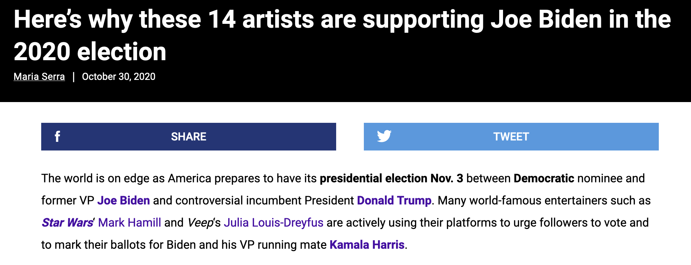

# What the Heck is "Musicians for Biden-Harris"?

Last month I published an [article](./anti-squad-pac.md) detailing how a former Hillary Clinton campaign consultant named [Sally Albright](https://www.sallylalbright.com/) is soliciting donations to primary the progressive Democrat “Squad” of congresspeople via a political action committee managed by the treasurer from John Fetterman’s 2022 senatorial campaign.

In addition to the Twitter accounts I found spamming links to donate to this PAC, another small account I stumbled across while researching is a pro-Biden account called [@Musicians4Biden](https://twitter.com/Musicians4Biden). At time of writing, it has only a few hundred tweets, allowing me to look at all of the account's activity. What I found was perplexing...

---

The [very first tweet](https://x.com/Musicians4Biden/status/1769084721110098247) from Musicians for Biden-Harris (misspelled as "Biden-Harrs" in their bio) is an [article](https://www.altpress.com/musicians-supporting-joe-biden-2020-election/) about musicians who supported Joe Biden's presidential campaign... in 2020. 

This was immediately followed by a [retweet](https://x.com/TWLadyGrey/status/1768605688777863352/retweets) of a post calling the majority of Biden critics "intellectual cowards who can't admit Biden is good". The third tweet is a [retweet](https://x.com/TommyInPA/status/1768814858005336434/retweets) of a post calling The Squad "racist antisemites".

Besides posting that initial article from 2020, the account has only made a handful of other posts about music: a retweet of a [Memorial to Dickey Betts](https://x.com/odie_jackson/status/1781060117800079452/retweets), a [quote](https://x.com/HeLiesWeDie1/status/1765961410763260391/retweets) of a tweet comparing Joe Biden at the State of the Union Address to Buddy Guy, a reply to [Clash - I Fought The Law](https://x.com/Musicians4Biden/status/1796346003857256583) being posted in response to Donald Trump's conviction, and a [recently-pinned](https://x.com/Musicians4Biden/status/1797895241682542731) tweet about favorite songs. That's it. **There's no indication whatsoever on Twitter that there's any musicians involved with "Musicians 4 Biden" at all.**

While the vast majority of the account's activity is retweets of other user's ActBlue links, it also sometimes posts these links [manually](https://x.com/Musicians4Biden/status/1798778554781487198) what's interesting about these posts is that the links don't contain a unique tracking code made for the @Musicians4Biden account. Instead, it uses the "b2bjm" code, which is used by the main @Back2Brunch account, **suggesting that "Musicians for Biden-Harris" is in fact a sock puppet account run by Sally Albright. This is supported by the complete lack of fundraising being done for any groups besides Pro PAC**.

I don’t know why someone would feel the need to attempt a fundraising scheme that is so suspicious and devoid of substance. If one truly believes in Joe Biden’s campaign, the best way to support it would be to promote his policies that will improve people’s lives. Unfortunately, I’ve seen very little of this during my research. Instead, Sally Albright, Musicians for Biden and the rest their social media circle seem intent on constantly soliciting money from voters while [antagonizing anti-war protestors](https://x.com/BanquoDyar/status/1799615488001286261/retweets).

### Coordinated Back2Brunch social media behavior

Here’s one example of this antagonism. The image below is a screenshot showing all the retweets of a [tweet](https://x.com/estherzelda0514/status/1797489170392473775/) mocking a pro-Palestine message from queer academic Jess A. Goldberg. Besides Musicians for Biden, 9 of the 12 accounts in this image were [documented](./anti-squad-pac.md) in my earlier article as being part of the Back 2 Brunch fundraiser/social media network. The remaining four accounts behave simililarly; they have the same blue wave emojis in their names and spend almost all of their time retweeting Back2Brunch links.

Similarly, a [tweet](https://x.com/Raise4Dems/status/1796524028192063676) from @Raise4Dems has 15 retweets - 8 were previously documented, 2 were included in the image above, and one is Musicians for Biden.

What's the purpose of all this internet detective work? **To demonstrate that "Back 2 Brunch", an anti-left fundraising drive run by a former Hillary Clinton campaign employee, is engaging with political content on Twitter in a coordinated fashion that resembles bots.** If these accounts were posting in favor of Donald Trump, I doubt many would hesitate to refer to them as "Russian bots". There is little to no replies or likes on many of these posts , further adding to the impression of a botnet.

If all of these accounts are being run by real people then I deeply apologize to their owners. But if that's the case, they're still people who have seemingly conspired to coordinate their political social media activity in a bot-like manner. 

🤔