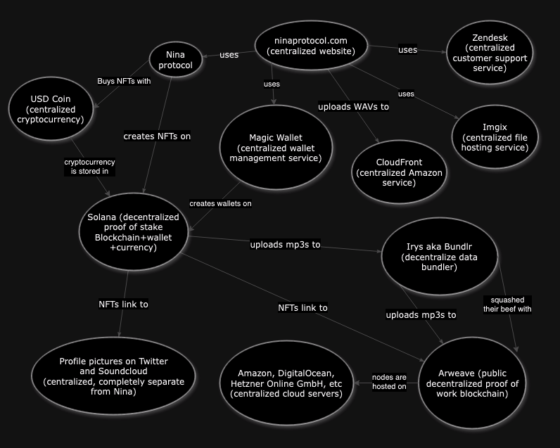

# I don't know who needs to hear this, but Nina Protocol is a sketchy NFT platform

Nina Protocol is a cryptocurrency-based NFT music platform. This is obvious from the platform's 2021 [announcement](https://www.coindesk.com/business/2021/11/20/music-marketplace-nina-wants-to-be-a-bandcamp-for-web-30/) on crypto news site CoinDesk, which described Nina as "Bandcamp for Web 3.0". Speaking on the nature of the platform, founder Mike Pollard said:
> I think that to get people who don’t care about crypto in, **you have to really baby-step that kind of stuff**... Right now, education around blockchain stuff involves too many words that people don’t know. And you have to feel like you’re making some kind of ideological shift. But I think that the benefits of blockchain can be delivered without having to fully drink the Kool-Aid.

Unfortunately for Nina, cryptocurrency, Web 3.0, and NFTs have rightfully become toxic in the eyes of many artists since the platform's 2021 launch. This led to Nina [announcing](https://twitter.com/ninaprotocol/status/1724179442212168063) a reboot of the platform in November 2023, claiming that there's "no crypto required".

This isn't exactly true.

As is the case with many crypto projects, Nina's developers have not been completely transparent with the electronic music community that makes up its userbase. Fully explaining this lack of transparency to people not already familiar with crypto and web development is difficult due to how convoluted web3 is, so this is a very long article. I've attempted to structure this article as the FAQ page that Nina actually should have written, but it's still quite lengthy. Apologies in advance.

## WTF is a blockchain anyway? An explainer

In its simplest form, a blockchain is just a database of financial transactions. It keeps track of everyone's crypto balances and what's been done with them. Unlike traditional financial databases controlled by one owner (PayPal, banks, etc), the data on a blockchain is duplicated across many disparate computers spread across the globe called "nodes". These nodes have to independently verify new transactions before they're added to the blockchain, ensuring that the wallet balances and transaction history are tamper-proof (in theory).

All blockchains require these decentralized nodes powering them to provide some kind of receipt that they data they're trying to add is legitimate before it gets appended to the official database. To prevent hacking, many identical receipts must be provided by different nodes before a transaction is finalized. The algorithm that creates these receipts (called a "consensus mechanism") is designed to require some work on the part of nodes, who are subsequently compensated in crypto for their effort. What exactly that "effort" entails is where things get tricky.

Bitcoin uses a consensus mechanism called **proof-of-work** where nodes are required to solve difficult, pointless math problems and attach their answers to data being added to the blockchain. This is where the term "mining" comes from - miners spend a lot of energy crunching data and are rewarded for their effort by being given newly created Bitcoins.

There is no limit on how many nodes can mine Bitcoin, which has created the environmentally disastrous gold rush of mining that has been in the news over the past few years. To deal with this problem, other consensus mechanisms for newer blockchains have been designed. The most popular of these is called "proof of stake", where the receipts are verified by nodes who own a substantial amount of crypto that is reserved for the use of the blockchain. This creates other problems, but it deals with the environmental impact of Bitcoin's proof of work. Solana, the blockchain that handles purchases on Nina, uses proof of stake.

## OK, what's Solana then?

Solana is the primary blockchain that keeps track of Solana releases. It's like Bitcoin, except the network allows users to store other currencies and NFTs alongside their Solana balance.

Accessing and using a crypto wallet requires access to its unique password (or "key"), which is not kept by anyone besides the owner. This has led to situations like a [hard drive worth $70 million being accidentally thrown in the trash](https://www.cnn.com/2021/01/15/uk/bitcoin-trash-landfill-gbr-scli-intl/index.html) with no insurance or recourse for the owner. Nina's [Terms of Service](https://nina-protocol.notion.site/Nina-Protocol-Terms-of-Service-45db765d2ccf4000946af0af2ee491b9) make it clear that their blockchain-based system comes with similar risks to users:
>You agree that you understand the inherent risks associated with cryptographic systems, including hacking risks and future technological development.
>
>You agree that you have an understanding of the usage and intricacies of native cryptographic tokens. You acknowledge and understand that you alone are responsible for securing your private key(s). We do not have access to your private key(s). Losing control of your private key(s) will permanently and irreversibly deny you access to blockchain resources and your blockchain wallet.

This is not obvious to new users on the Nina platform because Nina uses a service called Magic Wallet to create blockchain wallets on their behalf.
## What is Magic Wallet?

In order to simplify the act of signing up for an NFT platform, Nina uses a third party service called [Magic](https://magic.link/) which advertises itself as a provider of "the leading wallet-as-a-service plus essential NFT capabilities". Nina uses Magic to automatically create a wallet on the Solana blockchain to store cryptocurrencies and NFTs when users sign up with an email address. This makes the [FAQ page](https://help.ninaprotocol.com/hc/en-us/articles/14331796132887-Do-I-need-a-Solana-wallet-to-use-Nina) on the subject a bit misleading; **users do in fact need a Solana wallet to use Nina, Solana just uses a service to help them make one when they sign up.**

All this Nina/Magic/Solana business gets even more confusing once private keys get involved. While Nina makes new Magic accounts on behalf of users, I'm not sure how to actually access mine from Nina's platform. Nina displays the _Solano Address_ of every user on their profile but this is different from being able to access the wallet itself. **Wallets are created as soon as a new user enters their email and Nina does not seem to provide those new accounts with any information on the wallet being managed for them or any way to access their private keys.

I dunno what's going on here. 🤷‍♀️

## What's an NFT?

An NFT is simply a receipt that exists on a blockchain to indicate that a certain account owns a certain item. In Nina's case, this means attaching the metadata for a release (artist, title, record label, etc) and links to mp3 files to the Solana wallets that Nina creates for new users using Magic Wallet. 

Solana keeps track of who's buying what release, but it doesn't host the audio files itself. Instead, Nina uses a completely separate blockchain called Arweave.

## What's Arweave?

The blockchain and associated cryptocurrency used to host Nina's files is called [Arweave](https://www.arweave.org/). In simple terms, Arweave functions very similarly to Bitcoin wherein a network of miners do processing work to power the blockchain and are rewarded in crypto. The main difference between Arweave and Bitcoin is that Arweave asks miners to also reserve hard drive space for file hosting on top of the computation requirements. This means that Arweave (and thus Nina) inherit many of Bitcoin's flaws while also introducing new complications.

Nina uses two different blockchains as part of its architecture: Solana handles payments and determines who owns each NFT, and while Arweave is responsible for hosting and serving the actual music files.

## What's the environmental impact of using Arweave?

Besides proof of work and proof of stake, another consensus mechanism that's been proposed for blockchains is "proof of storage". Under this design, nodes must reserve hard drive space in order to verify transactions. This is usually done for blockchains that need to host larger files and in theory proof of stake doesn't have the same environmental impact as proof of work.

Arweave uses a variation of proof of space they call "succinct proof of access". Unfortunately, there's a catch to this: **Arweave's succinct proof of access [mechanism](https://docs.arweave.org/developers/mining/optimisation-tips) also uses a proof of work algorithm called [RandomX](https://github.com/tevador/RandomX) under the hood**. This means that Arweave miners, and thus Nina's platform, have the same environmental issues as Bitcoin. And just like Bitcoin, the fees charged by Arweave are used to reward their environmentally harmful miners.

One of Nina's developers recently disputed that Arweave uses proof of work when I pointed this out on Twitter. This developer stopped replying to me after I pointed out that Arweave's algorithm uses RandomX. The newly-added [Nina FAQ page](https://help.ninaprotocol.com/hc/en-us/articles/14334451677335-What-is-Arweave) about Arweave also does not mention this.

## Is Arweave actually "Trusted by the best"?

Arweave's [website](https://arweave.org/use) brags about its corporate partners, including Meta and Instagram. In the case of Meta, Arweave links to an [announcement](https://www.theblock.co/post/182569/meta-arweave-instagram-nfts) from November 2022 that Arweave will be used to power Instagram's NFTs. However, **Arweave doesn't mention that Instagram [disabled](https://www.forbes.com/sites/williamanderson/2023/04/11/instagram-no-longer-supports-nfts/) all of their NFT features a mere five months after launching them**.

I dunno why they haven't updated their website. 🤷‍♀️

## What is Irys?

Blockchains like Arweave tend to be expensive and slow, so most apps use a network called Irys (formerly Bundlr) which bundles the data for several Arweave transactions together and speed things up. 

Nina is such an app, meaning that uploads of Nina releases to Arweave and their associated fees are bundled together with other random NFTs. Because of this, its unclear to me how much of the fee is represented by a Nina release or how the fees are paid.

For example, the same Irys/Arweave bundle that contains dBridge's Vemödalen EP also contains an AI generated image of a Panda with Bitcoin bling called "Panda of Africa" and a meme NFT of Joe Biden called [COMMANDER BODEN](https://exchange.art/single/7RSq4f3VxsoNsL1hffE2gD5tPGfthUEunHD1nwnikLQn). This is part of an NFT collection called ["BODENS ARMY"](https://exchange.art/series/BODENS%20ARMY/about). This is the type of content that usually lives alongside Nina releases:

## What was up the beef between Irys and Arweave?

On December 17, 2023, Arweave founder Sam Williams [took to Twitter](https://twitter.com/samecwilliams/status/1736506715523178571)and alleged that Irys' developer were planning a hard fork of Arweave's blockchain. In non-crypto terms, this means that Irys was planning on making their own version of Arweave and start from scratch, deleting all of the existing data they were hosting, including the data uploaded to Nina up until that point. Williams accused Irys' developers of greed, claiming the "stated that they didn’t want to have to support the existing data and ‘give tokens to a bunch of (expletives)’". 

In a [response](https://twitter.com/irys_xyz/status/1736535577959264702), Irys denied this, stating that their plans would not disrupt existing services that rely on their network. However, that same tweet also claims that "active censorship" could cause issues with retrieving data from arweave.net, which is the domain currently used by Nina.

Earlier in the tweet, Williams states that "Permanent storage needs forks – they are required for long-term resilience". I agree with this, but it also means that Arweave's "permanent" storage requires not just regular maintenance of its code, but also the continued upgrading of the majority of its community. 

On January 4th, Irys founder Josh Benaron used his own account to [post another tweet](https://twitter.com/josh_benaron/status/1742887405068181641) announcing that the situation was resolved. He explained that Irys will continue to support Arweave's data for the forseeable future and apologized for "any distress this misunderstanding may have caused".

I dunno what's going on here either. 🤷‍♀️

## What's up with Nina's fees?

Uploads to Arweave are paid upfront by artists on Nina when they upload their music. Here's how Nina's [support page](https://help.ninaprotocol.com/hc/en-us/articles/14332524801559-What-are-the-transaction-fees-when-I-publish-a-release) describes this system:

> Music uploaded to Nina is stored on a decentralized storage network called Arweave. This requires a small one-time fee.
> 
>- The cost to store metadata is 0.032 SOL which is roughly $1.20 and the cost to store the artwork, audio, and artwork files.  This costs roughly $0.003/MB (so a 10MB mp3 costs a one-time fee of $0.03 to store).
>
>Nina does not take a cut from the one-time storage fee. Unlike similar services, you do not need to pay a monthly subscription fee to keep your music online.

The third sentence appears to be incomplete; the cost to store the "artwork, audio, and artwork files" is simply missing. 🤷‍♀️

Morever, Solana's cryptocurrency [trades](https://coinmarketcap.com/currencies/solana/)for $174.93 at time of writing, making 0.032 SOL equivalent to $5.57 rather than $1.20. I do not believe that this page tracks changes to the price of Solana, highlighting the issues of trying to use a volatile crypto currency to power a music platform.

## Where is my $26?

The same FAQ page also says that "new users on Nina get a .15 SOL credit to their upload account". I cannot find any information about this account or a 0.15SOL credit. 0.15SOL is worth $26.23, which I could conceivably cash out for real cash if I knew the wallet address. **I would like my $26.23!**

Nina's [terms of service](https://nina-protocol.notion.site/Nina-Protocol-Terms-of-Service-45db765d2ccf4000946af0af2ee491b9) says in no uncertain terms that **"fees are the sole responsibility of the Artists and users"**, but provides no way to see the fees I have racked up by uploading releases with a new account. If Nina is currently paying these fees on behalf on artists, the ToS seems to indicate they could decide to stop this policy at any time and retroactively ask artists for payment.

## What the heck is Arweave's "endowment"?

The one-time upload fees for uploading to Arweave are calculated by a complex formula its developers refer to as an ["endowment"](https://arwiki.wiki/#/en/storage-endowment). Here's how it works: your US dollars are converted into Arweave's AR cryptocurrency, then that crypto is distributed over time to miners as their reward for wasting electricity and keeping your data online.

The formula that calculates this upfront fee was devised by Arweave's developers by taking historical trends of hard drive prices dropping over time and [projecting those trends](https://arwiki.wiki/#/en/endowment-simulation) up to 10,000 years into the future. A conservative estimate of these trends is converted into the upload fee, which Arweave claims will "a finite cost for the indefinite storage of data" (or 200 years of storage, at least).

Notably absent from these simulations are scenarios where the price of storage goes *up* due to say, an economic depression or supply chain issues for the material needed to manufacture hard drives. This situation would also require the price of Arweave's crypto to remain relatively stable and for all of the miners in Arweave's network to stick around for that long. 

## How Decentralized is Arweave?

You might be wondering how many miners there actually are hosting Arweave's content. Because the blockchain is possibly, it's possible to simply look at its [public metrics](https://viewblock.io/arweave/nodes) to find the answer: 65. Of these 65 nodes, 16 of them are hosted by German hosting service Hetzner Online GmbH, 12 of them are hosted on Amazon servers, and 11 are hosted by DigitalOcean. These three companies together represent 55% of the entire Arweave network.

 That's not very decentralized and I don't think there's enough nodes to provide confidence that the network hosting Nina's music will last 200 years, much less 10,000.  On the flip side, it means there aren't very many people wasting electricity on this method of hosting.

## Is Nina itself actually decentralized?

Besides Solana and Arweave, the ninaprotocol.com website uses the https://help.ninaprotocol.com domain to host its help pages. This is a separate server from the main Nina website and is hosted on Zendesk, a very popular centralized and closed source commercial customer support software suite.

>We built Nina as open source software on open source networks (blockchains) to build a place for music online that avoids the pitfalls of legacy platforms.  Any policy change or fee is in code that can be seen in our public codebases.

These sentences conflate two different things. Nina being an open source project does not prevent its developers from changing that code out from under your feet. What open source could allow for is the creation of a competing platform built on Nina's code, but that new platform would have to be managed independently.

## What is a "protocol", anyway?

Nina's [blockchain FAQ](https://help.ninaprotocol.com/hc/en-us/articles/14331778320279-Why-is-Nina-built-on-the-blockchain) says the following:
>Nina might look like a platform, but we call it a protocol.  A protocol is an open source set of tools meant to be connected to and built upon by others.  Our tools are open source and can be viewed, used, and copied by anyone.

This isn't exactly accurate. A protocol is a set of _rules_ that tools (open source or other) can implement in order to operate as a network, not the tools themselves. Nina does indeed have a protocol for creating and selling releases as NFTs on the Solana blockchain, but the ninaprotocol.com website that implements their protocol is something else entirely. Nina's [Terms of Service](https://nina-protocol.notion.site/Nina-Protocol-Terms-of-Service-45db765d2ccf4000946af0af2ee491b9)also clarify that that **ninaprotocol.com is not a protocol but actually a Service operated by Nina Protocol Corp (a Delaware corporation)**.

This might seem like a nitpick, but the distinction becomes apparent as one reads the rest of the terms. 

## What's up with all the disclaimers?

Nina's terms of service agreement provides the following warnings:
>- **At any time, your access to your tokens or other cryptocurrency assets may be suspended or terminated** or there may be a delay in your access or use which may result in your tokens or other cryptocurrency assets diminishing in value or you being unable to complete a Smart Contract.
>- **The Services may be suspended or terminated for any or no reason**, which may limit your access to your Cryptocurrency Assets.
>- **You agree that you have an understanding of the usage and intricacies of native cryptographic tokens.** You acknowledge and understand that you alone are responsible for securing your private key(s). We do not have access to your private key(s). Losing control of your private key(s) will permanently and irreversibly deny you access to blockchain resources and your blockchain wallet.

Requiring an "understanding of the usage and intricacies of native cryptographic tokens" contradicts Mike Pollard's [claim](https://www.coindesk.com/business/2021/11/20/music-marketplace-nina-wants-to-be-a-bandcamp-for-web-30/) that Nina can "baby-step" people into crypto without them having to "fully drink the Kool-aid". Any artist or fan using the service without a strong understanding of how crypto works is at risk of permanently losing their purchases should something go wrong.

## You wouldn't right click a music NFT... would you?

A side effect of using Arweave's public blockchain for hosting is that all of the music on Nina can be downloaded for free by anyone. Unlike platforms like Bandcamp and iTunes that use low quality or short previews, **Nina exposes maximum quality mp3s uploaded by artists to the entire internet**. I was able to find the NFT minting transaction for the latest staff pick on Nina and download all of the songs on it in a matter of minutes.

This is the same issue faced by non-music NFTs such as the Bored Ape Yacht Club that led to the internet [roundly mocking](https://slate.com/technology/2021/11/nft-image-ownership-right-clicking-saving-copying-trolling.html) those who spent money on them. The usual defense against this offered by NFT enthusiasts is something along the lines of [this post](https://twitter.com/0xAllen_/status/1451218682080894991) by Twitter user 0xAllen. 

A Nina NFT, so the argument goes, benefits from the security of a decentralized network where users can buy and sell releases like physical records. This is exactly how Greenfield, the crypto investment firm that funded Nina in 2022, [described releases on the platform](https://greenfield.xyz/2022/10/12/backing-nina/) , calling them "one-of-a-kind digital vinyls". Meanwhile, a random person right clicking and saving the music would get nothing besides a worthless audio file.

There's just one problem with this: **mp3s of music that artists poured their souls into are not worth $0! Especially mp3s that are played by DJs at for profit gigs!**

I don't believe the artists on Nina were aware of this design when they signed up for the service and I don't want to enable piracy of their works. Accordingly, I am not including detailed instructions for locating these mp3s as part of this article.

## What about bonus material?

So far, my investigation has focused on the mp3s Nina stores on the blockchain. What happens to the original lossless WAV files that artists upload as "bonus material" is much less clear to me. 

WAV files for Nina releases don't seem to exist on Arweave as far as I can tell. The [Nina FAQ page](https://help.ninaprotocol.com/hc/en-us/articles/14334451677335-What-is-Arweave) about Arweave does not mention the storage of bonus material as being covered by upload fees.

This has a few benefits: WAV files are 4.4x bigger than mp3s which cuts down on storage fees and these files can be limited to the users who own the NFTs. On the other hand, this obfuscates how the files are managed and sacrifices the alleged benefits of using a blockchain in the first place.

When I attempted to re-download my own song from Nina, I was given a broken file less than a kilobyte in size. This file was in fact a text file mislabeled to have a `.wav` extension, which in turn contained a link to my music hosted on cloudfront.net.

CloudFront is content delivery network operated by Amazon Web Services. It is not decentralized.

While I'm not a huge fan of Amazon to say the least, I don't really have an issue with Nina using Amazon Web Services. AWS powers a lot of the modern internet and like Twitch.tv, it's a business that's mostly separate from the toxic mess that is the Amazon's primary business. What I *do* have a problem with is the lack of transparency from Nina's team. **Amazon servers are the epitome of the platforms "built on privately owned technology" decried in [Nina's blockchain FAQ](https://help.ninaprotocol.com/hc/en-us/articles/14331778320279-Why-is-Nina-built-on-the-blockchain).** 

This contradiction exposes a common flaw in blockchain-based platform: developers often have to go outside the blockchain to use traditional development methods in order to make a service that is functional and performant.

## What's going on with profile pictures?

The weirdness with file hosting on Nina doesn't stop with lossless files - how pictures are handled on the platform is similarly confusing.

Using the [Nina API explorer](https://dev.ninaprotocol.com/)to look up accounts, I'm able to see the recently created profile of [Shokuhin Maturi a.k.a Foodman](https://www.ninaprotocol.com/profiles/shokuhin-maturi), the acclaimed producer signed to Hyperdub Records. The data returned by Nina shows that Foodman's [profile picture](https://i1.sndcdn.com/avatars-AHrKsEqfpx9JJieF-QkYeKQ-t500x500.jpg) isn't being hosted by Nina or Arweave at all - **it's simply a link to the image on Soundcloud's servers**. This is good for Nina's bottom line, but it makes their service less reliable.

This doesn't apply to all images on Nina. For example, the [profile picture](https://nina.imgix.net/https%3A%2F%2Farweave.net%2FLjD449Du-yZSdqEiSUo5hNDtVH9N2HdOgIE1YJqJ6go?ixlib=js-3.8.0&w=320&fm=webp&s=615146c93b25114870d28d26865fa638) for Foodman's Nina Hub (a separate entity from his Nina account) is actually hosted on Arweave just like mp3s are. However, these profile pictures and all album art on Nina's website are processed through https://nina.imgix.net/ before being displayed rather than using the blockchain directly in order to save on bandwidth. Like CloudFront, [Imgix](https://www.imgix.com/) is a commercial and centralized traditional web business that Nina's developers are paying to use. This is yet another example of a blockchain-based system needing to rely on non-blockchain services to function.

## Why doesn't Nina's code work?

After the confusing ordeal of trying to download my own music, I decided to try running the user-face source code on [Nina's Github account](https://github.com/nina-protocol/nina). The instructions begin with a disclaimer in bold that says:
>**Nina is in active development - APIs subject to change - code is unaudited - use at your own risk**

I tried running the scripts under the "frontend" section of these instructions, but they simply do not exist in the code. I was able to find a script that does exist by searching through the files, but the undocumented build command failed with errors on my Macbook. 🤷‍♀️

## Where is the Nina's real source code?

As running Nina's code doesn't seem to work, my next move was to visually trace through the code to try and figure out what it does. Unfortunately, this led me to a new issue: **Nina's code doesn't line up with what's on their website**. For example, the [source code for managing release bonus material](https://github.com/nina-protocol/nina/blob/main/js/sdk/src/components/GateManageModal.js) contains phrases like "Bonus Material Manager" and "Existing Bonus Material" which don't appear in my interface for managing releases. The source code also uses a trash can icon for deleting files rather than the "delete file" text present on the website.

Confused by these discrepancies, I began to look into the history of Nina's public code. Since the release of Nina v2 on November 13, 2023, there has been a grand total of [3 changes](https://github.com/nina-protocol/nina/commits) to Nina's main code repository on Github. Only one of these commits contained a change to the code for Nina's website, which [added](https://github.com/nina-protocol/nina/commit/63ec44de4f7d96500ec995f8749ba1d512f7f0a7) a deprecation notice on the v1 pages for Hub.

The actual code for Nina v2 is nowhere to be found on Github. Thankfully, I'm still able to see the code using browser developer tools which are able to display the names of each file that makes up Nina's website. These names of these files, such as `ReleaseGeneralSettings.tsx`, are visible, allowing me to verify that they [do not exist](https://github.com/search?q=org%3Anina-protocol%20ReleaseGeneralSettings.tsx&type=repositories) in any of Nina's code repositories.

**This effectively means that Nina is no longer open source.**

## What is USDC?

Prices for releases on Nina are listed in "USDC" rather than US dollars. USDC, short for "USD Coin" is a "stablecoin"-type cryptocurrency that is centrally managed by a private company named Circle that will redeem it for real money to users. This generally works and buying releases avoids potential issues caused by swings in the price of Solana. However, the ability for artists to cash out their earnings in this currency is completely dependent on Circle's solvency. This proved to be an issue in March 2023 when Silicon Valley Bank, one of Circle's banking partners, [collapsed](https://en.wikipedia.org/wiki/Collapse_of_Silicon_Valley_Bank), causing the USDC stablecoin to stop being stable for a few days until Circle could fix their finances.

## Conclusion

Researching this article hurt my brain, so I put together a diagram to keep track of all the different services Nina uses to function. If this image seems like a confusing mess, that's because it is.

## tl;dr

To summarize:
 - Nina is an NFT platform
 - Nina's developers are not forthcoming with the fact that it's an NFT platform
 - Nina's music NFT data is bundled next to JPEG NFTs that are broadly mocked across the internet
- Nina's blockchain hurts the environment
- Nina's developers are evasive about their blockchain hurting the environment
- Nina's crypto options for buying the musical NFTs are 
  1. a volatile cryptocurrency that experiences wild swings in price or 
  2. a "Stablecoin" operated by a private company that acts as a bank
- Nina's code is not actually open source
- Nina's code that is open source is broken
- Nina's mp3 NFTs can be downloaded by anyone for free
- Nina's service requires several private, centralized services on top of two different blockchains to function
- One of these two blockchains is beefing with the people who run it
- This same blockchain claims to guarantee file availability for up to 10,000 years using magic math
- Nina's FAQ promised me a free $26. I want my $26!

I really don't like seeing crypto folks trying to worm their way into the electronic music scene. Please stop using this platform, folks.