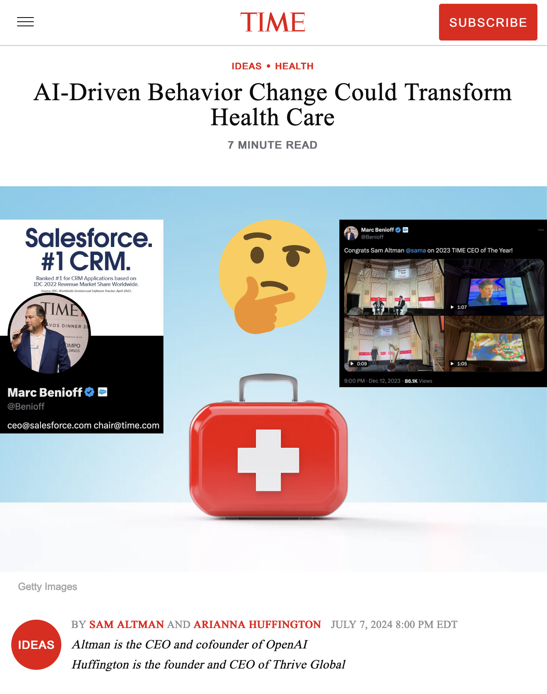
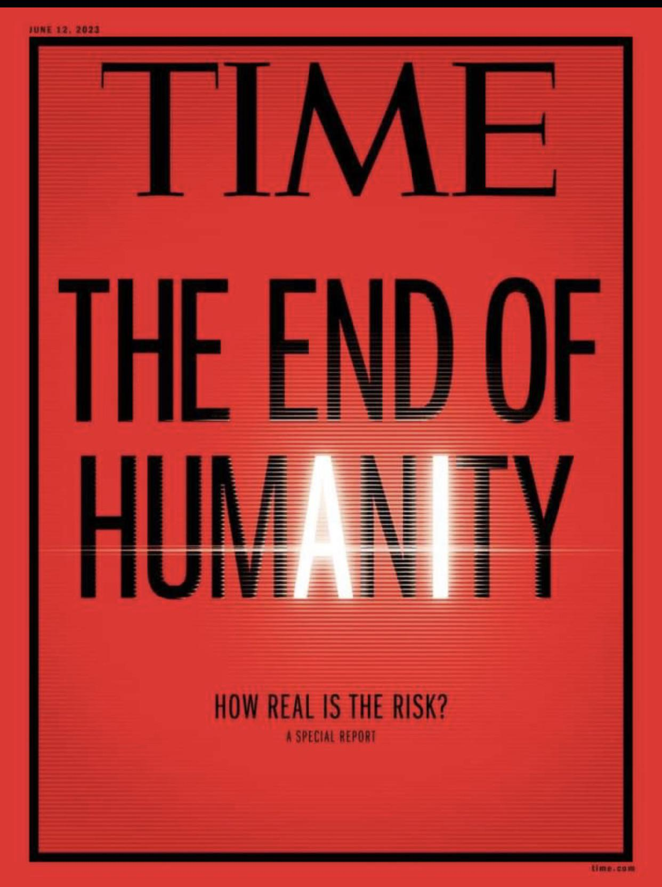

# We Need To Talk about Time Magazine and AI

If you keep up with Time Magazine's coverage of the news, you might have noticed that the topic of artificial intelligence comes up. A lot.

It's impossible to know exactly what editorial decisions led to this, but comparing the magazine's coverage with the actions of its owner and his business investments reveals a relationship with the AI industry that is not always disclosed in Time's coverage.

### A History of Time Magazine's Sensationalist AI Coverage

In March 2023, the outlet published a controversial op-ed by AI doomsayer Eliezer Yudkowsky warning of human extinction from AI and calling for airstrikes on data centers deemed dangerous. Time would later dedicate an entire issue to a special report about the potential existential risks of AI.

Later that year, Time's [Top 100 most influential people in AI](https://time.com/collection/time100-ai/) list included many other prominent people in the field who have expressed fears of murderous AI in addition to OpenAI CEO and Altman and Eliezer Yudkowsky. These include Google DeepMind's Shane Legg, OpenAI co-founder Ilya Sutskever, Anthropic co-founders Dario and Daniela Amodei, and researchers Geoffrey Hinton, Dan Hendrycks, Yoshua Bengio, and Jess Whittlestone.

On July 8, Time published an [article](https://time.com/6996090/ai-china-american-voters-poll/) about an exclusive poll they received from the [AI Policy Institute](https://theaipi.org/about/), a think tank focused solely on existential risks from AI.

This followed an essay published by Time the previous day penned by Sam Altman and Arianna Huffington. The op-ed, [AI-Driven Behavior Change Could Transform Health Care"](https://time.com/6994739/ai-behavior-change-health-care/) hypes up hypothetical applications of AI in health care with very little evidence for their predictions. The piece is essentially an ad for Huffington's new company "Thrive AI Health" that uses OpenAI's GPT technology for medical chatbots.

While it included a disclosure of OpenAI's licensing agreement with Time, there are several more conflicts of interests between it and commercial AI companies like OpenAI.

#### Marc Benioff, Salesforce & Generative AI

Time has been owned and co-chaired by billionaire Marc Benioff since 2018. Benioff is the founder and CEO of the massive cloud computing corporation Salesforce, which has [acquired](https://en.wikipedia.org/wiki/Salesforce#Acquisitions) many smaller tech companies and amassed a workforce of over 70,000 employees.

Salesforce [partnered with OpenAI](https://www.salesforce.com/news/press-releases/2023/03/07/einstein-generative-ai/) in 2023 to create their Einstein generative AI platform, which is still [advertised](https://openai.com/index/salesforce/) on OpenAI's website. Salesforce's venture capital arm also launched a $500 million [generative AI fund](https://www.salesforce.com/news/stories/generative-ai-investing/) which has funded at least one company ([Tribble](https://techcrunch.com/2023/06/12/salesforce-pledges-to-invest-500m-in-generative-ai-startups/)) that relies on OpenAI's GPT products.

Despite its rivalry with OpenAI, the same fund has also directly invested in Anthropic and Salesforce has published an [interview](https://salesforceventures.com/perspectives/in-conversation-with-anthropic-co-founder-tom-brown/) with Anthropic co-founder Tom Brown. In it, he claimed Artificial General Intelligence (sentient AI with human-level intelligence) already exists and theorized that it would soon surpass his own skills:
>“I think we already have weak AGI. You can talk with ChatGPT or Claude and it’s somewhat intelligent, and with each year it’s improving.”
>
>“Right now you may prompt the model to build a successful startup. It’ll try to do it, but it’ll get stuck. But as we add more compute, the model gets smarter. The model’s IQ goes up. So I think it would be surprising if the models suddenly stopped getting better. And then it’s a question of how much better can they get? One thing we don’t know is how far the model has to go for it to be an AI entrepreneur that could do a great job. But every year it seems like we’re getting more IQ points so at some point I think we’ll get models that are better at engineering than I am.”

The popular chat app Slack (a subsidiary of Salesforce) developed their [ChatGPT integration](https://slack.com/blog/news/why-we-built-the-chatgpt-app-for-slack) in collaboration with OpenAI and praised them by saying that they're "changing the world through innovations in AI". Conversely, OpenAI is a customer of Slack's platform. Having [1,200 employees](https://www.bloomberg.com/news/articles/2024-04-04/openai-sees-tremendous-growth-in-corporate-version-of-chatgpt), OpenAI should be paying a minimum of $180,000 per year for Slack, though their unique security needs necessitate a higher ["Enterprise Grid"](https://app.slack.com/plans/T071SMGKPJ5) service tier with custom pricing terms.

Beyond business ties, Marc Benioff has a personal relationship with OpenAI. During an earnings call in 2023, Benioff [described](https://www.businessinsider.com/marc-benioff-sam-altman-neighbors-ai-salesforce-openai-slack-chatgpt-2023-6) how he's neighbors with CEO Sam Altman and how they discussed AI and other unspecified "advanced technologies" over dinner. While their relationship has degraded slight since then with Benioff attempting to [poach OpenAI employees](https://x.com/Benioff/status/1727144886259040646), he still [celebrated](https://x.com/Benioff/status/1734755032375943222) Altman being named Time's [CEO of the Year](https://time.com/6342827/ceo-of-the-year-2023-sam-altman/). This award was given to Altman despite him being recently [temporarily fired from his position](https://www.npr.org/2023/11/24/1215015362/chatgpt-openai-sam-altman-fired-explained) and [portrayed in New York Magazine](https://nymag.com/intelligencer/article/sam-altman-artificial-intelligence-openai-profile.html) as racist and vindictive. New York Magazine's profile also led to the re-surfacing of [accusations](https://x.com/anniealtman108/status/1459696444802142213) of sexual and emotional abuse against Altman from his sister Annie.

#### Marc Benioff's Dystopian Sci-fi Views on AI

At his [January 2024 talk](https://www.youtube.com/watch?v=JSlniwSmBuI) at the World Economic Forum in Davos, Benioff revealed that he agrees with Sam Altman's views on the dangers of advanced technologies. Quoting Altman, he invokes several dystopian science fiction films as points of comparison for modern AI:
> As Sam likes to say, we don't really know what's gonna happen next, but we all saw Minority Report. We saw WarGames. We know about HAL. We saw the movie Her. It doesn't take a rocket scientist to fill it in.

He further [compared](https://www.cnbc.com/2024/01/18/we-dont-want-to-see-an-ai-hiroshima-salesforce-ceo-warns.html) AI to nuclear weapons by referencing a possible "AI Hiroshima" and referenced the 2023 UK AI Safety Summit where Rishi Sunak also mentioned possible extinction risk from AI.

Later in the interview, Benioff jokes that reporters "need forgiveness". It's unclear why he thinks that would be necessary, but an NPR report that was in progress at the time of the interview provides a hint as to why he doesn't like journalists.

### Marc Benioff's mystery land in Hawaii and harassment of an NPR reporter

In February 2024, NPR published an [investigation](https://www.npr.org/2024/02/28/1232564250/billionaire-benioff-buys-hawaii-land-salesforce) into previously unreported land purchases by Marc Benioff in Hawaii. During the course of the investigation, Benioff obtained the phone number of NPR's journalist and intimidated her with his knowledge of her location and personal information, claiming that stalking her is "his job". **The  owner of a major news outlet harassing a reporter for a rival publication for investigation him should alarm everyone interested in a free press and raise questions about the nature of Time's own reporting**. If Benioff was willing to say this to someone who works for NPR, it's easy to imagine that he has behaved even worse towards people who work for him and his companies.

NPR's investigation discovered that 165 acres of the land Benioff has purchased in Hawaii for his personal use. He denied being a "prepper" when asked if he was building a bunker, but this may not have been the truth.

This is because back in 2016, Marc Benioff's neighbor Sam Altman [opened up about his fears of an AI apocalypse](https://www.newyorker.com/magazine/2016/10/10/sam-altmans-manifest-destiny), revealing that he owns a safe location in Big Sur that contains guns and gas masks from the Israeli Defense Force amongst other survival gear. Given his increased concern about AI doomsday scenarios in the years since Altman was interviewed, it's very unlikely that Altman has given up his doomsday prepper ways. However, I do think it is likely that he has recommended that his tech executive peers such as Marc Benioff follow his lead.