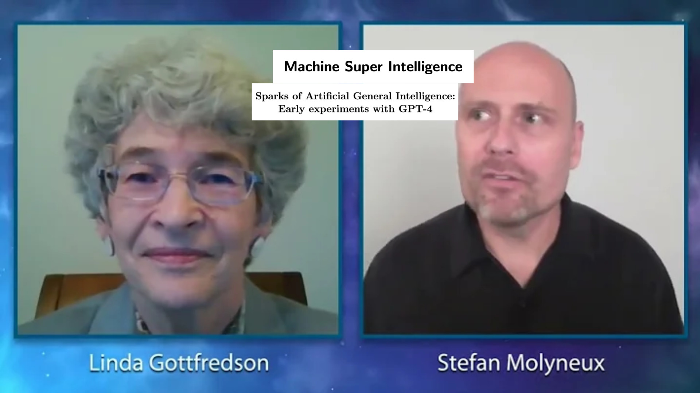

# AGI Researchers Stop Quoting White Supremacists Challenge (Impossible)

> Linda Gottfredson appearing on a show with right wing influencer Stefan Molyneux called "Race, Evolution and Intelligence" in 2015 where she claimed that the "IQs of African blacks" was "around 70". Molyneux would later be permanently banned from YouTube for hate speech.

Last spring, Microsoft and OpenAI made waves when they released a paper entitled "Sparks of Artificial General Intelligence: Early experiments with GPT-4" alleging that GPT-4's ability to complete various tasks represents an early form of "Artificial General Intelligence". Artificial General Intelligence (AGI for short) is a theorized form of self-aware machine learning that can achieve or even surpass the intelligence of humans. Before this announcement, both OpenAI and Google DeepMind had stated that their respective goals were to invent such an AI system, so this paper was viewed as a vindication of their belief that building AGI is possible.

Naturally, in order to create and test an AGI system, one has to first define what "intelligence" even is. Microsoft's paper acknowledges this difficulty and [chooses to use a definition](https://arxiv.org/pdf/2303.12712v1.pdf#section.1) presented by "a group of 52 psychologists who signed onto a broad definition published in an editorial about the science of intelligence" in 1994. This broad definition of intelligence was authored by a psychologist by the name of  Linda Gottfredson.

Unfortunately, it turns out that Linda Gottfredson has spent her decades-long career promoting pseudoscience in order to [oppose diversity](https://www1.udel.edu/educ/gottfredson/reprints/1994fromtheashes.pdf) and advance the idea that black people are genetically disposed towards having low IQs. The Southern Poverty Law Center, which specializes in tracking white supremacists, said this about Gottfredson in their [profile of her](https://www.splcenter.org/fighting-hate/extremist-files/individual/linda-gottfredson):
> Beyond her efforts to fight workforce equality, Gottfredson has devoted a great deal of time and energy to defending some of the most egregious figures in academic racism by writing articles celebrating their work. One such article was dedicated to Arthur Jensen, a psychologist at the forefront of modern scientific racism who used his authority to support segregation and sat on the editorial board of a German neo-Nazi “academic” journal, Neue Anthropologie. Gottfredson described Jensen as “a masterful scientist” who “deserves the gratitude of scientists and citizens alike.” 

SPLC goes on to discuss the group of 52 psychologists who signed Gottfredson's statement from Microsoft's paper:
> Although she prefers to stay further away from the spotlight than her more flamboyantly racist colleagues, Gottfredson gained some degree of notoriety at the national level with the publication of her 1994 Wall Street Journal op-ed, “Mainstream Science on Intelligence,” which was co-signed by 52 other scientists. “Mainstream Science” was Gottfredson’s contribution to the heated debate over the then-recent publication of Charles Murray and Richard Herrnstein’s The Bell Curve, which used arguments recycled from eugenicists, white supremacists, and neo-Nazis to claim that social inequality is caused by black genetic inferiority, especially in intelligence. 
> 
> One hundred and thirty-one scientists were sent copies of the statement and asked to append their signatures. Of those, 31 ignored the letter, and another 48 responded with a refusal to sign. Donald T. Campbell, a prominent psychologist and philosopher who was part of the latter group, has said that of the 52 scientists who did agree to sign Gottfredson’s statement, only 10 were actual experts in the field of intelligence measurement. Not only were the majority of the 52 signatories not experts in IQ measurement, but some had no relevant qualifications at all. 

In short, the 52 "experts" whose definition of intelligence Microsoft quoted are in fact not experts at all but rather the only people who Gottfredson could get to sign on to her racist manifesto. SPLC also notes that **at least 20 of the 52 signatories had received financial support from The Pioneer Fund, a eugenicist organization that was created to promote "race betterment"**. 

After linguist and AI hype critic Emily M Bender took to Twitter to [describe how problematic Gottfredson is](https://twitter.com/emilymbender/status/1645493282959675392) , lead author Sebastien Bubeck replied apologetically and Microsoft uploaded a [newly edited version](https://arxiv.org/pdf/2303.12712v4.pdf) to arXiv. However, **this updated paper continued using Gottfredson's definition of "intelligence" and only modified the citation to say that the editorial was "published in an editorial containing claims that we disavow". It also continued to refer to the signatories as a "large group of experts"**. After more criticism, the paper was finally updated [again](https://arxiv.org/pdf/2303.12712v5.pdf) to say that "there is no generally agreed upon definition of intelligence".

---
It goes without saying that none of how this played out is an acceptable way for a paper in the field of computer science, or any other science for that matter, to be handled. **As a black person with a background in machine learning, I am equally parts shocked and depressed that no one at Microsoft corrected this enormous issue in the introduction of their paper.** The conceptualization of "intelligence" at hand effects all of the AGI research pertaining to GPT and the authors' ignorance of the historical racism in intelligence research does not bode well for the quality of future work in the area. 

This incident also exposes the flaws with using preprint servers like arXiv as the primary platform for releasing research. Had Microsoft's paper gone through a traditional academic journal, the peer review process likely would've caught this issue. If that didn't happen for whatever reason, the journal would've had to publicly publish a correction that would inevitably (and rightfully) generate bad press. In contrast, arXiv's platform allowed Microsoft to quietly re-upload an edited version and pretend like this whole incident never happened. 

To make matters worse, "Sparks of Artificial General Intelligence" is not the only AI paper to cite Linda Gottfredson's work. After the news regarding Microsoft's paper broke, **I discovered that Shane Legg, co-founder of DeepMind (now part of Google) also cited her definition of intelligence in the introduction to his 2008 PhD thesis called ["Machine Super Intelligence"](https://www.vetta.org/documents/Machine_Super_Intelligence.pdf)**. In it, he refers to it as **"an especially interesting definition as it was given as part of a group statement signed by 52 experts in the field"**. The controversy regarding Gottfredson's racism and those of these "experts" was well established by 2008 as the statement was originally released in defense of Charles Murray's 1994 book [The Bell Curve](https://en.wikipedia.org/wiki/The_Bell_Curve). Murray's book was [immediately accused](https://www.nybooks.com/articles/1994/12/01/the-tainted-sources-of-the-bell-curve/) of supporting racist political policies upon its release and these accusations have [followed](https://blogs.scientificamerican.com/voices/the-real-problem-with-charles-murray-and-the-bell-curve/) the book into the 21st century.. As such, I again have no clue how this oversight managed to get into a released paper. Unlike "Sparks of AGI", Shane Legg had to submit and defend his thesis at the University of Lugano, meaning that this citation managed to pass by his supervisor and other members of faculty at approved this. 

The fact that this specific person has now appeared twice in prominent papers relating to AGI is a black mark on the entire concept and should prompt some philosophical soul searching on the part of those who are optimistic about AGI's possibility. Unfortunately, I have no confidence in the current machine learning world to do that introspection and I suspect this uncritical mindset is what led to Gottfredson's name re-surfacing in 2023. 

Virtually all proposed theories relating to AGI and its development rely on simplified, quantifiable representations of intelligence. This leads AGI researchers to gravitate towards metrics like IQ, along with all the historical baggage that comes with the use of those metrics. Sadly, these same AGI researchers are a group that is seemingly allergic to the humanities and are unlikely to have awareness of that baggage. For example, OpenAI CEO Sam Altman recently [tweeted](https://twitter.com/sama/status/1696286884803301605) that "building AGI is a scientific problem" while "building superintelligence is an engineering problem". This tech-first attitude leaves little room for the so-called "soft" sciences from which OpenAI and Microsoft are clearly desperately lacking in expertise.