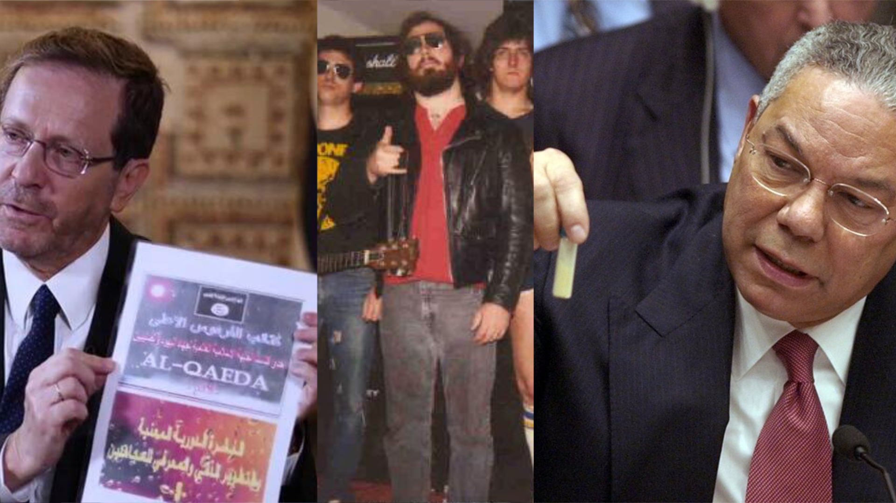
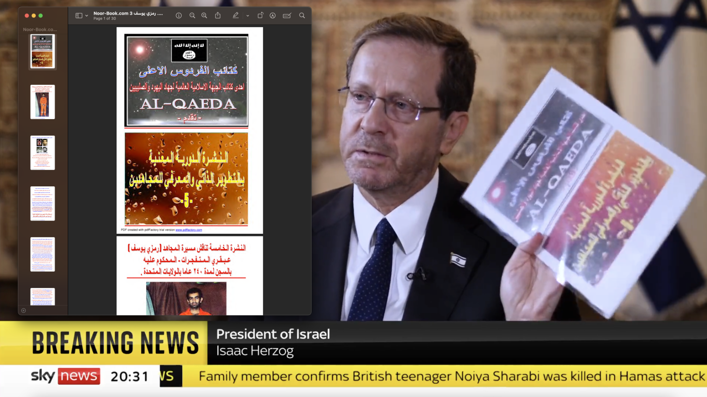
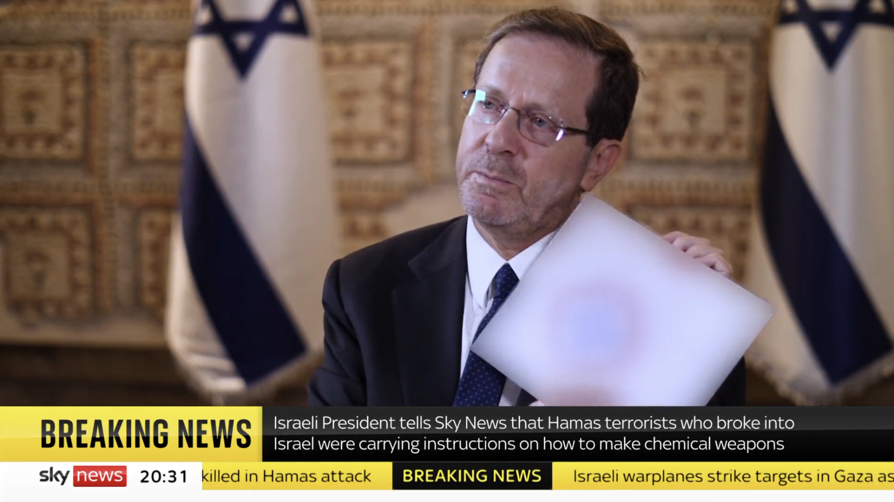
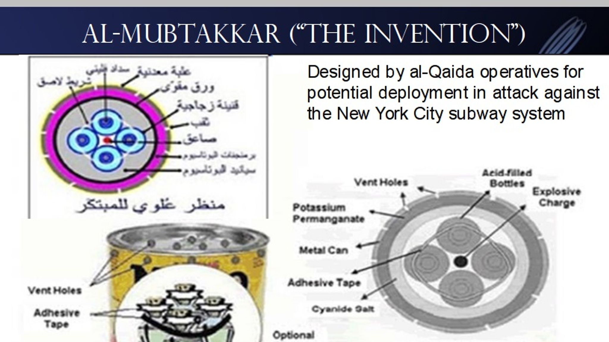
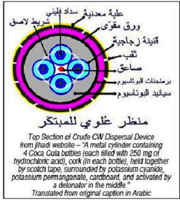

# About Those Hamas Chemical Weapons...
###  Chemical weapon designs presented by Israeli president Isaac Herzog were analyzed by experts over 15 years ago

*(Isaac Herzog, George "Dick Destiny" Smith, and Colin Powell)*

On October 22, 2023, Sky News aired an [interview](https://twitter.com/SkyNews/status/1716176823862587814) with Israeli president Isaac Herzog in which he presented two pieces of paper. According to Herzog, these papers come from an official instruction manual written by al-Qaeda on how to produce chemical weapons and were recovered from a Hamas fighter. An accompanying [press release](https://www.gov.il/en/departments/news/president-herzog-interviewed-on-sky-news-22-oct-2023) put out by the president's spokesperson proclaims the following:

> Its discovery indicates both the connection between the organizations and the intention of the Hamas terrorist organization to use chemical weapons to cause mass casualties". 

My brief investigation into the public history of the documents Herzog presented indicates that both of these claims are likely exaggerated.
## Page 1

Shortly after the interview went online, journalist [Séamus Malekafzali](https://twitter.com/Seamus_Malek/status/1716278455677923711) found a file containing the first page shown by Herzog on a book hosting website named [noor-book.com](https://www.noor-book.com/en/ebook-%D8%B1%D9%85%D8%B2%D9%8A-%D9%8A%D9%88%D8%B3%D9%81-pdf), though this is not the true origin of this document. The book's webpage on noor-book.com indicates that the file was taken from the Internet Archive and I was indeed able to find the [original PDF](https://archive.org/details/hamanyzaied_gmail_20140223/page/n3/mode/2up)[^1] there. The contents appear to pertain to [Ramzi Yousef](https://en.wikipedia.org/wiki/Ramzi_Yousef), ringleader of the 1993 World Trade Center bombings and the document doesn't include the other page shown by Herzog.

*(PDF from the Internet Archive compared to the document presented by Isaac Herzbog)*

The press release from the Israeli government concerning this document purports that it dates back to 2003. However, ISIS's predecessor group didn't officially merge with al-Qaeda until [2004](https://www.dni.gov/nctc/ftos/isis_fto.html) and used [other flag designs](https://en.wikipedia.org/wiki/Jama%27at_al-Tawhid_wal-Jihad#/media/File:Flag_of_JTJ.svg) at the time. Furthermore, the flag featured in the above photograph was [designed in 2006 and first revealed in 2007](https://www.theatlantic.com/international/archive/2015/09/isis-flag-apocalypse/406498/)[^2]  according to Will McCants, author of "The ISIS apocalypse: The history, strategy, and doomsday vision of the Islamic State". 

**It is unclear how a flag created in 2006 ended up on a document from 2003.**

As he holds up this page, Herzog claims that Israel is "dealing with ISIS, al-Qaeda, Hamas". This rhetoric is in line with the press release's allegation that the document represents an "attempt of the terrorist organization Hamas to trace back to ISIS". Similarly, Israel's Twitter/X account has outright stated ["Hamas is ISIS"](https://twitter.com/Israel/status/1713196336470790156) and created an accompanying #HamasISIS hashtag. While Israel's press release mentions the age of the material, Herzog doesn't mention that the chemical weapon design are older than ISIS itself, instead giving the impression that Hamas may be actively collaborating with ISIS or al-Qaeda.

In fairness, none of this is irrefutable evidence that Herzog isn't telling the truth. It is entirely possible that the cover to the Internet Archive document was taken from existing al-Qaeda material; it's an amateurish production, covered in waterwarks from the trial version of a PDF making app.  It's also possible that Israel simply made a mistake regarding the age of the document with the ISIS flag, though I would hope such things are double checked before presenting them to the press... 
## Page 2

This story gets much more complicated once the other piece of evidence is introduced. The second paper held up by Herzog contains a design for a chemical weapon, though Sky News opted to censor it. I'm unsure why they made that decision as other outlets have posted the uncensored video (such as Axios writer [Barak Ravid](https://twitter.com/BarakRavid/status/1716169113448370673)) and a PDF version of it was posted to the [Israeli government website](https://www.gov.il/BlobFolder/news/president-herzog-interviewed-on-sky-news-22-oct-2023/en/English_Swords_of_Iron_Al-Qaeda%20instructions-overview.pdf), allowing me to perform a reverse image search.

*(Censored and uncensored screenshots of al-Qaeda's improvised chemical weapon design)*

This reverse image search managed to find a handful of mainstream websites where the uncensored image is already available. While these sources do confirm that it is a diagram of an improvised chemical weapon created by al-Qaeda as early as 2003, they also indicate that there was never a realistic danger of a large scale chemical weapon attack using this weapon.

The first of these search results is none other than Sky News itself! The following image appeared in a 2018 article called ["Can you buy chemical weapons on the dark web?"](https://news.sky.com/story/can-you-buy-chemical-weapons-on-the-dark-web-11297819). Spoiler alert: the answer to this clickbait headline is "no". 

*(Diagram of "al-Mubtakkar" from Sky News' 2018 article)*

Experts interviewed by Sky at the time saw no evidence that anyone was trying to build such a device and pointed out that any attempts to do so would be very risky, with one quoted as saying **"You would need significant skills to develop a chemical weapon and not kill yourself"**.
### The Mubtakkar?

The name "Mubtakkar" and the story of the 2003 al-Qaeda plan to use it on the New York City subway both originate from the 2006 book [The One Percent Doctrine](https://en.wikipedia.org/wiki/The_One_Percent_Doctrine) written by Ron Suskind. While the intelligence report Suskind based his writing on was confirmed to be real, many people with knowledge of the matter downplayed the severity and likelihood of the planned attack described in Suskin's book. One official [told the New York Times](https://www.nytimes.com/2006/06/18/nyregion/18plot.html?ex=1308283200&en=512b32498584b593&ei=5088&partner=rssnyt&emc=rss) the following:

>"None of it has been confirmed in three years, who these guys were, whether they in fact had a weapon, or whether they were able to put together a weapon, whether that weapon has been defined and what it would cause or whether they were even in New York."

Another news article published by United Press International in 2006 is simply titled [Cyanide gas device 'probably didn't work'](https://www.upi.com/Defense-News/2006/06/26/Cyanide-gas-device-probably-didnt-work/89721151312786/). This piece quotes Milton Leitenberg, a chemical weapons expert from the University of Maryland who says the device would probably create "very little gas", a far cry from the potential "mass casualties" Israel is now warning us of. 

Leitenberg, who had 40 years of experience at the time, goes on to call Ron Suskind's claim that a Mubtakkar made from household ingredients could kill many people **"the stupidest statement I have heard in many years"** and points out that the Japanese terrorist group Aum Shinrikyo was unable to create an effective chemical weapon even with access to modern labs and millions of dollars. One ex-official interviewed by United Press said Suskind "makes it seem a lot more dramatic" than it really was while another stated **"if this is such an amazing weapon, and the design for it is out there, why has no one ever used it?"**.

This quote rings even more true in 2023. If the pictured device is indeed a Mubtakkar, all evidence seems to indicate that it has never successfully been used in a terrorist attack in the 20 years since its design.  

### Not the Mubtakkar?

The nature of the weapon diagram was disputed by chemist George Smith, whose [2006 blog post on the subject](http://www.dickdestiny.com/blog/2006/07/improvised-cyanide-munition-continued.html) was the other result found by my reverse image search.  This version of the image features English translations and was sourced from a [special report from WMD Insights](https://web.archive.org/web/20060819120540/http://www.wmdinsights.com/I7/I7_ME1_SP_MaunualFor.htm) [^3] which states report states that the weapon-making manual was already being widely reposted throughout jihadi networks no later than 2005. This predates the 2006 design of the ISIS flag in the first page shown by Herzog.

>  Although it is unclear when it was first posted on the Internet, this manual was available on the operational al-Qaeda jihadi websites _al-Firdaws_ and _al-Farouq_ from October 2005 to early 2006, when the sites were closed. Since then, it has been disseminated to other websites: most operational al-Qaeda manuals are reposted on numerous pages to maximize their exposure among the jihadi community.

*(Translated chemical weapon diagram from 2006)*

WMD Insights' report expressed concerns that terrorists unrelated to al-Qaeda might be able to recreate the weapon, but George Smith was skeptical. In his analysis, he points to a major error in the English instructions and concludes that WMD Insights were incorrect in labeling the weapon as "nearly identical" to Suskind's Mubtakkar[^4].

> **This diagram is not like Suskind's much-publicized Mubtakkar.** The Pulitzer-winner did not know the basic science involved and so described its design very poorly. But he did define it as a two-compound munition, even blutzing that bit on National Public Radio's Fresh Air, saying one of its reagents was "sodium chloride" -- simple table salt. However, the diagram at left is virtually identical to the photograph of the Department of Homeland Security prototype -- a three compound design -- distributed nationwide in cyberspace and discussed in "Improvised Cyanide Munition."

Smith goes on to detail the similarities between the DHS's prototype and the diagram, noting that the prototype "would be somewhat more explosive and less efficient, because of competition between chemicals, than whatever was described by reporter Ron Suskind". 

>  In any case, the munition as pictured has all the same drawbacks as the Department of Homeland Security's munition. It's a bomb in which the canister would likely burst and scatter its chemicals, or consume amounts of the desired product -- hydrogen cyanide, if much was produced at all.

Smith's conclusion is that none of the chemical weapons designs were as dangerous as portrayed by the press, adding that **"no such devices have as yet been recovered"**[^5]. 

### What is Hamas' plan anyway?

Milton Leitenberg claimed in his interview with United Press that "you would have to obtain the ingredients from a chemical supplier" in order to create Mubtakkar weapon capable of causing mass casualties. This is supported by other comments made to Sky News in 2018 indicating that this is a reason why jihadists don't use chemical weapons:

> "The time to be served for developing and selling a nerve agent means that the risk outweighs the reward, and the challenge regarding transporting the material is very difficult."
> 
> The fear that the attempted procurement of materials which could be used for terror purposes will result in a sting operation is even common among jihadist forums, Ms Pinkard told Sky News.

 I am by no means an expert, but it seems unlikely that Hamas would be able to smuggle those materials through the Israeli blockade of the  Gaza Strip. If they did manage that feat, I believe common sense would dictate that Hamas should manufacture their chemical weapons *before* beginning their assault on Israel.

Another possibility is that Hamas intended to obtain these chemicals in Israel during their attack, but I have heard no news of a Hamas attack on Israeli chemical depots and Hamas seems to be pre-occupied with their murder/kidnapping spree and the massive bombing campaign Israel has initiated in response right now.

An [Axios article](https://www.axios.com/2023/10/21/israel-hamas-cyanide-weapon-instructions) on the weapon-making manual says that the news of its existence was disseminated in a classified cable with the headline "Hamas intention of using chemical weapons". If this claim is based solely on the evidence presented by Herzog, any plans Hamas may have had for using chemical weapons seem to be poorly thought out at best.

### George Smith has a history in this area

*George "Dick Destiny" Smith poses with his band The Highway Kings*

I was initially reluctant to trust the word of a Blogspot blog named "Dick Destiny", so I did some more vetting of George Smith's credentials. Fortunately, he appears to be legit; the name "Dick Destiny" comes from his rock band, Dick Destiny and the Highway Kings[^6]. A 1987 [profile of his act](https://www.mcall.com/1987/01/02/dick-destiny-only-comes-out-at-night/) confirms that he already had a PhD and career in chemistry at the time. 

The [about page](http://dickdestiny.com/blog1/?page_id=7603) on a newer version of the Dick Destiny blog also reveals an incredible coincidence: George Smith's first claim to fame was testifying as an expert witness for the trial of the alleged [Wood Green ricin bioterrorists](https://en.wikipedia.org/wiki/Wood_Green_ricin_plot).

Some context: Back in January 2003, UK police arrested over a dozen people and charged them with plotting a major terrorist attack using the poison ricin (famously [portrayed](https://breakingbad.fandom.com/wiki/Problem_Dog) in Breaking Bad). After an investigation, it was revealed that no ricin was ever detected and all but one of the suspects were eventually released or acquitted. Despite this, the public was not informed that the poison scare was a false positive until 2005 and in early 2023 it was [revealed by lawyer involved with the case](https://bylinetimes.com/2023/03/30/ricin-and-the-red-tops-how-a-made-up-terror-plot-helped-the-media-build-the-case-for-the-iraq-war/) that the faulty intelligence that led to the arrests was probably obtained through torture.

Of course, none of this prevented Colin Powell from falsely [testifying to the United Nations](https://georgewbush-whitehouse.archives.gov/news/releases/2003/02/20030205-1.html) in 2003 that a network of terrorists with ties to Iraq and Saddam Hussein contained a "UK Poison Cell". 

*(Slide presented by Colin Powell to the UN showing a "UK poison cell" with ties to Iraq)*

Prior to this, former Prime Israeli Minister Benjamin Netanyahu (who is somehow Prime Minister again in 2023) had also [participated in a US Congressional hearing](https://www.youtube.com/watch?v=d_PDpwL8kuY) on Iraq. In his testimony, he warned of Saddam's (nonexistent) ability to produce weapons of mass destruction and said that an American invasion of Iraq would be "the right choice".  Netanyahu even doubled down on these falsehoods in a [Wall Street Journal op-ed](https://www.wsj.com/articles/SB1032480479501791755) a week later:

>This is a dictator who is rapidly expanding his arsenal of biological and chemical weapons, who has used these weapons of mass destruction against his subjects and his neighbors, and who is feverishly trying to acquire nuclear weapons.

The United States would infamously go on to invade Iraq despite the lack of evidence, find no weapons of mass destruction, and ironically create the conditions that would allow ISIS to establish itself in the country.

His involvement with this saga led George Smith to rightfully declare that his work "was one of the first places you could see at least one of the claims made by the US government, delivered by Colin Powell in his address to the UN Security Council, on reasons for war in Iraq, shot to pieces". I'm glad his website is still around over 15 years later to help scrutinize more justifications for war, though I really wish it wasn't necessary right now.

### Conclusion (tl;dr)

The alleged plans for making chemical weapons currently being used by Israel to justify its bombing and imminent invasion of Gaza were largely debunked 15 years ago by the same chemist who helped debunk Colin Powell's false allegations of chemical weapons that were used to justify the American invasion of Iraq. Time is a flat circle.

---

[^1] The noor-book.com page claims this PDF was added in February 2010 while the Internet Archive listing was added in February 2014. I'm unsure what caused this discrepancy or which date is correct.
[^2] Metadata for the [ISIS flag on Wikipedia](https://en.m.wikipedia.org/wiki/File:Flag_of_Islamic_State_of_Iraq.svg) states that "press photographs showing this flag first appear in early 2006". These photos may predate the "official" 2007 adoption of the flag on the internet described by William McCants.
[^3] wmdinsights.com now redirects to the website of [SAIC](https://en.wikipedia.org/wiki/Science_Applications_International_Corporation), a major government contractor.
[^4] One possible explanation for this is that name "Mubtakkar" was used for multiple weapon designs.
[^5] A [follow-up post](http://www.dickdestiny.com/blog/2006/07/who-designed-cyanide-bomb-answer.html) by George Smith cites an anonymous source who claims that one of these devices failed in an unpublicized incident in Afghanistan. The anonymous source also corroborates Israel's statement that the diagram dates back to 2003, though I can't verify either statement.
[^6] Their music [goes hard](https://www.youtube.com/watch?v=KGFVM7q2cUE)!