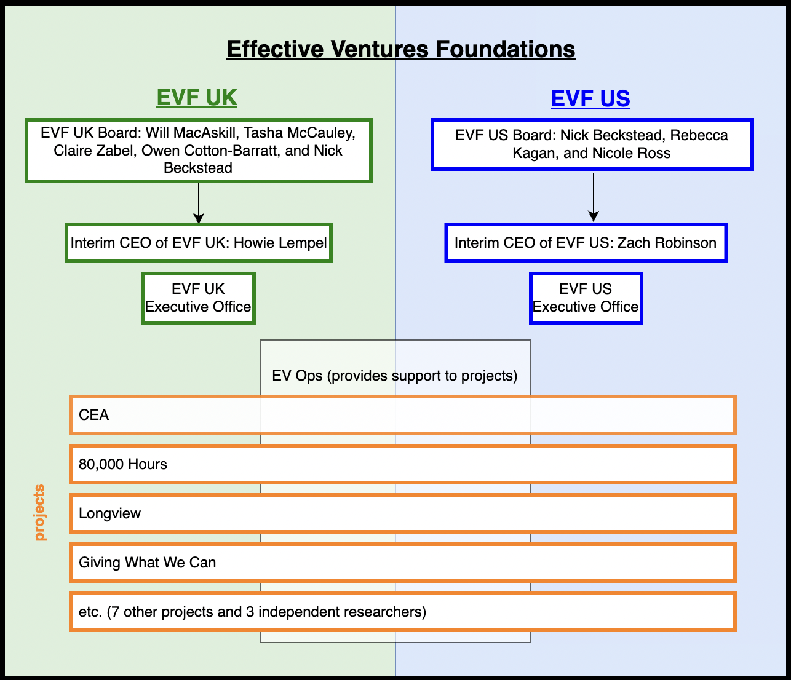
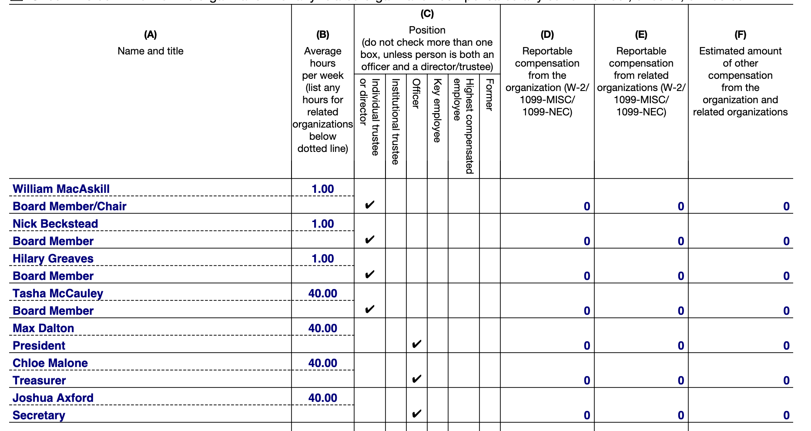

# “None of our board members are effective altruists”

In the week leading up to Sam Altman's [surprise firing](https://www.theverge.com/2023/11/17/23965982/openai-ceo-sam-altman-fired) from his job as OpenAI's CEO, VentureBeat published an [article](https://venturebeat.com/ai/openais-six-member-board-will-decide-when-weve-attained-agi/)  exploring the company's unusual corporate structure. This article included a statement from an OpenAI spokesperson:
> The OpenAI spokesperson said that “None of our board members are effective altruists,” adding that “non-employee board members are not effective altruists; their interactions with the EA community are focused on topics related to AI safety or to offer the perspective of someone not closely involved in the group.”

One of OpenAI's board members, Tasha McCauley, is on the UK board of trustees for [Effective Ventures](https://ev.org/ops/about/). Effective Ventures is one of the largest organization in the effective altruism movement and has a massive budget of over $50 million that it uses to "support and help grow some of the most impactful organizations in the effective altruism and longtermism communities"[^1]. More research into the organization indicates that she is indeed closely involved with effective altruism.

### Understanding the structure of Effective Ventures  and the Centre for Effective Altruism

The relationship between the Centre for Effective Altruism (CEA) and the Effective Ventures (EV) is complicated. The legal disclaimer on [centreforeffectivealtruism.org](https://www.centreforeffectivealtruism.org/) says the following:
> The Centre for Effective Altruism is an Effective Ventures project. Effective Ventures Foundation (UK) (EV UK) is a charity in England and Wales (with registered charity number 1149828, registered company number 07962181, and is also a Netherlands registered tax-deductible entity ANBI 825776867). Effective Ventures Foundation USA Inc. (EV US) is a section 501(c)(3) organization in the USA (EIN 47-1988398). EV UK and EV US are separate charities that collaborate closely under the “Effective Ventures” name.

This charity structure is very recent; the "Effective Ventures" name has only been in use since January 2023, when the organizations were restructured as part of the fallout of the FTX scandal. Following this restructuring, "Effective Ventures" became the group that supports CEA's activities alongside many other large EA organizations while the charities "CEA International" and "CEA USA" were renamed to "EV UK" and "EV US" respectively [^2].

>A diagram showing the structure of Effective Ventures as of January 2023.

The new project that is still called CEA runs the Effective Altruism Forum, which is where the name change announcement was posted. As part of this [announcement](https://forum.effectivealtruism.org/posts/GoWNiPbrEb6NHD3MF/announcing-interim-ceos-of-evf), EVF's statement said the following:
> In response to the new challenges from FTX, **the boards became much more involved in the day-to-day operations of the charities**. But it’s not ideal to have boards playing the role of executives, so the boards have now also appointed Interim CEOs to each charity. 

As a member of one of these boards, McCauley was presumably one of the people who temporarily took on more day to day responsibilities in running one of the largest effective altruist charities.

### Will MacAskill's list of "Senior Figures" in Effective Altruism

William MacAskill, often referred to as an ["originator"](https://www.businessinsider.com/sam-bankman-fried-ftx-collapse-effective-altruism-donate-philanthropy-money-2022-12) of effective altruism, has shared many of his thoughts on the state of the movement since the arrest of Sam Bankman-Fried and his subsequent recusal[^3] from his board positions. One of these takes was a forum post titled [Decision-making and decentralization in EA](https://forum.effectivealtruism.org/posts/DdSszj5NXk45MhQoq/decision-making-and-decentralisation-in-ea). In it, he explains some of the ways that effective altruism is centralized:

> The senior figures in EA are in fairly regular communication with each other (though there’s probably less UK<>US communication than there should be). It’s not totally determinate who is a “senior figure”, and it varies over time, but the current list of people would at least include: 
> 
> Nick Beckstead, Alexander Berger, Max Dalton, Holden Karnofsky, Howie Lempel, Brenton Mayer, **Tasha McCauley**, Toby Ord, Lincoln Quirk, Nicole Ross, Eli Rose, Zach Robinson, James Snowden, Ben Todd, Ben West, Claire Zabel, and me. All of these people have had or currently have positions at OP or senior positions at EV.

MacAskill also describes the state of effective altruism as a "middle ground between a highly centralised (sic) decision-making entity like a company and complete anarchy" and goes on to explain that Effective Ventures US is one of those centralized entities as it **"currently houses the majority of EA movement-building work"**.

It sure seems to me like one of the most influential people in the history of the EA movement disagrees with the idea that there are "no effective altruists on the board of OpenAI"...

 I think OpenAI might have some bigger problems right now anyway.

--------

[^1] It also owns a [15th century English manor](https://www.wythamabbey.org/workshops) for some reason.

[^2] Prior to this change, the most recent [Form 990 tax return from 2021](https://assets.ctfassets.net/es8pp29e1wp8/719m3SIVrQSzDcUxrzo7dS/af10eed02339549672126b0e87f2776d/Final_-_2021_Form_990_signed_-_CEA.pdf) for  CEA shows that it was the business name for Effective Ventures USA. As a result, Tasha McCauley was listed as a board member who worked 40 hours per week for the American side of Effective Ventures despite her designation as a trustee of EVF UK/CEA International. 

[^3] Nick Beckstead and William MacAskill resigned from their board positions in [August](https://forum.effectivealtruism.org/posts/Defu3jkejb7pmLjeN/nick-beckstead-is-leaving-the-effective-ventures-boards) and [September](https://forum.effectivealtruism.org/posts/mArisdpuQiFtTNWw3/will-macaskill-has-stepped-down-as-trustee-of-ev-uk#fn-aPdFhg8fBWsqJTHMB-2) 2023 respectively for reasons related to their [ties to FTX and Sam Bankman-Fried](https://time.com/6262810/sam-bankman-fried-effective-altruism-alameda-ftx/).