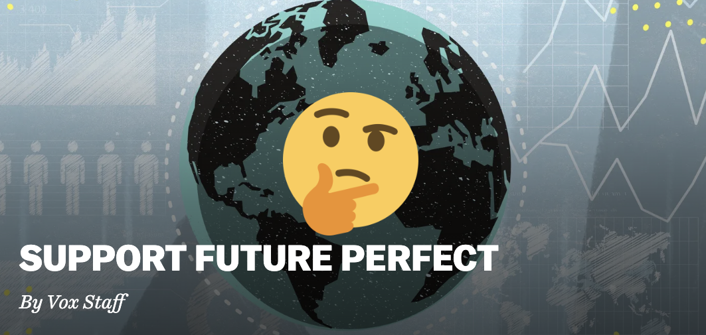

# Who Supports Future Perfect?

In 2018, news website Vox Media launched a subsection called Future Perfect with a motto of "finding the best ways to do good", often covering topics related to the effective altruism movement (EA for short). Future Perfect is partially funded by grants and their [donation page](https://www.vox.com/2020/1/7/21020439/support-future-perfect) claims that "all editorial decisions are made separately from fundraising and commercial considerations". While that may be the case, an investigation into those donors has revealed some worrying discrepancies with regards to how this fundraising has been disclosed. 

## Breakdown of Future Perfect's stated donors

*The “Support Future Page” is prominently displayed in the center of Future Perfect’s homepage*

Future Perfect's donation page lists the following entities as donors along with the years of their donations. 

    Rockefeller Foundation (2018-2019)
    James McClave (2020)
    Animal Charity Evaluators (2020-2021)
    BEMC Foundation (2021-2023)
    Building a Stronger Future (2022-2023)

With the exception of the [Rockefeller Foundation](https://en.wikipedia.org/wiki/Rockefeller_Foundation) (a massive philanthropic organization that was founded by oil baron John D Rockefeller over a century ago), all of these individuals and groups have direct ties to the effective altruism movement. In the case of Building a Stronger Future, those ties involved [disgraced](https://www.sec.gov/news/press-release/2022-219) cryptocurrency and EA evangelist Sam Bankman-Fried, leading to an announcement that those grant funds being frozen.

> In 2022, Future Perfect was awarded a one-time $200,000 grant from Building a Stronger Future, a family foundation run by Sam and Gabe Bankman-Fried, to support a reporting project on technological and innovation bottlenecks that hamper human progress. $14,000 of the grant funds were expended prior to the news of FTX’s bankruptcy and suspected fraud. The project (and any additional expenditure of grant funds) remains on hold. If and when a restitution fund is created, Future Perfect intends to turn over the balance to that fund.

This leaves Animal Charity Evaluators, James McClave and BEMC Foundation as the other donors to Future Perfect.

## Animal Charity Evaluators

Animal Charity Evaluators (ACE) was previously known as "Effective Animal Activism" and was originally founded as part of 80,000 Hours, one of the largest Effective Altruist outreach organizations before rebranding as a standalone charity in 2013. Today, ACE's website rarely mentions its connection to the EA movement despite the fact that the Centre for Effective Altruism's Welfare Fund is listed as a Diamond-tier donator for 2018, 2020, and 2023. Similarly, EA funding organization Open Philanthropy gave [grants to ACE](https://www.openphilanthropy.org/grants/?q=Animal+Charity+Evaluators) 2017, 2020, 2021 and 2023 for a total of $2.2 million dollars.

Regarding their relationship with Vox, ACE's [website](https://animalcharityevaluators.org/about/impact/annual-reports/2020-year-in-review/) provides quite a bit more detail about the nature of their partnership than Future Perfect itself does. It states:

> In 2020, thanks to a generous gift from a donor, ACE collaborated with Vox Media to highlight animal welfare issues. This support enabled their Future Perfect series of journalism and podcasts to commit its third podcast season exclusively to farmed animal welfare topics. Episodes covered human interactions with animals from angles that weren’t previously popular in the broader discourse, such as how animal agriculture affects immigrant workers and local communities. The podcast was also able to highlight the relationship between factory farming and pandemic risk. ACE used our communications expertise to support the third season’s launch and promoted it via our channels, including our recommended charities, animal advocacy Facebook groups, and the broader EA community.

 ACE's claim that "this support enabled their Future Perfect series of journalism and podcasts to commit its third podcast season exclusively to farmed animal welfare topics.", which seems to contradict Vox's own claim that "all editorial decisions are made separately from fundraising and commercial considerations" on their fundraising page. Clearly, there had to be some kind of editorial decision made to exclusively focus on animal welfare.

ACE's website also states that this amounted to "$262,500 of a restricted $350,000 donation" in 2020, while records show that the remaining $87,500 was disbursed over course of 2021. However, ACE's [most recent tax filing](https://projects.propublica.org/nonprofits/organizations/364684978/202222229349302257/full) for January-March 2022 shows an additional $32,672 of grant money not covered by the "2020-2021" disclosure on Future Perfect's website. 

Furthermore, ACE states that "ACE decided to continue the media project into 2022 following progress updates and reports provided by Vox media. Vox Media will continue to provide progess (sic) updates", indicating that their relationship with Vox was ongoing as of at least last March. 

ACE's [self-published 2022-2023 review](https://animalcharityevaluators.org/about/impact/annual-reports/2022-2023-year-in-review/) claims that the total money given to Vox over the course of 2022 totaled $120,514. This lines up with their currently released tax records and seems to indicate that Future Perfect was receiving money from ACE up until the end of 2022. Unlike the initial grant from ACE which came via a round $350,000 grant from one donor, ACE's review refers multiple "restricted donations" intended for Vox. It's unclear who any of these donors are.

**A personal note**: As a vegan myself, I am naturally a supporter of animal rights advocacy and I appreciate Animal Charity Evaluators' financial transparency practices as they were very helpful in researching this article. However, that transparency has raised more questions than it answers regarding the nature of their relationship with Vox.

## James McClave and BEMC Foundation

### What is BEMC Foundation?

Future Perfect lists "BEMC Foundation" as a donor for the years 2021 through 2023, making it the most recent major sponsor of the outlet that still exists. 

Future Perfect describes BEMC Foundation's support as such:
> Thanks to support from the BEMC Foundation — a grant-making organization committed to outstanding charities and causes promoting high-impact opportunities for saving and improving lives throughout the world — Future Perfect brought in our first class of fellows in 2021 and added more staff.

It's unclear where they got this description from; outside of Future Perfect's own coverage of the organization, BEMC Foundation has no internet presence whatsoever. The only Google results for "BEMC Foundation" are for the years [2020](https://projects.propublica.org/nonprofits/organizations/854281986/202210469349100116/full) and [2021](https://projects.propublica.org/nonprofits/organizations/854281986/202243189349104649/full), listed on ProPublica's handy [Nonprofit Explorer](https://projects.propublica.org/nonprofits/).

Those records reveal that BEMC Foundation is operated solely by JamesMcClave and his wife Emily Berger and that Future Perfect is the only organization that has ever received a grant from BEMC Foundation, to the tune of $611,527.  Given the collapse of Building a Stronger Future, it seems likely that this $600K represents a large part of Future Perfect's budget. It also represents a small fraction of BEMC Foundation's initial investment of $20 million.

It's unclear why McClave felt the need to create a private foundation solely to donate to Vox when he previously donated under his own name. It's also unclear what causes (if any) BEMC donates to or even what the origin of its name is.

### BEMC Foundation references Future Perfect videos

Besides the donation page, the only other references to BEMC Foundation on vox.com come from two specific Future Perfect videos: One about cloud seeding called ["Humans finally figured out how to make it rain"](https://www.youtube.com/watch?v=n3sEl4bB3qU) and another titled ["Batteries are dirty. Geothermal Power can help."](https://www.youtube.com/watch?v=HnsKfdnKZVk) on geothermal power. Both videos' description contain a disclaimer saying "this video was made possible by a grant from the BEMC Foundation" with no further information.

### James McClave, Jane Street Capital, Anthropic, and FTX

Like BEMC, James McClave (sometimes referred to as "Jim") doesn't have much of a presence on the internet. Political campaign contribution records show that he works for Jane Street Capital, a Wall Street trading firm famous for attracting effective altruists, including Sam Bankman-Fried who would later bring other effective altruists with him to his ill-fated FTX and Alameda Research companies. A [New York Times article](https://www.nytimes.com/2023/02/21/business/bankman-fried-altruism-jane-street.html) from February 2023 details this connection.

>Mr. Bankman-Fried had heard about Jane Street through the [effective altruists](https://www.nytimes.com/2022/12/09/books/review/effective-altruism-sam-bankman-fried-crypto.html) he already knew — many of them young, with roots in the technology industry. Once he joined the firm, working out of its main office in downtown Manhattan, he built ties with more than half a dozen colleagues with similar views, who later became part of the FTX universe.

>Jane Street, which had become informally associated with the effective altruism movement, seemed like an obvious place to start. The firm projected an anti-Wall Street bent, where casual clothing was the norm well before the pandemic and playing puzzles was [part of a trader’s training](https://figgie.com/). It recruited heavily from college campuses such as M.I.T., Carnegie Mellon and the University of California, Berkeley; paid junior employees handsomely; promoted a flat hierarchy; and saw little turnover.
>
>A spokesman for Jane Street said that many people at the firm were involved in philanthropic giving, some donating to causes associated with effective altruism, but that Jane Street itself never had any connection to the movement. He declined to make anyone at the firm available for an interview.

It's clear that McClave is part of Jane Street's effective altruist social circles. Beyond his donations to Future Perfect, his 2018 wedding registry website indicated that he wanted gifts directed to GiveWell, an effective altruist charity assessor that was a sibling organization to Open Philanthropy until 2017. 

Like SBF and other effective altruists, McClave also appears to be involved in bitcoin trading. In June 2022, he filed [a letter with the SEC ](https://www.sec.gov/comments/sr-nysearca-2021-90/srnysearca202190-20131689-302096.pdf) requesting that they allow the New York Stock Exchange to allow trading shares of a Bitcoin-based trust called the Grayscale Bitcoin Trust (GBTC).

>Jane Street fully appreciates that in considering proposals to list bitcoin ETPs such as GBTC the Commission has stated, as recently as a few weeks ago, that it applies the same standard as it has to all other exchanges seeking to list derivative securities products. The Commission has continually reiterated that for every commodity-trust ETP listed to date the listing exchange has entered into a surveillance sharing agreement with at least one significant, regulated futures market for the underlying. Nevertheless, in submitting these comments Jane Street merely wishes to assert that we believe the bitcoin ecosystem is sufficiently robust to support a US-listed ETP, such as GBTC, and that US investors would benefit from such a listing.

>Jane Street thanks the Commission for its consideration. To the extent it would be helpful, we would be happy to provide further insight on these comments specifically, or our perspectives on the operation of cryptocurrency ETPs and their underlying markets more broadly.

Given the [astronomical energy requirements of Bitcoin](https://news.climate.columbia.edu/2022/05/04/cryptocurrency-energy/), lobbying the SEC on behalf of Wall Street to give institutional approval of it would appear to run contrary to the concern for the environment and animals professed by most effective altruists. This is especially true as rival cryptocurrency Ethereum finally [completed its long-delayed switch](https://www.theverge.com/2022/9/15/23329037/ethereum-pos-pow-merge-miners-environment) to a vastly less energy-hungry proof of stake algorithm in September 2022. There are currently no plans to make a similar change to how Bitcoin functions, and the "robust Bitcoin ecosystem" Jane Street is advocating for in this letter will continue to waste electricity for the foreseeable future.

Outside of his contributions to Vox and work for Jane Street, McClave's name only appears in the news in the context of his early funding of the AI startup Anthropic when it formed in 2021. He was one of six series A funders of the company; the other five are as follows:
- Eric Schmidt, co-founder of Google
- Billionaire and prominent EA investor Jaan Tallin
- Dustin Mokovitz, co-founder of Facebook and co-founder/primary funder of Open Philanthropy
- Polaris Ventures (then known as The Center for Emerging Risk Research), a Swiss longtermist nonprofit 

*Note: Longtermism is a [niche subset](https://newrepublic.com/article/168047/longtermism-future-humanity-william-macaskill) of effective altruist ideology that often focuses on "existential risks" to humanity (namely, runaway AI) at the expense of other issues. A more in depth exploration of its philosophy is outside the scope of this article.*

McCleave also participated in Anthropic's Series B funding, along with five others:
- Jaan Tallinn
- Polaris Ventures
- Sam Bankman-Fried
- Caroline Ellison
- Nishad Singh

These Series A and B investors are surprisingly interconnected:
- Caronline Ellison and Nishad Singh were Bankman-Fried's primary partner (in both business and romance) and Director of Engineering for FTX respectively. As of February 2023, [they've both plead guilty to criminal fraud charges](https://www.coindesk.com/policy/2023/02/28/former-ftx-engineering-director-nishad-singh-pleads-guilty-to-criminal-charges-reuters/) stemming from the FTX fiasco.
- Polaris Ventures and its president Ruairi Donnelly were also directly involved in FTX's mismanagement. A [Wall Street Journal](https://www.wsj.com/amp/articles/former-ftx-executives-charity-generated-profits-from-insider-token-prices-f3135c8) article alleges that Donnelly was one of FTX's first employees and was still employed by them when he was involved in transactions related to FTX's now-worthless FTT coin that made Polaris millions of dollars.
- Jann Tallinn was one of Bankman Fried's earliest investors, [loaning him $110 million worth of cryptocurrency](https://www.semafor.com/article/12/07/2022/charity-money-launched-sam-bankman-frieds-empire) before recalling the loan in 2018. Tallinn has stated that his primary reason for recalling the loan was that "that Sam seemed to have gotten other financing so he did not need my funds anymore". 
- In the wake of FTX's collapse, Moskovitz's Open Philanthropy has [offered support](https://forum.effectivealtruism.org/posts/HPdWWetJbv4z8eJEe/open-phil-is-seeking-applications-from-grantees-impacted-by) to longtermist projects whose finances have been affected.

In summary, of the eight unique investors in Anthropic's first two rounds, six of them have ties to FTX. The only exceptions are Eric Schmidt (who didn't return for Series B) and JamesMcClave.

Vox/Future Perfect has [covered](https://www.vox.com/future-perfect/2023/6/29/23762219/ai-artificial-intelligence-new-nuclear-weapons-future) Anthropic [repeatedly](ttps://www.vox.com/future-perfect/2022/8/10/23298108/ai-dangers-ethics-alignment-present-future-risk) without mention of their ties to McClave and Anthropic. An [article](https://www.vox.com/future-perfect/23794855/anthropic-ai-openai-claude-2) published on Future Perfect in July 2023 focusing on Anthropic does mention that BEMC Foundation is owned by McClave, but as of this writing that same connection is not disclosed on "Support Future Perfect". 

That same article also claims that Tallinn was "not linked to the FTX disaster" which only seems to be technically true in the sense that he pulled out his investments before FTX collapsed. As for McClave, both he and Bankman-Fried were Jane Street employees, crypto enthusiasts, and vocal effective altruists. This overlap, along with the fact that McClave apparently has millions of dollars to spare while SBF allegedly enjoys stealing millions of dollars, suggests that they've at least met each other at some point even if they have no apparent direct ties.

### BEMC 4 Association?

In addition to BEMC Foundation, [records from ProPublica](https://projects.propublica.org/nonprofits/organizations/874726186/202233189349312348/full) show that McClave and Berger created another organization called "BEMC 4 Association" in 2021. BEMC 4 Association's stated mission is to "engage, and advocate for, high impact strategies for saving and improving lives through the world and giving a voice to underrepresented groups", though as of 2021 it has yet to make any grants. It did, however, report revenue of exactly $15 million, bringing the total amount of money that has gone to BEMC organizations over $35 million.

Like BEMC Foundation, "BEMC 4 Association" appears to have no internet presence at all; a [Google search](https://www.google.com/search?q=%22bemc+4+association%22&oq=%22bemc+4+association%22)for its name returns exactly four results.

### Content management system weirdness

While researching this piece, I noticed that the ["Support Future Perfect"](https://www.vox.com/2020/1/7/21020439/support-future-perfect) page says it was last updated on August 18, 2022. However, the content of the page contains an update dated December 19, 2022, relating to the FTX collapse. 

Ironically, a similar discrepancy exists on Vox Media's [corporate Editorial Ethics & Guidelines page](https://corp.voxmedia.com/ethics/). The footnote states the following:

> Policies as of April 2021; we will continue to update this page

However, the Wayback Machine indicates that the section on generative AI was added in early May 2023 while this disclaimer remained unchanged. I assume that both of these errors are caused by some kind of CMS bug, but it raises the possibility that other web pages on Vox's website have been updated after their last stated update date.

Further complicating matters, vox.com has their own [Ethics and Guidelines](https://www.vox.com/2018/12/7/18113237/ethics-and-guidelines-at-vox-com) in addition to the ones imposed by their parent company Vox Media. This page was last updated in April 2020 and its disclosure section appears to be suffering from [link rot](https://en.wikipedia.org/wiki/Link_rot), making for a confusing reading experience. That page says this:

> Vox Media also has a number of investors, which are publicly disclosed [here](https://www.voxmedia.com/a/go-deeper/leadership).

However, the link to https://www.voxmedia.com/a/go-deeper/leadership now redirects to the same Vox Media ethics page quoted above. This is all it has to say regarding investors; their names do not appear to be publicly disclosed any longer.

>Vox Media also has a number of investors. Our investors do not influence our reporting and do not have any involvement with our internal reporting process.

To find a working version of the old leadership page, I had to travel all the way back to [October 2019](https://web.archive.org/web/20191031155346/https://www.voxmedia.com/a/go-deeper/leadership) which reveals that at the time, Vox's investors were NBCUniversal and venture capital firms Accel, Khosla Ventures, and General Atlantic. Vox Media has covered all three of these companies extensively via the Recode, a tech outlet which they. acquired in 2015 and merged into vox.com in 2019. It's unclear if any of those companies are still investors in Vox Media. Recode articles like this 2018 [interview with a new partner at Khosla](https://www.vox.com/2018/6/17/17469256/khosla-ventures-dan-levin-hired-box-interview)currently live on vox.com without a disclosure of a potential conflict of interest at time of reporting.

## Conclusion: More Questions than Answers

In conclusion, I'm not really sure what to conclude. This investigation has left me with many more questions than answers.

* How does Vox's content management system allow them to make updates to pages after their last listed update?
* Are Accel, Khosla Ventures, and General Atlantic still investors in Vox Media?
- Why didn't Future Perfect disclose that BEMC Foundation is run by James McClave until July 2023? 
- Why is there still no indication of what BEMC actually does or that it has no employees outside of McClave's family?
- What association does James McClave have with SBF and the rest of FTX, if any?
- How did James McClave get $35 million to put into BEMC organizations? Were his contributions funded by his Bitcoin work for Jane Street?
- Why does "BEMC 4 Association" exist separately from BEMC Foundation? Who are "underrepresented groups" they plan on serving?
- To what extent does McClave's investment in Anthropic present a conflict of interest in their coverage, if at all?
- Why was BEMC Foundation only ever named in the two Future Perfect videos?
- What does "BEMC" even stand for?

Future Perfect claims that "all editorial decisions are made separately from fundraising and commercial considerations". I'd like to believe that, but the lack of clarity around what those commercial considerations are has raised doubts in my mind.

### Appendix: Wayback Machine timeline of Future Perfect's donor page

Research for this article included using the the Wayback Machine to determine exactly when changes were made to Future Perfect's donation page. The following is a detailed breakdown of the notable edit made to it.

In [April 2020](https://web.archive.org/web/20200430100914/https://www.vox.com/2020/1/7/21020439/support-future-perfect), the only listed donor was McClave.

>In 2020, Future Perfect is made possible thanks in part to the support of James McClave. We are constantly searching for new and innovative ways to fund the work we’re doing and ensure the health of Future Perfect for years to come.

ACE was added as a donor at some point time between [November](https://web.archive.org/web/20201118162835/https://www.vox.com/2020/1/7/21020439/support-future-perfect) and [December 2020](https://web.archive.org/web/20201218192332/https://www.vox.com/2020/1/7/21020439/support-future-perfect).

> In 2020, Future Perfect is made possible thanks in part to the support of James McClave and Animal Charity Evaluators.

Text was added between [May 2021](https://web.archive.org/web/20210525181105/https://www.vox.com/2020/1/7/21020439/support-future-perfect) and [August 2021](https://web.archive.org/web/20210815120557/https://www.vox.com/2020/1/7/21020439/support-future-perfect) to include previous donors in addition to current ones.

>Future Perfect thanks the following donors for their support since our launch in 2018:
 Rockefeller Foundation (2018-2019)
 James McClave (2020)
 Animal Charity Evaluators (2020-2021)

BEMC Foundation was added as a donor in [early November 2021](https://web.archive.org/web/20211104120328/https://www.vox.com/2020/1/7/21020439/support-future-perfect), along with the language about it being a "a grant-making organization committed to outstanding charities". This 2021 update indicated that BEMC's funding would last through 2023.

>Future Perfect thanks the following donors for their support since our launch in 2018:
 Rockefeller Foundation (2018-2019)
 James McClave (2020)
 Animal Charity Evaluators (2020-2021)
 BEMC Foundation (2021-2023)

> Thanks to support from the BEMC Foundation — a grant-making organization committed to outstanding charities and causes promoting high-impact opportunities for saving and improving lives throughout the world — Future Perfect will be expanding its operations.

### Appendix: Additional Sources

##### Wayback Machine archives of Future Perfect
April 2020: https://web.archive.org/web/20200430100914/https://www.vox.com/2020/1/7/21020439/support-future-perfect
November 2020: https://web.archive.org/web/20201118162835/https://www.vox.com/2020/1/7/21020439/support-future-perfect
December 2020: https://web.archive.org/web/20201218192332/https://www.vox.com/2020/1/7/21020439/support-future-perfect
May 2021: https://web.archive.org/web/20210525181105/https://www.vox.com/2020/1/7/21020439/support-future-perfect
August 2021: https://web.archive.org/web/20210815120557/https://www.vox.com/2020/1/7/21020439/support-future-perfect
November 2021: https://web.archive.org/web/20211104120328/https://www.vox.com/2020/1/7/21020439/support-future-perfect

##### Wayback Machine archives of Vox Media's Editorial Ethics and Guidelines
April 30, 2023: https://web.archive.org/web/20230430112937/https://corp.voxmedia.com/ethics/
May 3, 2023: https://web.archive.org/web/20230503121125/https://corp.voxmedia.com/ethics/

##### Tax returns for BEMC organizations
 BEMC Foundation, 2020: https://projects.propublica.org/nonprofits/organizations/854281986/202210469349100116/full
 BEMC Foundation, 2021: https://projects.propublica.org/nonprofits/organizations/854281986/202243189349104649/full
 BEMC 4 Foundation, 2021: https://projects.propublica.org/nonprofits/organizations/874726186/202233189349312348/full

##### Animal Charity Evaluators yearly reports, including links to their tax returns
https://animalcharityevaluators.org/about/impact/annual-reports/2020-year-in-review/
https://animalcharityevaluators.org/about/impact/annual-reports/2021-ace-year-in-review/
https://animalcharityevaluators.org/about/impact/annual-reports/2022-2023-year-in-review/
 
