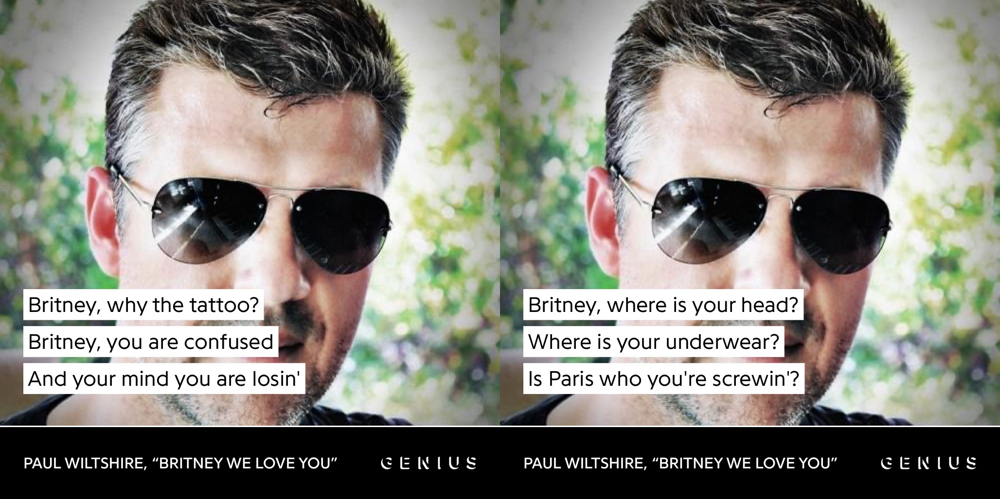
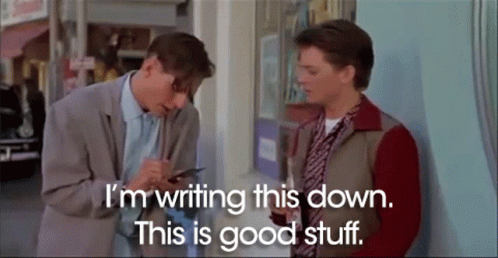
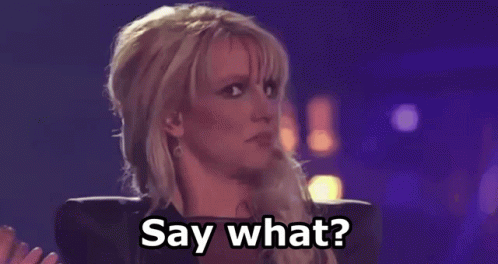

# Bandcamp's New CEO Was *Really* Into Britney Spears Back In The Day

On October 16, two weeks after promising ["business as usual"](https://twitter.com/songtradr/status/1707916008084636014), Bandcamp's new management at [Songtradr](https://en.wikipedia.org/wiki/Songtradr) announced that they would be laying off 50% of the company's entire workforce, including all of the union bargaining team. As a result, my social media timeline have become despondent over the obvious gutting and union busting of a beloved platform for independent musicians.

In a [statement to 404 Media](https://www.404media.co/bandcamps-entire-union-bargaining-team-was-laid-off/), Songtradr claimed that it had no knowledge of the union's leadership before making decisions about who to terminate. However, this was contested by the union, who provided 404 Media with proof that Songtradr CEO Paul Wiltshire had previously accepted a meeting invite with the bargaining team and thus knew their identities.

After learning this, I decided to look a little into Mr. Wiltshire's background before the Bandcamp acquisition. I first stumbled across [this interview with The Music Network](https://themusicnetwork.com/songtradr-paul-wiltshire-interview/) where he reveals some of the secrets to his success:

> “I was lucky because I had a network being a record producer, I did know people,” he recounts.  
> 
> If you’re raising capital, “maybe you need someone that has some sort of banking network on your advisory board. If it’s a music business, you obviously need someone that’s potentially got some great hair like me and add that on your on your advisory board.”
> 
> Wiltshire didn’t go to college, doesn’t have an MBA. He didn’t even complete year 12 (“I wanted to be in a band”).

Make sure to know the right people and have great hair. No education needed. Got it.

As a fellow musician, I was naturally interested in hearing Wiltshire's musical output for myself so I listened through everything that's been posted on his [Soundcloud account](https://soundcloud.com/paul-l-wiltshire). He describes his music as "an eclectic mix of tracks Paul has produced and written over the years which have never been officially released" and as expected of a commercially successful producer, these unreleased tracks are mostly immaculately engineered early 2000's pop, with a clear taste for pop rock and the upbeat aesthetics of Max Martin. The production on songs like [Heaven is Missing an Angel](https://soundcloud.com/paul-l-wiltshire/heaven-is-missing-an-angel) and [Don't Be Sorry](https://soundcloud.com/paul-l-wiltshire/dont-be-sorry) also display a strong similarity to the percussive style of beats popularized by Timbaland and The Neptunes for artists such as Justin Timberlake around the same period.

One of Wiltshire's song titles stood out to me: [**"Britney We Love You"**](https://soundcloud.com/paul-l-wiltshire)

This song was written about Britney Spears' well-publicized mental health struggles in 2007. Upon hearing it, I immediately realized it needed to be shared with the rest of the internet. Here is a complete transcription of the lyrics (with the exception of one line I couldn't make out):
> [Verse 1]  
> Britney, where are your kids?  
> Britney, where is your hair?  
> Britney, what are you doin'?  

> Britney, get to rehab  
> Britney, we are so scared  
> Britney, why are you fumin'?  

> Britney, where is your head?  
> Where is your underwear?  
> Is Paris who you're screwin'?  

> Britney, why the tattoo?  
> Britney, you are confused  
> And your mind you are losin'  
> 
> [Chorus]  
> Britney, we love you  
> Britney, please go back into the studio soon  
> Britney, we need you  
> Britney, you're our queen of pop  
> Without you we can't do  
> Britney, we love you  

> [Verse 2]  
> Britney, were you misled?  
> When you married K-Fed?  
> Britney, what were you thinkin'?  
> 
> Ms. Spears, you are our star  
> And you shine from afar  
> Girl, you must've been drinkin'  

> Honey, you are so cute  
> And we're a Slave to U  
> But we're scared where you party  

> Britney, we are your fans  
> And we miss you so bad  
> So get the music started  

> *(Chorus)*  

> [Bridge]  
> [?] she don't have your style  
> But then Madonna was cool for a while  
> Nothing's ever really been the same  
> Since Justin Timber...lake  
> Britney, where are your kids?  
> Britney, where is your hair?  

> *(Chorus)*

> [Outro]  
> Britney, we love you  
> Britney, call your band and go back out on tour soon  
> Britney, we love  
> We love, we love  
> Britney, we love you  

There's a lot to unpack here. For starters, Paul Wiltshire and Britney Spears were 31 and 20 years old respectively in 2001. The song's lyrics don't really express an interest in Britney's wellbeing during this dark time of her life besides a desire to see her "go back into the studio" and "go back out on tour" which is a weird flex for a record producer. It's also a callous attitude to have towards an artist, especially in light of the revelations that Britney's behavior during this period was largely a way of [resisting the exploitative and controlling conditions](https://www.cbsnews.com/news/britney-spears-memoir-excerpts-woman-in-me-shaving-her-head-after-years-of-being-eyeballed/) of her pop stardom. The lines about underwear, Paris Hilton, and Britney "being so cute" are just plain creepy.

To make matters even more bizarre, another Wiltshire-produced track from 2001 called ["Damn, Is It Natural"](https://soundcloud.com/paul-l-wiltshire/damn-is-it-natural) has a beat and chorus that bear a remarkable similarity to Spears' megahit ["...Baby One More Time"](https://www.youtube.com/watch?v=C-u5WLJ9Yk4). I took the liberty of [synchronizing the chorus of both songs](https://soundcloud.com/collegehill/damn-is-it-natural-baby-baby-one-more-time) and the resemblance is uncanny to say the least.

I honestly don't know how to feel about all of this or how to end this piece besides saying that it's giving me a very uneasy feeling about Bandcamp's future. Bad vibes all around...